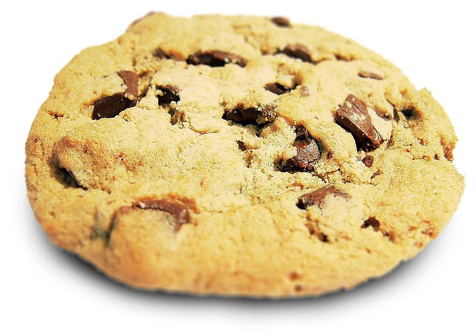
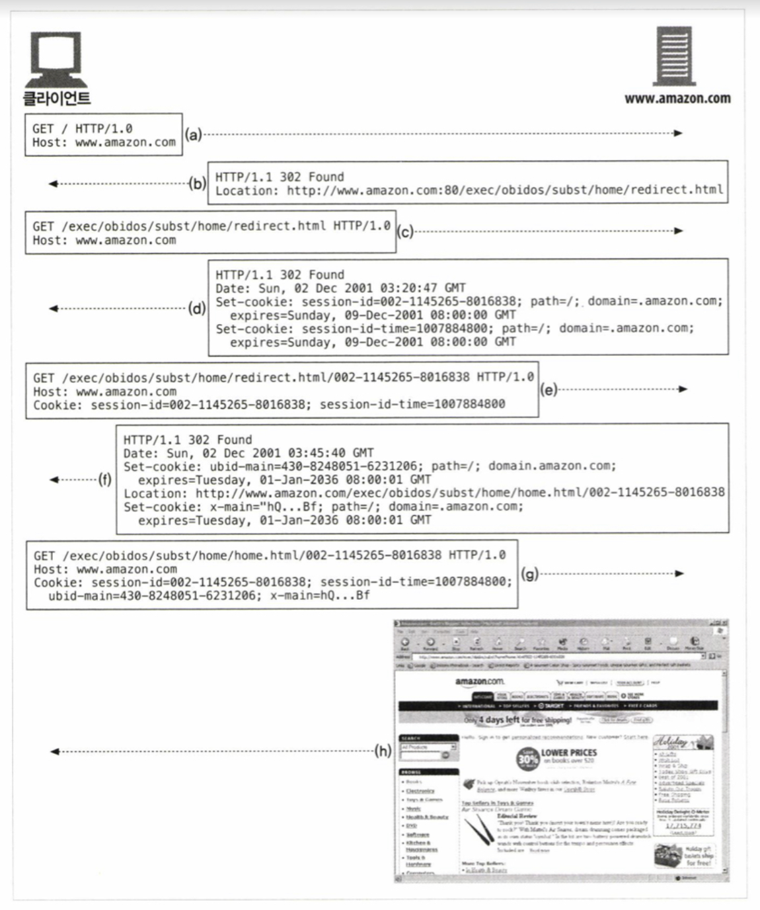

# 11.1 개별접촉

### HTTP의 특징

- 익명
- 매 요청은 일회성이고 독립적으로 처리
- 요청과 응답으로 통신되는 프로토콜이다.

=> 웹서버는 요청을 보낸 사용자를 식별하거나 방문자가 보낸 연속적인 요청을 추적하기 위해 약간의 정보를 이용한다. 이 정보를 통해, 여러방식으로 사이트를 개인화시켜 사용자에게 제공한다.

### 개별접촉(개인화)의 예

- 개별 인사 : 사용자에게 특화된 환영메세지나 페이지 내용
- 사용자 맞춤 추천 : 고객의 흥미나 생일등을 학습해서 특별한 상품을 제시
- 저장된 사용자 정보 : 복잡한 주소나 신용카드 정보를 저장하여 한번 식별하고 나면 저장된 사용자 정보를 이용
- 세션 추적 : 장바구니 기능을 위해 사용자의 상태를 저장

### 사용자 식별 기술의 예

- 사용자 식별 관련 정보를 전달하는 HTTP헤더들
- 클라이언트 IP주소 추적으로 알아낸 IP주소로 사용자를 식별
- 사용자 로그인 인증을 통한 사용자 식별
- URL에 식별자를 포함하는 기술인 fat Url
- 식별정보를 지속해서 유지하는 강력하면서도 효율적인 기술인 쿠키

  

# 11.2 HTTP헤더

### 사용자의 정보를 전달하는 HTTP 요청 헤더

| 헤더 이름       | 헤더 타입  | 설명                                     |
| --------------- | ---------- | ---------------------------------------- |
| Form            | 요청       | 사용자의 이메일 주소                     |
| User-Agent      | 요청       | 사용자의 브라우저                        |
| Referer         | 요청       | 사용자가 현재 링크를 타고 온 근원 페이지 |
| Authorization   | 요청       | 사용자 이름과 비밀번호(뒤에서 다룸)      |
| Client-ip       | 확장(요청) | 클라이언트의 IP 주소(뒤에서 다룸)        |
| X-Forwarded-For | 확장(요청) | 클라이언트의 IP 주소(뒤에서 다룸)        |
| Cookie          | 확장(요청) | 서버가 생성한 ID 라벨(뒤에서 다룸)       |

- Form  
  사용자의 이메일 주소를 포함한다  
  악의적으로 서버가 이메일 주소를 모아서 스팸 메일을 발송하는 문제 때문에 Form 헤더를 보내는 브라우저는 많지 않다.
- User-Agent  
  사용자가 사용하고 있는 브라우저의 이름, 버전 정보, 운영체제에 대한 정보를 포함한다.
  그것들의 속성에 맞추어 콘텐츠를 최적화하는데 유용할 수 있지만, 특정 사용자를 식별하는데에는 큰 도움이 되지 않는다.
- Referer  
  사용자가 현재 페이지로 유입하게 한 웹페이지의 url을 가리킨다.
  사용자를 식별할 수는 없지만, 이전에 어떤 페이지를 방문했었는지 알려주기 때문에 웹사용형태나 사용자의 취향을 더 잘 파악할 수 있다.

  

# 11.3 클라이언트 IP 주소

초기 웹 선구자들은 사용자 식별에 클라이언트 IP 주소를 사용하려 했다.  
하지만 IP주소로 사용자를 식별하는 방식은 다음과 같은 약점이 있어 인트라넷 같이 제한된 영역에서는 사용하기도 하지만, 그 외에는 사용하지 않는다.

### IP주소 방식의 문제점

- 여러 사용자가 같은 컴퓨터를 사용 할 때
- 인터넷 서비스 제공자(ISP)가 사용자가 로그인할 때 동적으로 IP 주소를 할당하는 경우
- 사용자가 네트워크 주소 변환(NAT)방화벽을 사용할 경우
- 웹 서버가 클라이언트 IP주소 대신 프락시 서버의 IP주소를 볼 경우

  

# 11.4 사용자 로그인

로그인을 요구하여 사용자에게 명시적으로 식별요청을 할 수 있다.
로그인을 통해 사용자의 식별정보를 알게 되면, 브라우저는 요청마다 해당 사용자의 식별정보 토큰을 헤더에 담아 서버로 전송하여 세션이 진행되는 내내 사용자에 대한 식별을 유지한다.

### 사용자 로그인 방식의 문제점

- 귀찮다.
- 사용자가 사이트마다의 사용자 이름과 비밀번호를 기억해야한다.

  

# 11.5 뚱뚱한 URL

사용자의 상태정보를 포함하고 있는 URL을 의미한다.

### 뚱뚱한 URL의 문제점

- 못생긴 URL
- 공유하지 못하는 URL
  - 누적된 개인정보가 포함되어있을수도 있음
- 캐시를 사용할 수 없음
- 서버 부하 가중
- 이탈 시 사용자의 진척사항이 초기화
- 세션 간 지속성의 부재
  - 로그아웃하면 모든 정보를 잃어버림

  

# 11.6 쿠키

사용자를 식별하고 세션을 유지하는 방식 중 현재 가장 널리 사용중인 방식이다.
단, 쿠키만으로 하기 힘든일에는 위 기타 기술들을 함께 사용하기도 한다.

## 11.6.1 쿠키의 타입

- 세션 쿠키
  - 임시쿠키, 사용자가 브라우저를 닫으면 삭제된다.
- 지속 쿠키
  - 디스크에 저장되어, 사용자가 브라우저를 닫더라도 유지된다.
  - 사이트에 대한 설정정보, 로그인 이름 등

차이점 : 파기되는 시점  
Discard 파라미터가 설정되어 있거나, Expires, Max-Age 파라미터가 없으면 세션 쿠키가 된다.

## 11.6.2 쿠키는 어떻게 동작하는가

쿠키 = 스티커

1. 사용자가 웹 서버를 방문한다. 서버는 사용자에 대해 아무것도 모른다.
2. 사용자가 다시 돌아왔을 때 사용자를 식별하기 위한 값을 쿠키에 할당한다.
   - 쿠키는 임의의 이름 = 값 형태의 리스트이다.
   - Set-Cookie 같은 HTTP 확장 헤더에 담아 사용자에게 전달한다.
3. 브라우저는 서버로 온 Set-Cookie 헤더에 있는 콘텐츠를 브라우저 쿠키 데이터베이스에 저장한다.
4. 나중에 같은 사이트를 방문하면 브라우저는 쿠키를 Cookie 요청 헤더에 담아 전송한다.

## 11.6.3 쿠키상자: 클라이언트 측 상태

브라우저는 쿠키 정보를 저장하는 시스템  
= 클라이언트 측 상태  
= 공식적인 이름 : 'HTTP 상태 관리 체계'(HTTP State Management Mechanism)

### 구글 크롬 쿠키

크롬은 Cookies라는 SQLite 파일에 쿠키를 저장한다.

### 마이크로소프트 인터넷 익스플로러 쿠키

<del>캐시 디렉터리에 각각의 개별 파일로 쿠키를 저장한다.</del>

## 11.6.4 사이트마다 각기 다른 쿠키들

브라우저는 다음과 같은 이유때문에 각 사이트에 두개 혹은 세개만의 쿠키를 보낸다.

- 쿠키를 모두 전달하면 성능이 저하된다.
- 서버에 특화된 이름/값 쌍을 포함하기 때문에 대부분 사이트에서는 무의미한 값이다.
- 잠재적인 개인정보 문제를 일으킬 수 있다.

#### 쿠키의 Domain 속성

쿠키를 생성할 때, Set-Cookie 응답 헤더에 Domain 속성을 담아 쿠키를 읽을 수 있는 사이트를 제어한다.  
`Set-cookie: user="mary17"; domain="airtravelbargains.com"`

#### 쿠키의 Path 속성

url 경로의 앞부분인 path속성을 기술해서 해당 경로에 속하는 페이지에만 쿠키를 전달한다.  
`Set-cookie: user="mary17; domain="airtravelbargains.com" path=/autos/`

## 11.6.5 쿠키 구성요소

현재 사용하는 쿠키 명세 RFC 6265

- Version 0 쿠키 (넷스케이프 쿠키)
- Version 1 쿠키 (RFC 2965)

## 11.6.6 Version 0 (넷스케이프) 쿠키

Set-Cookie 응답헤더와 Cookie 요청 헤더와 쿠키를 조작하는데 필요한 필드를 정의

`Set-cookie: name=value [; expires=date] [; path=path] [; domain=domain] [; secure]
Cookie: name1=value1 [; name2=value] ...`

### Version 0 Set-Cookie 헤더

쿠키의 이름과 값을 가져야한다.

| 속성           | 설명                                                                                                                                  |
| -------------- | ------------------------------------------------------------------------------------------------------------------------------------- |
| 이름=값 (필수) | 세미콜론,쉼표,등호,공백은 포함할 수 없다 (단, 큰따옴표로 감싸면 가능)                                                                 |
| Expires        | 쿠키만료시각 (요일, DD-MM-YY HH:MM:SS GMT) Expires를 명시하지 않으면 세션이 끝날 때 파기                                              |
| Domain         | 특정 도메인에만 쿠키를 제한적으로 전달, 두개에서 세개 영역을 가지는 도메인을 기술해야함(.com, .edu 등은 불가능 / musinsa.com 은 가능) |
| Path           | 특정경로에만 쿠키를 할당할 수 있다.                                                                                                   |
| Secure         | 이 속성이 포함되어 있으면, 쿠키는 HTTP가 SSL 보안 연결을 사용할때만 쿠키를 전송한다.                                                  |

### Version 0 Cookie 헤더

클라이언트가 서버로 요청을 보낼 때는, Domain, Path, Secure 필터들이 현재 요청하려고 하는 사이트데 들어맞으면서 아직 파기되지 않은 쿠키들을 함께 보낸다.
`Cookie: session-id=002-1143265-8015827; session-id-time=100878848800`

## 11.6.7 Version1 (RFC 2965)쿠키

RFC 2109 -> RFC 2965 -> RFC 6265  
Version0의 확장 등으로 잘 사용하지 않는다.

#### Version 0 쿠키와의 차이점

- 쿠키마다 목적을 설명하는 설명문이 있다.
- 만료 주기와 상관없이 브라우저가 닫힐 때 쿠키를 삭제할 수 있다.
- 절대 날짜(Expires) 대신 초 단위의 상대 값(Max-age)으로 쿠키의 생명주기를 결정한다.
- 포트 번호로도 쿠키를 제어한다.
- 버전 번호가 추가되었다.
- Cookie 헤더에 $ 접두어가 있다.

## 11.6.8 쿠키와 세션 추적

페이지는 세션 쿠키를 이용하여 사용자를 추적한다.

## 11.6.9 쿠키와 캐싱

쿠키와 관련된 문서를 캐싱하면 사용자의 쿠키가 다른 사용자에게 할당되거나, 개인 정보가 노출될 수 있어 주의해야한다.

### 캐시를 다루는 기본 원칙

- 캐시되지 말아야 할 문서가 있다면 표시하라
  - Set-Cookie 빼고 캐시를 해도 된다면, `Cache-Control: no-cache = 'Set-Cookie'`
  - 캐시를 해도 되는 문서는 `Cache-Control: public` 를 사용하면 웹의 대역폭을 더 절약시켜준다.
- Set-Cookie 헤더를 캐시하는 것에 유의하라
  - 만약 응답이 Set-Cookie 헤더를 가지고 있으면, 본문은 캐시할 수 있지만 Set-Cookie헤더를 캐시하는 것은 주의를 기울여야한다.
  - 같은 Set-Cookie 헤더를 여러명에게 보내면, 사용자 추적에 실패한다.
  - 응답을 저장하기 전에 Set-Cookie헤더를 제거하는 캐시의 문제점을 위해 헤더를 추가하여 재검사가 일어나게 할 수 있다.
  - `Cache-Control: must-revalidate, max-age=0`
- Cookie 헤더를 가지고 있는 요청에 주의하라
  - 보수적인 캐시는 Cookie 헤더가 있는 요청에 대한 응답은 캐시하지 않는다.
  - 이미지는 캐싱하고 텍스트는 캐싱하지 않을 수도 있다.
  - 이미지에 Max-age가 0인 Cookie 헤더를 설정해 매번 재검사하게 만들 수 있다.

## 11.6.10 쿠키, 보안 그리고 개인정보

쿠키를 사용하지 않도록 비활성화 시킬 수 있고, 로그 분석 같은 다른 방법으로 대체 하는 것도 가능하므로, 쿠키 자체가 보안상으로 엄청나게 위험한 것은 아니다.

- 개인정보를 다루거나 사용자를 추적하는 기술이 잘못된 의도로 사용될 수 있어 조심해야한다.
- 광고사이트가 사용자를 추적하기 위해 지속 쿠키를 사용하는 등의 오용을 조심해야한다.
- IP 주소와 Referer헤더에 있는 정보를 함께 사용한다면, 마케팅 회사들은 사용자 패턴에 대해 꽤 정확한 데이터를 수집할 수 있다.
- 부정적인 여론이 많긴 하지만, 제공하는 개인정보를 누가 받는지 명확히 알고 개인정보 정책에만 유의한다면 쿠키에 관련한 위험성보다 편리함이 더 크다.
