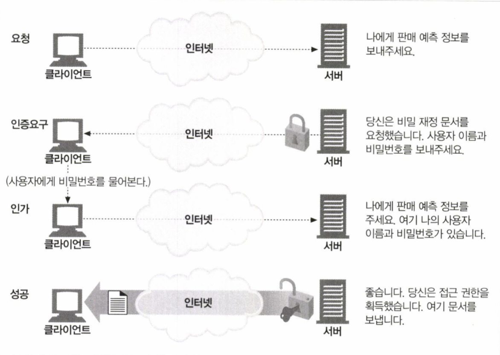
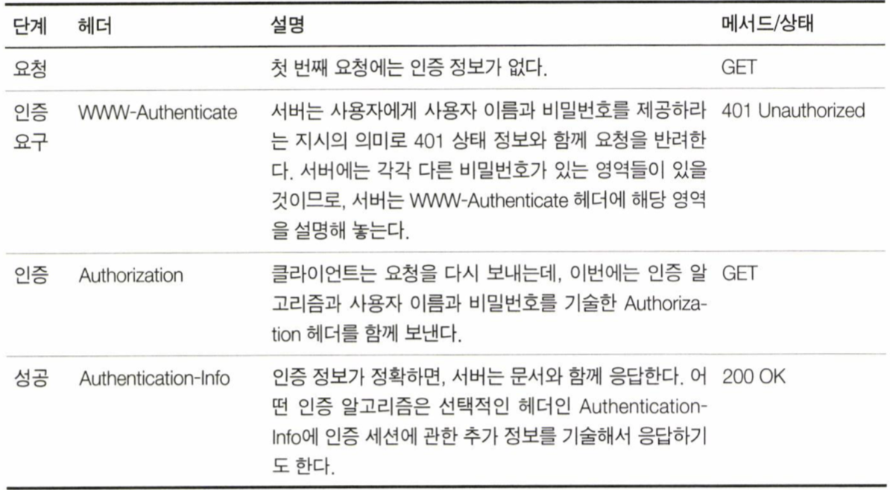
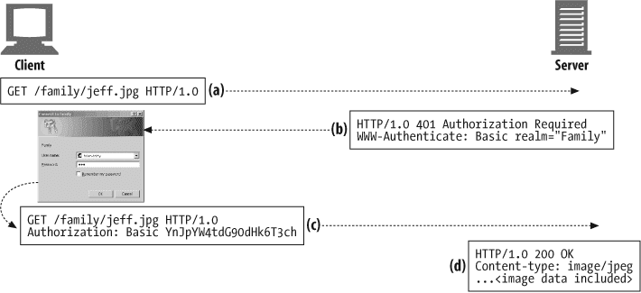
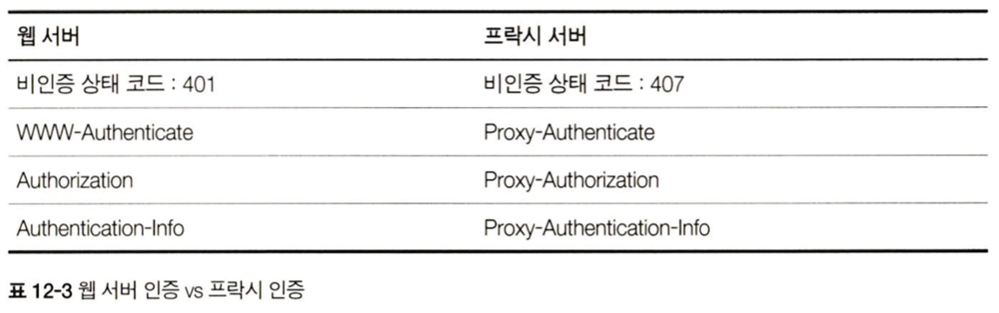

# 12장 기본 인증

웹사이트에 있는 개인 프로필이나 개인 문서는 소유자의 동의 없이는 볼 수 없어야 한다. 또한, 기업의 민감한 문서는 권한 없는 임직원이 볼 수 없게 해야한다.  
그러기 위해서는 서버가 사용자가 누구인지 식별할 수 있어야 한다. 인증은 당신이 누구인지 증명하는 것이다. 보통 사용자 이름과 비밀번호를 입력해서 인증한다. 그리고 HTTP는 자체적으로 인증 관련 기능을 제공한다.  
이 장에서는 HTTP 인증과 그것의 기본이 되는 기본 인증을 알아볼 것이다.

## 12.1 인증

### 12.1.1 HTTP의 인증요구/응답 프레임워크

HTTP는 사용자 인증을 하는 데 사용하는 자체 인증요구/응답 프레임워크를 제공한다.  


### 12.1.2 인증 프로토콜과 헤더

인증은 네 가지 단계를 거친다.

  
위 표의 헤더와 형식은 인증 프로토콜에 따라 달라지며, 인증 프로토콜은 HTTP 인증 헤더에 기술되어 있다.

### 12.1.3 보안 영역

웹 서버는 기밀문서를 보안 영역(realm) 그룹으로 나눈다. 보안 영역은 저마다 다른 사용자 권한을 요구한다.  
예를 들어 웹 서버가 보안 영역 두 개를 가진다고 가정해보자. 한 개는 회사의 재정 정보이고 다른 하나는 개인의 가족 문서다. 각 사용자는 서로 다른 영역으로 접근한다.


```
HTTP/1.0 401 Unauthrized
WWW-Authenticate: Basic realm="Corporate Financials"
```

realm는 사용자가 권한의 범위를 이해하는데 도움이 되도록 해설 형식으로 되어있어야 한다. realm에 "executive-committee@bigcompany.com"같은 서버의 호스트명을 넣는 것도 유용할 수 있다.

## 12.2 기본 인증

기본 인증은 가장 잘 알려진 HTTP 인증 규약이다. 거의 모든 주요 클라이언트와 서버에 기본 인증이 구현되어 있다.

### 12.2.1 기본 인증의 예



- (a) 사용자가 자신의 가족사진인 /family/jeff.jpg를 요청한다.
- (b) 서버가 WWW-Authenticate 헤더와 함께 개인 가족 사진에 접근하는 데 필요한 비밀번호를 요구하는 401 Authrization Required 응답을 반환한다.
- (c) 브라우저가 401 응답을 받고 Family 영역에 관한 사용자 이름과 비밀번호를 요구하는 대화상자를 띄운다. 사용자가 이름과 비밀번호를 입력하면, 브라우저는 그것들을 콜론으로 이어 붙이고, base-64 방식으로 인코딩하고, Authorization 헤더에 그 값을 담아 서버로 다시 보낸다.
- (d) 서버가 사용자 이름과 비밀번호를 디코딩하고, 그 값이 정확한지 검사한 후, 문제가 없으면 HTTP 200 OK 메시지와 함께 요청받았던 문서를 보낸다.

기본 인증 프로토콜은 표 12-1에서 봤던 Authentication-Info 헤더를 사용하지 않는다.

### 12.2.2 Base-64 사용자 이름/비밀번호 인코딩

HTTP 기본 인증은 사용자 이름과 비밀번호를 콜론으로 이어서 합치고, base-64 인코딩 메서드를 사용해 인코딩 한다.  
base-64 인코딩은 8비트 바이트로 이루어져 있는 시퀀스를 6비트 덩어리의 시퀀스로 변환한다. 각 6비트 조각은 대부분 문자와 숫자로 이루어진 특별한 64개의 문자 중에서 선택된다.

Base-64 인코딩은 바이너리, 텍스트, 국제 문자 데이터 문자열을 전송 가능한 문자인 알파벳으로 변환하기 위해 발명됐다. 국제 문자나 HTTP 헤더에서 사용할 수 없는 문자(큰따옴표, 콜론, 캐리지 리턴)를 포함한 사용자 이름이나 비밀번호를 보내야 할 때 유용할 수 있다. 또한 base-64는 사용자 이름과 비밀번호 문자를 섞을 수 있기 때문에, 뜻하지 않게 노출되는 문제를 예방하는데 도움이 된다.

### 12.2.3 프락시 인증

중개 프락시 서버를 통해 인증할 수도 있다. 어떤 회사는 사용자들이 회사의 서버나 LAN, 무선 네트워크에 접근하기 전에 프락시 서버를 거치게 하여 사용자를 인증한다.  
프락시 서버에서 접근 정책을 중앙 관리할 수 있기 때문에, 회사 리소스 전체에 대해 통합적인 접근 제어를 하기 위해 프락시 서버를 사용하면 좋다.  
이 절차의 첫 번째 단계는 프락시 인증으로 사용자를 식별하는 것이다.

프락시 인증은 웹 서버의 인증과 헤더와 상태 코드만 다르고 절차는 같다.
아래는 웹 서버와 프락시 인증에 쓰이는 상태 코드와 헤더들의 대조표이다.


## 12.3 기본 인증의 보안 결함

기본 인증은 단순하고 편리하지만 안심할 수는 없다. 보안 결함을 살펴보자.

1. 기본 인증은 사용자 이름과 비밀번호를 쉽게 디코딩할 수 있는 형식으로 네트워크에 전송한다. 사실상, 인코딩한 비밀번호는 누구나 읽고 메모하기 어렵지 않은 일반 문자열로 보내진다. base-64 인코딩은 어렵지 않게 디코딩 할 수 있기 때문에 사실상 비밀번호 그대로 보내는 것과도 다름없다. 누군가 가로채는 것을 방지하려면 모든 HTTP 트랜잭션을 SSL 암호화 채널을 통해 보내거나, 보안이 더 강화된 다이제스트 인증 같은 프로토콜을 사용하는 것이 좋다.
2. 보안 비밀번호가 디코딩하기에 더 복잡한 방식으로 인코딩되어있다고 하더라도, 여전히 제삼자는 인코딩 결과물을 캡쳐해서 사용할 수 있다. 기본 인증은 이러한 공격을 예방하지 못한다.
3. 심지어 기본 인증이 회사의 인트라넷 접근 제어나 개인화된 콘텐츠처럼 보안이 뚫려도 치명적이지는 않은 애플리케이션에 사용된다고 하더라도, 이는 굉장히 위험하다. 비밀번호를 요구하는 수많은 사이트에 지쳐버린 사용자들이 같은 아이디와 비밀번호를 사용하기 때문이다. 누군가는 무료 인터넷 이메일 같은 사이트에서 사용자 이름과 비밀번호 문자열을 그대로 캡쳐한 다음, 같은 정보고 중요한 온라인 은행 사이트에 접근할 수도 있다.
4. 인증 헤더를 건드리지 않더라도, 그 외 다른 부분을 수정해서 트랜잭션의 본래 의도를 바꿔버리는 프락시나 중개자가 개입하는 경우 기본 인증은 정상적인 동작을 보장하지 않는다.
5. 기본 인증은 가짜 서버의 위장에 취약하다. 공격자는 가짜 서버나 게이트를 제공한 뒤 비밀번호를 요청해서 저장한 다음 에러가 난 척을 할 것이다.

종합해보면, 기본 인증은 일반적인 환경에서의 개인화나 접근 제어에는 편리하며 다른 사람이 보지 않기 원하지만 보더라도 치명적이지 않은 경우에는 여전히 유용하다. 호기심 많은 사용자가 우연이나 사고로 정보에 접근해서 치명적이지 않은 정보를 보는 것을 예방하는 정도에 사용하면 좋다.
기본 인증 암호화된 데이터 전송(SSL 같은)과 연계해서 사용하는 것이 널리 사용되고 있다.
