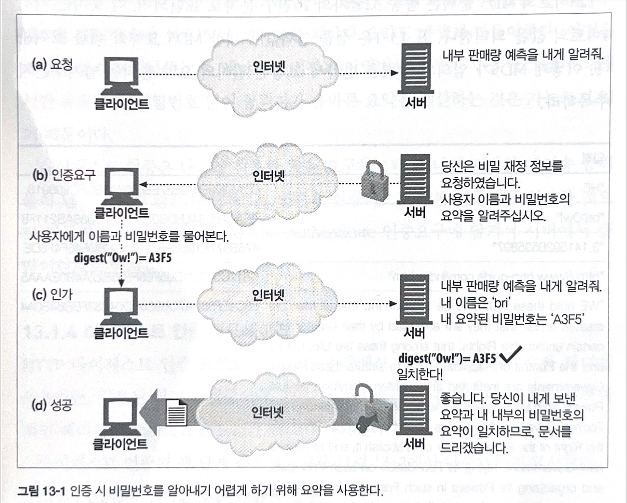

# 13. 다이제스트 인증

기본 인증은 편리하고 유연하지만 전혀 안전하지 않다. 

- 사용자 이름과 비밀번호 를 평문으로 보내고, 메시지를 위조하지 못하게 보호하려는 어떠한 시도도 하지 않는다. (단순히 base64 인코딩을 이용해 뒤섞을 뿐이라 디코딩이 쉽다.)
- 기본 보안을 안전하게 이용하는 유일한 방법은 SSL과 결합해서 사용하는 것이다.

다이제스트 인증은 기본 인증과 호환되는 더 안전한 대체재로서 개발되었다. **다이제스트 인증은 널리 쓰이지는 않지만**, 그 개념은 보안 트랜잭션을 구현하고자 하는 이들에게 여전히 유용하다.

# 13.1 다이제스트 인증의 개선점

- **비밀번호를 절대로 네트워크를 통해 평문으로 전송하지 않는다.**
- 인증 체결을 가로채서 재현하려는 악의적인 사람들을 차단한다.
- 구현하기에 따라서 메시지 내용 위조를 막는 것도 가능하다.
- 그 외 몇몇 잘 알려진 형태의 공격을 막는다.

보안 강도 : 기본 인증 < 다이제스트 인증 < TLS, HTTPS

<aside>
💡 공개키 기반 메커니즘과 비교해 보았을 때, 다이제스트 인증은 그다지 강력한 인증 메커니즘을 제공하지는 않는다. 다이제스트 인증은 비밀번호 자체를 보호하는 것을 넘어서 어떠한 비밀 보호도 제공하지 않는다.

</aside>

## 비밀번호를 안전하게 지키기 위해 요약 사용하기

다이제스트 인증 좌우명 : **“절대로 비밀번호를 네트워크를 통해 보내지 않는다.”**

클라이언트는 비밀번호를 비가역적으로 뒤섞은 fingerprint, digest(요약)을 보낸다.

서버는 요약이 비밀번호에 알맞게 대응하는지 검사한다.

요약만으로는 비밀번호를 유추해내기 어려워 악의적인 접근을 막는다.

### **다이제스트 인증의 동작**

1. 클라이언트가 보호된 문서를 요구한다.
2. 서버는 클라이언트에게 사용자 이름과 요약된 형태의 비밀번호를 요구한다.
3. 클라이언트는 비밀번호의 요약을 전달한다.
4. 서버는 클라이언트가 제공한 요약과 내부적으로 계산한 요약을 비교한다. (서버는 요약만 알고 있으면 된다.)일치 여부를 확인하고, 클라이언트에게 문서를 전달한다. 이 과정에서 비밀번호는 결코 네트워크를 통해 전송되지 않는다.

## 단방향 요약

요약은 단방향 함수로 동작한다.

모든 입력값들을 유한한 범위의 압축으로 변환하기 때문에 극소의 확률로 동일한 요약본이 생성될 수 있다. 하지만 비밀번호 일치 여부를 확인하기 위한 요약이기 때문에 중요하지 않다.(?)

인기 있는 요약 함수 중 하나인 MD5(메시지 다이제스트 #5)는 128 비트 2의 128제곱가지 수의 압축이 만들어질 수 있다.

128 비트의 MD5 출력은 32글자의 16진수문자로 종종 표현된다.

요약 함수는 보통 암호 체크섬(cryptographic checksums)으로 불리며, 단방향 해시 함수이거나 지문 함수(fingerprint function)이다.

## 재전송 방지를 위한 난스(nonce) 사용

단방향 요약은 비밀번호 요약을 전송하고 악의적인 집단이 쉽게 원래 비밀번호를 해독할수 없음을 보장한다. 하지만 요약을 가로채서 서버에 몇 번이고 재전송을 하게 된다면 언젠가는 보안이 뚫릴 수 있기 때문에 재전송 공격을 방지하기 위해서 서버는 클라이언트에게 난스 라고 불리는 특별한, 자주 바뀌는 증표를 건네준다.

약 1밀리초마다 갱신되는 난스를 비밀번호에 섞어서 재전송 공격을 막는다.

난스는 WWW-Ahtuenticate 인증요구에 담겨서 서버에서 클라이언트로 넘겨진다.

## 다이제스트 인증 핸드셰이크

HTTP 다이제스트 인증 프로토콜은 기본인증에서 사용하는 것과 비슷한 헤더를 사용하는, 강화된 버전의 인증이다.

1. 서버가 난스를 생성한다.
2. WWW-Ahthenticate 인증요구 메시지에 담아 서버가 지원하는 알고리즘 목록과 함께 전송한다.
3. 클라이언트는 알고리즘을 선택하고 비밀번호와 그 외 데이터에 대한 요약을 계산한다.
4. Authrization 메시지에 요약을 담아 서버에게 돌려준다. 서버를 인증하고 싶다면 클라이언트 난스를 보낸다.
5. 요약, 알고리즘, 보조 데이터들을 받고 클라이언트가 했던 그대로 요약을 계산한다. 서버의 요약과 전송된 요약이 같은지 확인한다. 클라언트가 클라이언트 난스를 요구했다면 클라이언트 요약을 만든다.
6. 서버는 다음번 난스를 미리 계산해서 클라이언트에게 넘겨줄 수 있다.

# 13.2 요약 계산

다이제스트 인증의 핵심은 공개된 정보, 비밀 정보, 시한부 난스 값을 조합한 단방향 요약이다.

## 요약 알고리즘 입력 데이터

요약의 세 요소

- 단방향 해시 함수H(d)와 요약 함수KD(s,d). s: 비밀, d: 데이터
- 비밀번호 등 보안 정보를 담고 있는 데이터 A1
- 요청 메시지의 비밀이 아닌 속성을 담고 있는 데이터 A2

A1, A2 두 조각의 데이터는 요약을 생성하기 위해 H와 KD에 의해 처리된다.

## H(d)와 KD(s,d) 알고리즘

MD5(기본), MD5-sess 중 사용

H 함수는 데이터의 MD5를 계산

KD 요약함수는 비밀 데이터와 일반 데이터의 MD5를 계산

> H(<데이터>) = MDS(<데이터>)
KD(<비밀>, <데이터>) = H(연결(<비밀>, <데이터>))
> 

## 보안 관련 데이터 (A1)

사용자 이름, 비밀번호, 보호 영역, 난스와 같은 비밀 보호 정보

MD5

- A1=<사용자〉:〈영역):<비밀번호>

MD5-sess

- A1= MD5(<사용자):〈영역〉:<비밀번호》:<난스): 〈C난스>

## 메시지 관련 데이터 (A2)

URL, 요청 메서드, 메시지 엔터티 본문을 포함한다.

메서드, 리소스, 메시지의 위조 방지를 위해 사용된다.

qop 값에 따라 두가지 사용법을 제공한다.

qop=”auth”

- <요청 메서드>:<uri 지시자 값>

qop=”auth-int”

- <요청 메서드>:<uri 지시자 값>:H(<요청 엔터티 본문>)

## 요약 알고리즘 전반

RFC2617은 H, KD, A1, A2로 요약을 계산하는 알고리즘으로 두 가지 방법을 정의한다.

<aside>
💡 RFC2617은 `HTTP Authentication: Basic and Digest Access Authentication` 에 관한 표준이다.

</aside>

찌그러진(?) 펼쳐진 요약 알고리즘 차트 시트

## 다이제스트 인증 세션

WWW-Authenticate 인증요구에 대한 클라이언트의 응답으로 인증 세션이 시작된다.

다른 서버로부터 또 다른 WWW-Authenticate 인증요구를 받기 전까지 지속된다.

사용자 이름, 비밀번호, 난스, 난스 횟수, Authrization 헤더 등의 값으로 이루어진다.

## 사전(preemptive)인가

클라이언트가 다음 난스에 대해 미리 알고 있어서, Authorization 헤더를 계산할 수 있다면 요청/인증요구 단계를 거치지 않고 미리 Authorization 헤더를 제공할 수 있다. 

사전 인가는 기본 인증에서도 흔하게 사용된다. 다이제스트 인증에서의 사전인가는 재전송 공격을 저지하기 위한 난스 기술로 인해 더 복잡하다.

안전한 기능을 유지하면서 사전인가를 할 수 있는 방법은 아래와 같다.

- 서버가 다음 난스를 Authentication-Info 성공 헤더에 담아서 미리 보낸다.
- 서버가 짧은 시간 동안 같은 난스를 재사용 하는 것을 허용한다.
- 클라이언트와 서버가 동기화되어 있고 예측 가능한 난스 생성 알고리즘을 사용한다.

### 다음 난스 미리 생성하기

Authentication-Info 성공 헤더를 통해 다음 난스 값을 미리 제공한다.

> Authentication-Info : nextnonce=”<난스값>”
> 

요청/인증요구 사이클에서 벗어날 수 있다.

다음 난스 값을 받아야 하므로 다중 요청을 파이프라이닝(회전 지연 회피를 위한 기술)하는 능력은 떨어진다.

### 제한된 난스 재사용

난스를 횟수 혹은 시간을 두어 재사용하도록 허락한다.

클라이언트는 자유롭게 요청을 발행하여 파이프라이닝 할 수 있다.

난스를 재사용하면 공격자의 재전송 공격이 허용되므로 보안성이 감소된다. (재사용 시간의 텀을 늘릴수록 감소)

### 동기화된 난스 생성

제 3자가 쉽게 예측할 수 없는 공유된 비밀키에 기반하여 클라이언트-서버가 동기화된 난스 생성 알고리즘을 사용하는 것도 가능하다.

> 이 알고리즘은 다이제스트 인증 명세의 범위를 넘어서는 것이다. 🙃
> 

## 난스 선택

난스의 내용은 불투명하고 구현 의존적이다. 성능 수준, 보안, 편의성은 선택할 수 있다.

- RFC 2617이 내놓은 가상의 난스 공식
    
    > BASE64(타임스탬프 H(타임스탬프”:” ETag “:” 개인키))
    > 
- 서버는 클라이언트 인증 헤더에서 해시 부분을 재계산해 보고 인증헤더의 난스와 일치하지 않거나 타임스탬프가 오래되었다면 요청을 거절한다.
- ETag를 포함하면 갱신된 리소스에 대한 재요청을 방지한다.
- 재전송 공격을 방지하기 위해 이전에 사용된 난스나 요약을 받아들이지 않을 수 있다.

## 상호 인증

RFC 2617은 클라이언트가 서버를 인증할 수 있도록 다이제스트 인증을 확장했다.

서버가 올바른 응답 요약을 생성할 수 있도록 클라이언트 난스(c난스)값을 Authentication-Info 헤더를 통해 클라이언트에 제공한다.

RFC 2617표준이지만 RFC 2069와의 하위호환성을 고려해 선택사항이지만, 보안이 상당히 개선되므로 반드시 구현할 것을 권장한다.

응답 요약은 메시지 본문 정보(A2)가 를 제외하고 요청 요약과 같은 방법으로 계산할 수 있다.

# 13.3 보호 수준 향상

qop 필드

- 요약 헤더의 세가지 헤더 WWW-Authenticate, Authorization, Authentication-Info에 모두 존재할 수 있다.
- 클라이언트-서버가 보호 기법과 수준을 협상할 수 있게 한다.
- 서버는 WWW-Authenticate 헤더에 qop 옵션을 쉼표로 구분된 목록 형태로 내보낸다.
- 클라이언트는 자신의 요구에 맞는 것을 선택하고 Authorization 헤더의 qop 필드에 담아 돌려준다.
- 선택사항이지만 하위호환을 위한 것이며 RFC 2617에서는 auth, auth-int 를 초기 보호수준값으로 한다.

> qop=”auth”는 인증, qop=”auth-int” 인증 및 메시지 무결성 보호를 의미한다.
> 

## 다이제스트 인증 헤더

기본, 다이제스트 인증 프로토콜 모두 WWW-Authenticate 헤더에 전달 되는 인증 요구와 Authorization 헤더에 담겨 전달되는 인가 응답을 포함한다. 다이제스트 인증은 여기에 선택적인 Authentication-Info 헤더를 추가했다. 이 헤더는 3단계 핸드셰이크를 완성하고 다음 사용할 난스를 전달하기 위해 인증 성공 후에 전달된다.

# 13.4 실제 상황에 대한 고려

## 다중 인증요구

서버는 한 리소스에 대해 여러 인증을 요구할 수 있다.

기본 및 다이제스트 인증요구를 모두 보낼 수 있다.

클라이언트는 자신이 지원하는 가장 강력한 인증 메커니즘을 선택해야 한다.

다양한 인증 옵션 제공하는 경우 ‘가장 허약한 연결부분’에 대한 보안 우려도 발생한다.

## 오류 처리

다이제스트 인증에서 지시자나 그 값이 적절하지 않거나 요구된 지시자가 빠져있는 경우 알맞은 응답은 400 Bad Request 이다.

요청과 요약이 맞지 않으면 기록해 두고, 반복된 실패를 판별하여 공격자가 비밀번호 추측을 시도하고 있음을 알 수 있다.

인증 서버는 반드시 ‘uri’ 지시자가 가리키는 리소스가 요청줄에 명시된 리소스와 같음을 확인해야 한다. 중간의 프락시가 클라이언트의 요청을 변조했을 가능성에 대처할 수 있게 해준다.

## 보호 공간

**영역**

- 서버의 루트 URL와 결합되어 보호 공간을 정의한다.
- 서버의 보호된 리소스들을 자신만의 인증 제도와 인가 데이터베이스를 보호 영역의 집합으로 분할할 수 있게 한다.
- 영역 값은 서버에 의해 할당되는 문자열이며 인증 제도에 추가적인 의미를 더하며 다른 다중 인증요구가 있을 수가 있다.

**보호 공간**

- 어떤 자격이 자동으로 적용되는 영역을 결정한다. 요청이 인가되면 인증 제도, 매개변수, 사용자 설정 중 한가지 이상에 의해 정해진 시간동안 재사용된다.
- 보호공간의 인증 메커니즘
    - 기본 인증: 클라이언트는 요청 URI와 그 하위의 모든 경로는 같은 보호공간에 있는 것으로 가정한다.
    - 다이제스트 인증 : 인증요구의 WWW-Ahthenticate: domain 필드는 작은 따옴표로 묶인 URI의 공백으로 분리된 목록이다. 이 domain 목록의 모든 URI와 논리적으로 그 하위에 위치한 모든 URI는 같은 보호공간에 있는 것으로 가정한다.

## URI 다시 쓰기

프락시는 리소스의 변경 없이 구문만 고쳐서 URI를 다시 쓰기도 한다.

- 호스트 명은 정규화되거나 IP주소로 대체될 수 있다.
- 문자들은 “%” escape 형식으로 대체될 수 있다.
- 특정 원 서버로부터 가져오는 리소스에 영향을 주지 않는, 타입에 대한 추가 속성이 URI의 끝에 붙거나 중간에 삽입될 수 있다.

## 캐시

Authorization 헤더를 포함한 요청과 어떤 공유 캐시의 응답이 아래의 Cache-control 지시자를 포함한 경우에만 캐시 응답을 반환한다.

- 원 서버의 응답이 “must-revlidate” Cache-Control 지시자를 포함한 경우
- 원 서버의 응답이 “public” Cache-Control 지시자를 포함한 경우

# 13.5 보안에 대한 고려사항

RFC 2617의 HTTP 인증 제도에 내재된 보안 위협을 일부를 정리하였다.

## 헤더 부당 변경

안전한 시스템을 제공하기 위해 양 쪽 엔드포인트에 대해 암호화나 헤더에 대한 디지털 서명을 사용한다.

다이제스트 인증은 그 보호를 데이터까지 확장하지 않고 보호 수준에 대한 정보는 WWW-Authenticate, Authorization 헤더에만 담겨 있다.

## 재전송 공격

어떤 트랜잭션에서 엿들은 인증 자격을 다른 트랜잭션을 위해 사용하는 공격에 대해 다룬다.

GET 요청에 대한 이슈이지만 POST, PUT 요청에 대해서도 예방해야 한다.

서버가 재전송된 자격을 승인해버렸다는 것은 같은 난스값을 반복해서 사용한 것이다. 이를 완화시키기 위한 방법으로는 클라이언트의 IP주소, 타임스탬프, 리소스의 ETag, 개인서버키에 대한 요약을 포함하는 난스를 서버가 생성하게 하는 것이다.

난스 생성시 클라이언트 IP를 사용하는 경우 같은 사용자로부터의 요청이 다른 프락시를 통과하게 될 수도 있는 프락시 팜은 사용할 수 없게 된다.(반대 아닌가??)

재전송 공격을 완전히 피할 수 있는 방법은 매 트랜잭션마다 유일한 난스값을 사용하는 것이다.

## 다중 인증 메커니즘

서버가 다중 인증 제도를 지원할 때, 클라이언트는 강력한 메커니즘을 선택할 의무는 없으므로 인증의 강도는 다중 인증 선택지 중 가장 약한것과 같다.

클라이언트가 가능한 한 가장 강력한 인증 제도를 선택하거나, 강력한 인증 제도를 유지하는 프락시 서버를 사용하여 해결할 수 있다. 사내 네트워크와 같은 모든 클라이언트가 강력한 인증 제도를 지원할 수 있다고 알려진 경우에만 실현 가능하다.

## 사전(dictionary) 공격

전형적인 비밀번호 추측 공격이다. 트랜잭션을 엿들어서 난스/응답 쌍에 대해 비밀번호 추측 프로그램을 사용하여 공격한다. 사용자가 상대적으로 단순한 비밀번호를 사용하고 서버도 단순한 난스를 사용하고 있다면 맞는 것을 찾아낼 확률이 꽤 있다.

상대적으로 복잡한 비밀번호를 사용하고 비밀번호 만료 정책을 수립하여 해결해야 한다.

## 악의적인 프락시와 중간자 공격

프락시간에 많은 인터넷 트래픽이 발생한다. 리다이렉션 기술과 차단 프락시의 도입으로 사용자는 프락시를 통과하는 것도 눈치 채지 못하곤 한다. 만약 중간에 악의적인 프락시가 있거나 보안이 허술하다면 중간자 공격에 취약한 상태가 된다.

신뢰할 수 있는 프락시의 신뢰도에 흠집을 낼 수 있는 것 중 하나는 역설적이게도 프락시 자신의 확장 인터페이스이다. 프락시들을 이용하는 확장을 작성하여 트래픽을 가로채 수정할 수 있다. 다만 데이터 센터의 보안과 프락시 자체가 제공하는 보안은 악의적인 플러그인을 통한 중간자 공격의 가능성을 매우 희박하게 한다.

클라이언트가 사용자에게 인증의 강도를 시각적으로 보여주는 것, 클라이언트가 가능한 한 가장 강력한 인증을 선택하는것, SSL을 사용하는 방법 으로 해결할 수 있다.

## 선택 평문 공격

다이제스트 인증을 사용하는 클라이언트는 응답을 생성하기 위해 서버가 제공한 난스를 사용한다. 보안이 허술하거나 악의적인 프락시, 혹은 서버 자체가 악의적이라면, 어렵지 않게 클라이언트가 응답 계산을 하기 위한 난스를 제공할 수 있다. 선택 평문 공격이란 응답을 계산하기 위해 알려진 키를 사용하는 것이며 이것은 암호 해독을 쉽게 한다.

### **미리 계산된 사전 공격**

사전 공격과 선택 평문 공격의 조합이다. 미리 결정된 난스와 자주 쓰이는 비밀번호들로 응답의 집합을 생성하고 사전을 만든다. 공격 서버/프락시는 트래픽을 차단하고 미리 결정된 난스를 클라이언트로 전송한다. 클라이언트로 부터 응답을 받을 때, 공격자는 대응되는 항목을 사전에서 찾는다. 만약 대응되는 것이 있다면 공격자는 특정 사용자의 비밀번호를 손에 넣은 것이다…

### 자동화된 무차별 대입 공격

많은(빠른) 컴퓨터를 동원해 주어진 범위에서 가능한 모든 비밀번호를 열거하여 공격을 한다.

서버에서 제공된 난스 대신 선택적인 c난스 지시자를 사용하여 응답을 생성할 수 있도록 설정하여 방어한다.

강력한 비밀번호 강제 정책과 좋은 비밀번호 만료 메커니즘으로 무차별 공격의 위협은 완전히 경감시킬 수 있다.

## 비밀번호 저장

다이제스트 인증 메커니즘은 사용자 응답을 서버 내부에 저장된 것(보통 사용자 이름, 영역, 비밀번호의 요약을 통해 계산된 H(A1)과 사용자 이름의 투플)과 비교한다. 

다이제스트 인증 비밀번호 파일이 유출되면 영역의 모든 문서는 즉각 공격자에게 노출된다.

문제를 완화하는 방법

- 비밀번호 파일을 안전하게 보호한다.
- 영역 이름이 유일함을 보장하며, 파일이 유출되더라도 피해를 특정 영역으로 국소화한다.

**다이제스트 인증이 기본 인증에 비해 훨씬 탄탄하고 안전한 해결책을 제공함에도 불구하고, 여전히 콘텐츠에 대한 보안 측면에서는 어떠한 보호도 제공하지 못한다. 진정한 보안 트랜잭션은 SSL을 통해서만 가능하다.**