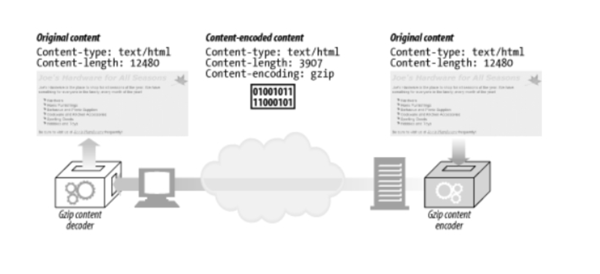
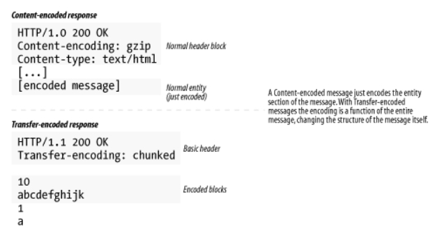
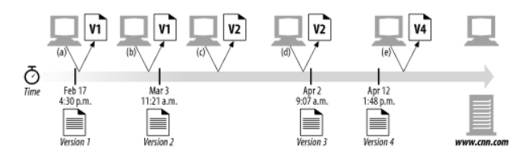

# 엔터티와 인코딩

HTTP는 수십억개의 메세지를 실어 나르고,  
올바르게 수송, 식별, 추출, 처리되는 것을 보장한다. (다음을 보장한다.)

- 객체는 올바르게 식별됨 (Content-Type, Content-Language)
- 객체는 올바르게 압축이 풀림(Content-Length, Content-Encoding)
- 객체는 항상 최신(엔티티 검사기, 캐시 만료 제어)
- 사용자의 요구를 만족(Accept)
- 네트워크 사이를 빠르고 효율적으로 이동(범위 요청, 델타 인코딩, 그 외의 데이터 압축)
- 조작되지 않고 온전하게 도착(전송 인코딩, Cotent-MD5 체크섬)

## 15.1 메시지는 컨테이너, 엔터티는 화물

HTTP 메시지 => 인터넷 운송시스템의 컨테이너  
HTTP 엔터티 => 메시지의 실직적인 화물
<br/>

**주요 엔터티 헤더 필드**

- Content-Type: 엔터티에 의해 전달된 객체의 종류
- Content-Length: 전달되는 메세지의 길이나 크기
- Content-Language: 전달되는 객체와 각장 잘 대응되는 자연어
- Content-Encoding: 객체 데이터에 대해 행해진 변형(압축 등)
- Content-Location: 요청 시점을 기준으로 객체의 또 다른 위치
- Content-Range: 이 엔티티가 전체의 어느 부분에 해당하는지
- Content-MD5: 엔티티 본문의 콘텐츠에 대한 체크섬
- Last-Modified: 서버에서 이 콘텐츠가 생성 혹은 수정된 날
- Expires: 엔터티 데이터가 더이상 신선하지 않다고 간주되기 시작한 날짜와 시각
- Allow: 리소스에 대해 허용되는 메소드

### 15.1.1 엔터티 본문

엔터티 본문 : 가공되지 않은 데이터  
헤더 : 그 외 다른 정보들  
=> 가공되지 않은 날 데이터(엔터티 본문)의 의미를 헤더를 통해 설명할 필요가 있다.

엔터티 본문은 헤더 필드의 끝을 의미하는 빈 CRLF줄 바로 다음부터 시작한다.

## 15.2 Content-Length: 엔터티의 길이

Content-Length : 엔터티 본문의 크기를 바이트 단위로 나타낸다. (만약 압축되었다면, 압축된 후의 크기를 표현한다.)  
Content-Length 헤더는 메세지가 잘렸거나, 잘못되었거나 지속 커넥션을 위해 필수로 필요하다.

### 15.2.1 잘림 검출

Content-Length가 없다면 클라이언트는 커넥션이 정상적으로 닫힌 것인지 메시지 전송 중에 서버에 충돌이 발생한 것인지 구분하지 못한다.  
메시지 잘림은 캐싱 프록시 서버에 특히 취약하다. 결함이 있는 콘텐츠를 저장하고 계속해서 제공하게 될 것.  
=> 위험을 줄이기 위해, 캐싱 프록시 서버는 Content-Length 헤더를 지니지 않은 HTTP 본문은 보통 캐싱하지 않는다.

### 15.2.4 콘텐츠 인코딩

HTTP는 엔터티 본문 인코딩을 통해 보안을 강화하거나 압축하여 공간을 절약한다.  
인코딩된 콘텐츠의 Content-Length 헤더는 원본이 아닌 **인코딩된 본문의 길이**를 바이트 단위로 정의한다.

### 15.2.5 엔터티 본문 길이 판별을 위한 규칙

엔터티 본문의 길이와 끝나는 위치를 바르게 판별하는 상황별 규칙들이다. (순서대로 적용)

1. 본문을 갖지 않는 특정 타입의 HTTP메시지는 Content-Length가 무시된다. (ex. HEAD)
2. Transfer-Encoding 헤더를 포함하고 있다면 메시지가 커넥션이 닫혀서 먼저 끝나지 않는 이상 엔티티는 '0 바이트 청크'라고 불리는 특별한 패턴으로 끝나야한다.
3. Content-Length 헤더를 갖는다면 Transfer-Encoding 헤더를 갖는 메시지는 반드시 Content-Length 헤더를 무시해야 한다.
4. 멀티파트 유형(multipart/byteranges)은 자신의 크기를 스스로 결정할 수 있는 유일한 엔티티 본문 유형
5. 위 어떤 규칙에도 속하지 않는다면 엔터티는 커넥션이 닫힐때 끝난다.

## 15.4 미디어 타입과 Charset

Content-Type 헤더 필드는 엔터티 본문의 MIME 타입을 기술한다. MIME타입은 전달되는 데이터 매체의 기저 형식의 표준화된 이름이다.

- text/html HTML 문서
- text/plain 플레인 텍스트 문서
- image/gif GIF 이미지
- image/jpeg JPEG 이미지
- audio/x-wav WAV 음향 데이터를 포함
- model/vrml 삼차원 VRML 모델
- application/vnd.ms-powerpoint 마이크로소프트 파워포인트 프레젠테이션
- mulipart/byteranges 여러 부분으로 나뉘는데, 각 부분은 전체 문서의 특정 범위를 담고 있다.
- message/http 완전한 HTTP 메시지

### 15.4.1 텍스트 매체를 위한 문자 인코딩

Content-Type 헤더는 내용 유형을 더 자세히 지정하기 위한 선택적인 매개변수도 지원한다.  
엔터티의 비트 집합을 텍스트 파일의 글자들로 변환하기 위한 'charset' 매개변수가 대표적인 예이다.  
`Content-Type: text/html; charset=utf-8`

### 15.4.2 멀티파트 미디어 타입

HTTP는 멀티파트 본문도 지원한다. 그러나 일반적으로는 폼을 채워서 제출할 때와 문서의 일부분을 실어 나르는 범위 응답을 할 때의 두 가지 경우에만 사용된다.  
MIME "멀티파트" 이메일 메시지는 서로 붙어있는 여러 개의 메시지를 포함하며, 하나의 복합 메시지로 보내진다.

### 15.4.3 멀티파트 폼 제출

멀티파트 본문은 여러 다른 종류와 길이의 값으로 채워진 폼을 허용한다.
HTTP 폼을 채워 제출하면, 가변 길이 텍스트 필드와 업로드 될 객체는 각각 멀티파트 본문을 구성하는 하나의 파트가 되어 보내진다.

## 15.5 콘텐츠 인코딩

HTTP는 때때로 콘텐츠를 보내기 전에 인코딩을 하려고 한다.

- 느린 속도로 연결된 클라이언트에게 큰 HTML문서를 전송하기 위해 압축
- 허가받지 않은 제3자가 볼 수 없도록 암호화하거나 뒤섞어서 전송

인코딩은 발송하는 쪽에서 콘텐츠에 적용한다.

### 15.5.1 콘텐츠 인코딩 과정



1. 웹서버가 원본 Content-Type과 Content-Length헤더를 수반한 원본 응답 메시지를 생성한다.
2. 콘텐츠 인코딩 서버(원서버 혹은 다운스트림 프락시)가 인코딩된 메시지를 생성한다. (인코딩된 메시지는 Content-Type은 같지만 Content-Length는 다르다.) 콘텐츠 인코딩 서버는 Content-Encoding 헤더를 인코딩된 메시지에 추가하여, 수신 측 애플리케이션이 그것을 디코딩할 수 있도록 한다.
3. 수신 측 프로그램은 인코딩된 메시지를 받아 디코딩하고 원본을 얻는다.

### 15.5.2 콘텐츠 인코딩 유형


gzip, compress, deflate 인코딩은 전송되는 메시지의 크기를 정보의 손실 없이 줄이기 위한 무손실 압축 알고리즘이다.  
이 중 gzip은 일반적으로 가장 효율적이고 가장 널리 쓰이는 압축 알고리즘이다.

### 15.5.3 Accept-Encoding 헤더

서버가 클라이언트가 지원하지 않는 인코딩을 사용하는 것을 막기 위해, 클라이언트는 자신이 지원하는 인코딩의 목록을 Accept-Encoding 요청 헤더를 통해 전달한다.
Accept-Encoding:\_ 이거나 헤더가 존재하지 않는다면 어떤 인코딩이든 받아들일 수 있는 것으로 간주한다.

`Accept-Encoding: gzip;q=1.0, identity;q=0.5, _;q=0`  
각 인코딩에 Q(quality)값을 매개변수로 더해 선호도를 나타낼 수 있다.  
(0.0 가장 원하지 않음 ~ 1.0 가장 선호함)

## 15.6 전송 인코딩과 청크 인코딩

콘텐츠 인코딩은 콘텐츠 포맷과 긴밀하게 연관되어 있다. (ex. 텍스트 파일은 gzip으로 압축하지만 JPEG 파일은 gzip으로 잘 압축되지 않기때문에 그렇게 하지 않는다.)

전송 인코딩 또한 엔터티 본문에 적용되는 변환이지만, 구조적인 이유 때문에 적용되는 것이며 콘텐츠의 포맷과는 독립적이다.


콘텐츠 인코딩된 메시지는 단지 메시지의 엔터티 부분만 인코딩한다.  
전송 인코딩된 메시지에서는 인코딩은 전체 메시지에 대해 적용되어 메시지 자체의 구조를 바꾼다.

### 15.6.1 안전한 전송

HTTP에서 전송된 메시지의 본문이 문제를 일으킬 수 있는 이유는 다음과 같다

- 알 수 없는 크기
  - 콘텐츠를 생성해야 메시지 본문의 최종 크기를 판단할 수 있는데, 그 사이즈를 알기 전에 데이터의 전송을 시작하려고 한다.
- 보안
  - 공용 전송 네트워크로 메시지 콘텐츠를 보내기 전에 전송 인코딩을 사용해 알아보기 어렵게 뒤섞어버리는 방법도 있다. (그러나 흔하지 않다.)

전송 인코딩은 다른 프로토콜에서도 네트워크를 통한 안전한 전송을 위해 존재했다.

### 15.6.2 Transfer-Encoding 헤더

전송 인코딩을 제어하고 서술하기 위한 헤더

- Transfer-Encoding : 안전한 전송을 위해 어떤 인코딩이 메시지에 적용되었는지 수신자에게 알려준다.
- TE : 어떤 확장된 전송 인코딩을 사용할 수 있는지 서버에게 알려주기 위해 요청 헤더에 사용한다.

HTTP/1.1명세는 청크 인코딩에 대해 Q(quality)값이 0.0을 갖는 것을 금지한다.

### 15.6.3 청크 인코딩

지속 커넥션에서는 반드시 Content-Length 헤더에 본문의 길이를 담아 보내줘야한다.  
그런데, 청크 인코딩을 이용하면 메시지를 보내기 전에 전체 크기를 알 필요가 없어진다.

메시지를 일정 크기의 청크 여럿으로 쪼갠다. (chunk : 큰 덩어리)

동적으로 본문이 생성되면서, 서버는 그 중 일부를 버퍼에 담은 뒤 그 한 덩어리를 그의 크기와 함께 보낼 수 있다. 본문을 모두 보낼 때까지 이 단계를 반복하여 서버는 크기가 0인 청크로 본문이 끝났음을 알리고 다음 응답을 위해 커넥션을 열린채로 유지할 수 있다.  
청크 인코딩은 전송 인코딩의 한 형태이며, 따라서 본문이 아닌 메시지의 속성이다.(<-> 멀티파트 인코딩)

### 15.6.5 전송 인코딩의 규칙

- 전송 인코딩의 집합은 반드시 'chunked'를 포함해야 한다. (예외, 메시지가 커넥션이 종료로 끝나는 경우)
- 청크 전송 인코딩이 사용되었다면 메시지 본문에 적용된 마지막 전송 인코딩이 존재해야한다.
- 청크 전송 인코딩은 반드시 메시지 본문에 한 번 이상 적용되어야 한다.

## 15.7 시간에 따라 바뀌는 인스턴스

같은 URL은 시간에 따라 다른 버전의 객체를 가리킬 수 있다.(웹 객체는 정적이지 않다.)  
  
HTTP 프로토콜은 어떤 특정한 종류의 요청이나 응답을 다루는 방법들을 정의하는데 이것은 인스턴스 조작이라고 하며 객체의 인스턴스에 적용한다. 대표적인 두 가지가 범위 요청과 델타 인코딩이다.

## 15.8 검사기와 신선도

리소스가 만료되면 클라이언트는 최신 사본을 서버에 요구해야한다.  
클라이언트가 서버에게 자신이 갖고 있는 버전을 말해주고 검사기를 사용해 사본 버전이 더 이상 유효하지 않을 때만 사본을 보내달라고 요청한다. => 조건부 요청

### 15.8.1 신선도

서버는 클라이언트에 얼마나 오랫동안 콘텐츠를 캐시하고 그것이 신선하다고 가정할 수 있는지에 대한 정보를 제공한다.

- Expires : 문서가 더 이상 신선하다고 간주할 수 없게 되는 정확한 날짜를 명시 (시계 동기화에 의존해야함)
- Cache-Control : 문서의 최대 수명을 문서가 서버를 떠난 후로부터 총 시간을 초단위로 정한다. (매우 강력)

### 15.8.2 조건부 요청과 검사기

캐시된 사본은 만료될 수 있지만 서버 콘텐츠는 여전히 캐시 콘텐츠와 같을 수 있다.  
만약 그럼에도 서버에서 같은 문서를 가져온다면 캐시는 네트워크의 대역폭을 낭비하고, 캐시와 서버에 불필요한 부하를 주고 모든 것을 느려지게 만들게 된다.

이를 해결하기 위해, HTTP는 클라이언트에게 리소스가 바뀐 경우에만 사본을 요청하는 조건부 요청이라는 방법을 제공한다.

**조건부 요청**  
평범함 HTTP요청 메시지이지만, 특정 조건이 참일때에만 수행한다.

```
Get /announce.html HTTP/1.0
If-Modified-Since: Sat, 29 Jun 2002, 14:30:00 GMT
```

=> 참 : 요청 수행 / 거짓 : HTTP 에러코드 반환

**검사기**  
각 조건부 요청은 특정 검사기 위에서 동작한다.  
검사기 : 문서의 테스트된 특정 속성

```
Get /announce.html HTTP/1.0
If-Modified-Since: Sat, 29 Jun 2002, 14:30:00 GMT
```

문서 인스턴스의 마지막 수정된 날짜를 검사하므로, 검사기 = 마지막 수정된 날짜

## 15.9 범위 요청

위를 통해, 클라이언트가 서버에게 리소스를 요청할 때 어떻게 자신이 갖고 있는 사본이 더 이상 유효하지 않을때만 새로 보내달라고 요청하는지 이해했다.  
추가로, HTTP는 클라이언트가 문서의 일부분이나 특정 범위만 요청할 수 있도록 해준다.

```
GET /bigfile.html HTTP/1.1
Host: www.joes-hardware.com
Range: bytes=4000-
User-Agent: Mozila/4.61 [en] (WinNT; I)
```

ex. 4000바이트 이후의 부분을 요청

범위 요청은 객체의 특정 인스턴스를 클라이언트와 서버 사이에서 교환하는 것이기 때문에 인스턴스 조작의 일종이라는 것에 주의해야 한다. 범위 요청은 오직 클라이언트와 서버가 같은 버전의 문서를 갖고 있을 때만 의미가 있다.

## 15.10 델타 인코딩

만약 클라이어트가 만료된 사본을 갖고 있다면, 최신 인스턴스를 요청해야한다.  
서버가 최신 인스턴스를 갖고 있다면 서버는 클라이언트에게 그 페이지를 보낼 것이고, 아주 일부분만 변경되었다 할지라도 전체 인스턴스를 새로 보낼 것이다.

그런데, 새 페이지 전체를 보내는 대신, 클라이언트의 사본에 대해 변경된 부분만을 서버가 보낸다면 클라이언트는 더 빨리 페이지를 얻을 수 있을 것이다.

**델타 인코딩**  
객체 전체가 아닌 변경된 부분에 대해서만 통신하여 전송량을 최적화하는 HTTP 프로토콜의 확장이다.  
델타 인코딩은 전송 시간을 줄일 수 있지만, 구현하기가 까다로울 수 있다.

ex. 변경이 잦고 많은 사람들이 접근하는 페이지의 경우, 클라이언트가 요청을 보냈을때 갖고 있는 사본과 최신 사본간의 차이점을 알아내기 위해 자신이 제공하는 페이지가 변경되는 매 순간의 사본을 모두 유지하고 있어야만 한다.  
=> 서버는 문서의 과거 사본을 모두 유지하기 위해 디스크 공간을 더 늘려야한다. 이는 전송량 감소로 얻은 이득을 금방 무의미하게 만들 것 이다.
