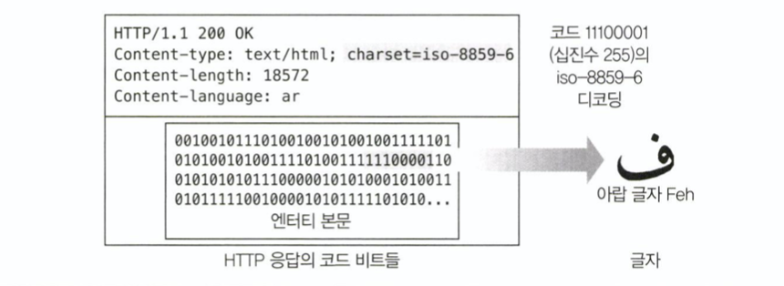
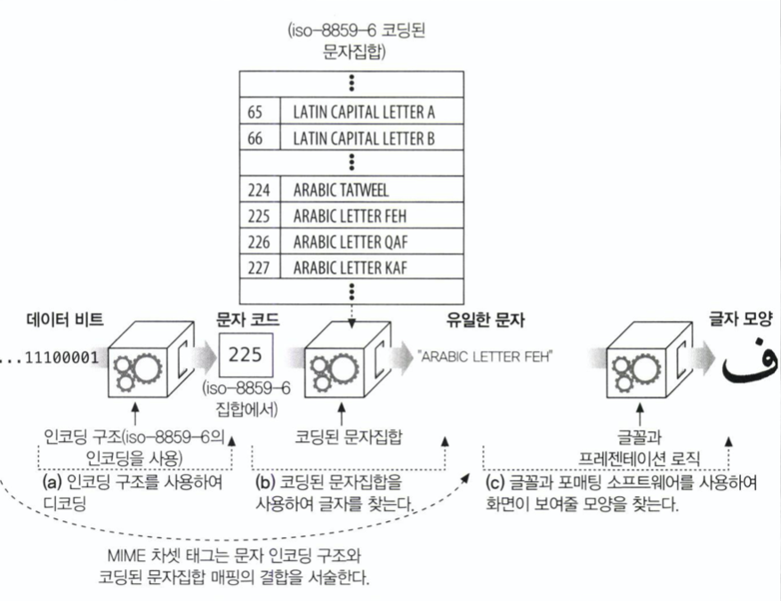

# 16장 국제화

## 16.1 국제적인 콘텐츠를 다루기 위해 필요한 HTTP 지원

- 서버는 클라이언트에게 문서의 문자와 언어를 `HTTP Content-Type charset` 매개변수와 `Content-Language` 헤더를 통해 알려준다.
- 동시에 클라이언트는 서버에게 사용자가 어떤 언어를 이해할 수 있고 어떤 알파벳의 코딩 알고리즘이 브라우저에 설치되어 있는지 `Accept-Charset`, `Accept-Language`를 통해 말해줘야 한다.
- 예시
  ```
  Accept-Language: fr, en;q=0.8 // 프랑스어 사용자, 모국어를 선호하지만 피치 못할 경우에는 영어도 사용
  Accept-Charset: iso-8859-1, utf-8 // 사용자의 브라우저는 ios-8859-1 서유럽어 차셋 인코딩과 UTF-8 유니코드 차셋 인코딩을 지원할 것이다.
  ```
  - `q=0.8`은 품질 인자(quality factor)로 기본값 1.0(프랑스어)보다 영어에 0.8로 낮은 우선순위를 주었다.

## 16.2 문자집합과 HTTP

웹 국제화에서 가장 중요하고 가장 헷갈리는, 국제 알파벳 스크립트와 그들의 문자집합 인코딩에 대해 알아보자.

### 16.2.1 차셋(Chatset)은 글자를 비트로 변환하는 인코딩이다.

- HTTP 차셋 값은 엔터티 콘텐츠 비트를 특정 문자 체계의 글자들로 어떻게 바꿀지 말해준다.
- 각 차셋 태그는 비트를 글자로 변환하거나, 그 반대의 일을 해주는 알고리즘을 명명한다.
- 차셋 태그는 등록된 MIME 문자집합에 표준화되어 있고, IANA가 관리한다(http://www.iana.org/assignments/character-sets)
- 예시
  ```
  Content-Type: text/html; charset=iso-8859-6
  ```
  - 수신자에게 콘텐츠가 HTML 파일임을 말해준다.
  - charset 매개변수는 수신자에게 8859-6 아랍 문자집합 디코딩 기법을 사용하여 콘텐츠 비트를 글자로 디코딩하라고 말해준다.
  - ios-8859-6 인코딩 구조는 8비트 값을 숫자와 구두점 및 다른 기호들을 포함하는 라틴 문자와 아랍 문자로 매핑한다.
  - 

### 16.2.2 문자집합과 인코딩은 어떻게 동작하는가

비트-문자 변환은 두 단계(16-2a, 16-2b)에 걸쳐 일어난다.



문자 시스템의 핵심 목표는 표현(시각적 표현 방식)에서 의미(글자)를 분리하는 것이다.  
HTTP는 문자 데이터 및 관련 언어와 차셋 라벨의 전송에만 관심을 갖고, 16-2c와 같이 글자 모양을 어떻게 표현할지는 사용자의 그래픽 디스플레이 소프트웨어(브라우저, 운영체제, 글꼴)가 결정한다.

### 16.2.3 잘못된 차셋은 잘못된 글자들을 낳는다

만약 클라이언트가 잘못된 charset 매개변수를 사용한다면, 클라이언트는 깨지거나 의도와 다른 글자를 보여주게 될 것이다.

### 16.2.4 표준화된 MIME 차셋 값

특정 문자 인코딩과 특정 코딩된 문자집합의 결합을

- MIME 차셋 = 특정 문자 인코딩 + 특정 코딩된 문자집합
- HTTP는 표준화된 MIME 차셋 태그를 Content-Type과 Accept-Charset 헤더에 사용한다.
- 브라우저에 의해 사용되는 MIME 차셋 인코딩 구조 목록 예시
  - us-ascii 1968년 표준화된 문자 인코딩
  - iso-8859-1 서유럽 언어 지원을 위한 ASCII 확장
  - iso-8859-6 아랍 문자를 포함하기 위한 ASCII 확장 등

### 16.2.5 Content-Type charset 헤더와 META 태그

```
Content-Type: text/html; charset=iso-2022-jp
```

웹 서버는 클라이언트에게 MIME 차셋 태그를 charset 매개변수와 함께 Content-Type 헤더에 담아 보낸다.
만약 문자 집합이 명시적으로 나열되지 않았다면, 수신자는 문서의 콘텐츠로부터 문자 집합을 추측하려 시도한다.

```
<META HTTP-EQUIV="Content-Type CONTENT="text/html; charset=iso-2022-jp">
```

문서가 HTML이 아니거나 Meta Content-Type 태그가 없다면, 소프트웨어는 언어와 인코딩에 대한 일반적인 패턴을 찾기 위해 실제 텍스트를 스캐닝하여 문자 인코딩을 추측한다.

### 16.2.6 Accept-Charset 헤더

- 대부분의 클라이언트가 모든 종류의 문자 코딩과 매핑 시스템을 지원하지는 않으므로, HTTP 클라이언트는 서버에게 클라이언트가 어떤 문자 체계를 지원하는지 Accept-Charset 요청 헤더를 통해 알려준다.
- Accept-Charset 헤더 값에는 클라이언트가 지원하는 문자 인코딩 목록이 포함된다.
  ```
  Accept-Charset: iso-8859-1, utf-8
  ```
  - 클라이언트가 서유럽 iso-8859-1 문자 시스템을 UTF-8 가변길이 유니코드 호환 시스템만큼 잘 받아들일 수 있음을 말해준다.

## 16.3 다중언어 문자 인코딩에 대한 지침

### 16.3.1 문자집합 용어

대표적인 여덟 개의 전자 문자 체계 용어

- 문자
- 글리프(glyph)
- 코딩된 문자(coded character)
- 코드 공간(coding space)
- 코드 너비(code width)
- 사용 가능 문자집합(charactor repertoire)
- 코딩된 문자집합(coded character set)
- 문자 인코딩 구조

### 16.3.2 '차셋(Charset)'은 형편없는 이름이다

엄밀히 말해, Content-Type charset 매개변수와 Accept-Charset 헤더에서 쓰이는 MIME 차셋 태그는 문자집합을 의미하는 것이 아니다. 이는 데이터 비트를 고유한 문자의 코드로 매핑하는 알고리즘의 이름이다. 즉, 문자 인코딩 구조와 코딩된 문자집합의 개념을 합친 것이다.

### 16.3.3 문자

- 쓰기의 기본적인 구성 요소이다.
- 하나의 문자는 하나의 알파벳 글자, 숫자, 구두점, 표의문자, 수학 기호 혹은 그 외 다른 쓰기의 기본 단위를 표현한다.
- 한 글자는 여러 가지 다른 쓰기 형태를 가질 수 있다.
- 같은 글자라도 단어에서 어디에 위치하느냐에 따라 각각 다른 모양을 갖기도 한다.

### 16.3.4 글리프(glyphs), 연자(ligatures) 그리고 표현 형태

- 글리프는 문자와는 다른, 각 글자를 그리는 특정한 방법이다.
- 그리고 많은 필기체 및 활자체가 인접한 글자들이 부드럽게 이어지는 연자를 지원한다.

### 16.3.5 코딩된 문자집합(Coded Character Set)

- 정수를 글자로 대응시킨다.
- 코딩된 문자집합은 보통 코드 번호로 인덱싱된 배열로 구현된다.
- 대표적인 코딩된 문자집합
  - US-ASCII
    - 모든 문자집합의 어머니
    - HTTP 메시지(헤더, URI 등)는 US-ASCII를 사용한다.
  - iso-8859
  - JIS X 0201 등이 있다.

### 16.3.6 문자 인코딩 구조

문자 인코딩 구조들은 숫자로된 문자 코드를 콘텐츠 비트로 변환한다.
크게 세 종류로 분류할 수 있다.

- 고정폭
  - 각 코딩된 문자를 고정된 길이의 비트로 표현한다. 처리가 빠르지만 공간 낭비의 우려가 있다. (8비트)
- 가변폭(비모달)
  - 문자 코드 번호마다 다른 길이의 비트를 사용한다. (UTF-8)
- 가변폭(모달)
  - escape 패턴을 사용한다. 처리가 복잡하지만 효과적이다.

## 16.4 언어 태그와 HTTP

- 언어에 이름을 붙이기 위한 짧고 표준화된 문자열이다. (pt-BR, en-US, ...)

### 16.4.1 Content-Language 헤더

- 엔터티가 어떤 언어 사용자를 대상으로 하는지 서술한다.
  ```
  Content-Language: fr // 프랑스어 사용자 대상
  ```
- 문서 뿐 아니라 특정 언어 사용자를 대상으로 하는 어떤 종류의 미디어(오디오 클립, 동영상, 애플리케이션)라도 이 헤더를 가질 수 있다.
- 여러 언어를 나열할 수 있다.

### 16.4.2 Accept-Language 헤더

- 우리의 언어 제약과 선호도를 웹서버에 전달하기 위해 사용한다.
- 웹 서버가 자원에 대해 여러 언어로 된 버전을 갖고 있을 때, 아래와 같이 요청할 수 있다.
  ```
  Accept-Language: es // 스페인어 선호
  ```

### 16.4.3 언어 태그의 종류

- 언어 태그는 문서화로 표준화된 문법을 갖고 있다.
- 언어 태그 예시
  - 일반적인 언어의 종류(es, kr, ...)
  - 특정 국가의 언어(en-GB, 영국 영어)
  - 방언(no-bok, 노르웨이어의 방언)
  - 지방어(sgn-US-MA, 마서스 비니어드 섬의 수화) 등

### 16.4.4 서브태그

- 언어 태그는 하이픈으로 분리된 하나 이상의 서브태그로 이루어져있다.


### 16.4.5 대소문자의 구분 및 표현

- 모든 태그는 대소문자를 구분하지 않는다. (en과 eN은 같다.)
- 관용적으로 언어에는 소문자, 국가에는 대문자를 사용한다.

### 16.4.6 IANA 언어 태그 등록

IANA에서 표준 언어 태그 목록을 관리한다.

## 16.5 국제화된 URI

오늘날 URI는 국제화를 그다지 지원하지 않으며, US-ASCII의 부분집합으로 구성되어 있다.

### 16.5.1 국제적 가독성 vs 의미 있는 문자들

- URI 설계자들은 조작, 공유를 쉽게 하기 위해 전 세계 대부분의 소프트웨어와 키보드에서 지원하는 매우 제한된 공통 문자집함(기본적인 라틴 알파벳 문자, 숫자 그리고 몇 개의 특수문자들)을 선택했다.
- 불행히도 라틴 알파벳을 인식조차 하지 못하는 전세계의 시민들이 기억하기에는 어렵다.

### 16.5.2 URI에서 사용될 수 있는 문자들

- 예약되지 않음
  - [A-Z][a-z][0-9]-\_.!~\*'()
  - 일반적으로 사용될 수 있다.
- 예약됨
  - ;/?:@&=+$,
  - 특별한 의미를 가지며, 일반적으로 사용될 수 없다.
- 이스케이프
  - % <HEX> <HEX>

### 16.5.3 이스케이핑과 역이스케이핑(unescaping)

- URL 이스케이프는 예약된 문자나 다른 지원하지 않는 글자들(스페이스와 같은)을 안전하게 URL에 삽입할 수 있는 방법을 제공한다.
- 이스케이프는 퍼센트 글자(%) 하나와 뒤이은 16진수 글자 둘로 이루어진 세 글자 문자열이다.(예: %20)
- 16진수 두 글자는 US-ASCII 문자의 코드와 매칭된다.
  - URL에 스페이스(아스키 32)를 삽입하고 싶다면, 이스케이프 %20을 사용할 수 있다. (20은 32의 16진법 표현이다.)

### 16.5.4 국제 문자들을 이스케이핑하기

- 이스케이프 값들은 US-ASCII 코드 범위(0-127)에 있어야 한다. 범위 밖의 국제 문자를 사용하면 어떤 애플리케이션에서는 문제를 유발할 수 있다.

### +) 이스케이핑 예시

1. **Spaces**: 스페이스는 URL에 허용되지 않으며 일반적으로 %20으로 대체된다.
   Spaces are not allowed in a URL and are typically replaced with %20.

- Original: 'Hello World'
- Escaped: 'Hello%20World'

2. **Special Characters**: '?', '&', '#', and '%'는 URL에서 특정한 의미를 갖는 문자이므로 쿼리 스트링이나 경로의 일부일 경우 반드시 이스케이핑되어야 한다.

- '?' (used to signify the start of a query string) is escaped as %3F.
- '&' (used to separate query parameters) is escaped as %26.
- '#' (used to indicate a fragment identifier) is escaped as %23.
- '%' (used for percent-encoding itself) is escaped as %25.  
  Example:
- Original: 'name=John Doe&age=30'
- Escaped: 'name=John%20Doe%26age%3D30'

3. **Slashes**: 일반적으로 슬래시('/')는 URL에서 경로 구분에 사용하지만, 쿼리 스트링이나 파라미터의 일부로 사용될 때는 이스케이핑 되어야 한다.

- Original: 'date=2023/02/27'
- Escaped: 'date=2023%2F02%2F27'

4. **Colons and Semi-colons**: 콜론(':')과 세미콜론(';')도 특정한 의미를 지닐 수 있으므로 특정 맥락에서는 이스케이핑 되어야 할 수 있다.

- Original: time=10:30am; meeting room
- Escaped: time=10%3A30am%3B%20meeting%20room

5. **Unicode Characters**: ASCII 범위 외의 문자는 그들의 UTF-8 방식에 의해 먼저 인코딩되고, 그 이후에 퍼센트 인코딩 된다.

- Original: こんにちは (Hello in Japanese)
- UTF-8 Encoded then Escaped: '%E3%81%93%E3%82%93%E3%81%AB%E3%81%A1%E3%81%AF'
