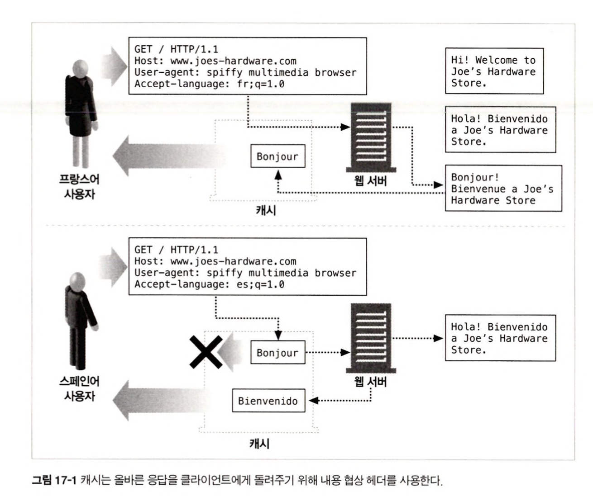
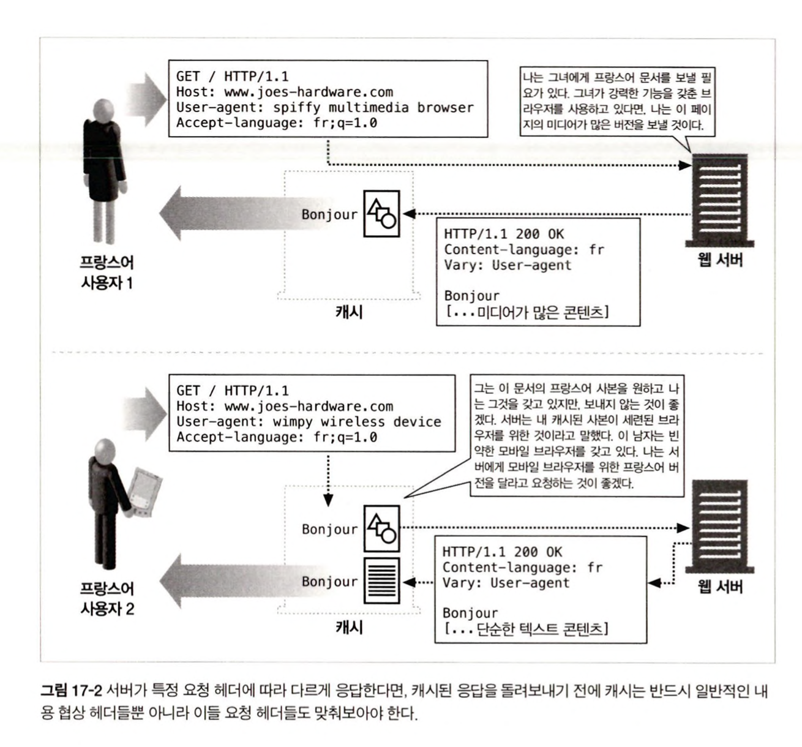
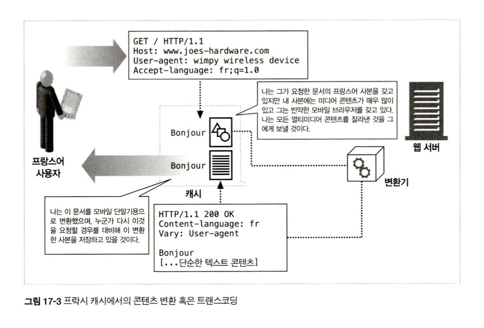

# 17. 내용 협상과 트랜스코딩

**웹 애플리케이션이 어떻게 내용 협상을 수행하는가?**

내용 협상(Content-negotiation) : 동일한 URL의 다국어 지원 등 여러 리소스 중 적합한 내용을 제공하는 방법

트랜스코딩: 특정 URL에 대해 클라이언트의 구형 디바이스 등을 판단하여 알맞는 페이지로 제공하는 방법

## 17.1 내용 협상 기법

1. 클라이언트에게 선택지를 주는 방법
2. 서버가 자동으로 판단하는 방법
3. 중개자에게 선택하도록 부탁하는 방법

| 기법            | 동작 방식                                                                                 | 장점                                                                                                                                                                                                           | 단점                                                                           |
| --------------- | ----------------------------------------------------------------------------------------- | -------------------------------------------------------------------------------------------------------------------------------------------------------------------------------------------------------------- | ------------------------------------------------------------------------------ |
| 클라이언트 주도 | 클라이언트가 요청을 보내면 서버는 클라이언트에게 선택지를 보내주고 클라이언트가 선택한다. | 서버 입장에서 가장 구현하기 쉽다. 클라이언트는 최선의 선택을 할 수 있다.                                                                                                                                       | 대기시간이 증가한다. 즉, 올바른 콘텐츠를 얻으려면 최소 두번의 요청이 필요하다. |
| 서버 주도       | 서버가 클라이언트의 요청 헤더를 검증해서 어떤 버전을 제공할지 결정한다.                   | 클라이언트 주도 협상보다 빠르다. HTTP는 서버가 가장 적적한 것을 선택할 수 있도록 q값 메커니즘을 제공하고, 서버가 다운스트림 장치에게 요청이 어떻게 평가되는지 말해줄 수 있도록 하기 위해 Vary 헤더를 제공한다. | 만약 결정이 뻔하지 않으면(헤더에 맞는 것이 없으면) 서버는 추측을 해야 한다.    |
| 투명            | 투명한 중간 장치(주로 프락시 캐시)가 서버를 대신하여 협상을 한다.                         | 웹 서버가 협상을 할 필요가 없다. 클라이언트 주도 협상보다 빠르다.                                                                                                                                              | 투명 협상을 어떻게 하는지에 대한 정형화된 명세가 없다.                         |

## 17.2 클라이언트 주도 협상

서버가 클라이언트의 요청을 받았을 때 제공 가능한 페이지의 목록을 응답으로 돌려주어 클라이언트가 보고 싶은 것을 선택하게 한다. 서버에게 있어 가장 쉬운 방법이고 최선의 사본이 선택될 것이다.

사용자가 결정을 하기 위해 대화창을 띄우고, 수동으로 클라이언트가 결정하게 하는데 소요된 증가된 대기시간과 페이지당 여러 번의 요청이 필요하다는 단점이 있다. 또, 여러개의 URL(주 페이지 하나와 각 특정 조건별 페이지들)을 요구한다.

- www.joes-hadware.com
- www.joes-hadware.com/english
- www.joes-hadware.com/french

클라이언트는 어느 페이지를 북마크를 할 것인가 ?

## 17.3 서버 주도 협상

클라이언트 주도 협상의 단점인 서버 ↔ 클라이언트 커뮤니케이션 증가를 줄이기 위한 한 방법은 서버가 어떤 페이지를 돌려줄 것인지 결정하게 하는 것이다. 클라이언트는 자신이 무엇을 선호하는지에 대한 충분한 정보를 서버에게 제공해야 한다.

### 17.3.1 내용 협상 헤더

클라이언트는 Accept 관련 헤더를 이용해서 자신의 선호 정보를 보낼 수 있다.

| 헤더            | 설명                                                |
| --------------- | --------------------------------------------------- |
| Accept          | 서버가 어떤 미디어 타입으로 보내도 되는지 알려준다. |
| Accept-Language | 서버가 어떤 언어로 보내도 되는지 알려준다.          |
| Accept-Charset  | 서버가 어떤 차셋으로 보내도 되는지 알려준다.        |
| Accept-Encoding | 서버가 어떤 인코딩으로 보내도 되는지 알려준다.      |

15장에서 이야기했던 엔터티 헤더들과 비슷하지만 분명히 다르다.

- 엔터티 헤더
  - 메시지를 서버에서 클라이언트로 전송 할 때 필요한 메시지 본문의 속성
- 내용 협상 헤더
  - 클라이언트와 서버가 선호 정보를 서로 교환하고 문서들의 여러 버전 중 하나를 선택하는 것을 도와, 클라이언트의 선호에 가장 잘 맞는 문서를 제공해주기 위한 목적

서버는 클라이언트의 Accept 관련 헤더들을 적절한 엔터티 헤더들과 짝을 지어준다.

| Accept 관련 헤더들 | 엔터티 헤더      |
| ------------------ | ---------------- |
| Accept             | Content-Type     |
| Accept-Language    | Content-Language |
| Accept-Charset     | Content-Type     |
| Accept-Encoding    | Content-Encoding |

HTTP는 상태가 없는 프로토콜 이기 때문에 클라이언트는 자신의 선호 정보를 반드시 매 요청마다 보내야 한다.

서버가 자동으로 돌려보낼 문서를 고르도록 하는 것은 클라이언트 주도 모델에서 협상을 위해 발생했던 추가 커뮤니케이션 대기시간을 줄여준다.

그러나 클라이언트가 원하는 문서가 서버에 없다면 ? 서버는 능력껏 추측하거나 클라이언트 주도 모델로 전환하여 클라이언트가 선택하도록 해야 한다.

다행히도 HTTP는 클라이언트가 선호하는 풍부한 설명을 품질값(quality value, 줄여서 q값)을 이용해 전달할 수 있는 메커니즘을 제공한다.

### 17.3.2 내용 협상 헤더의 품질값

HTTP 프로토콜은 클라이언트가 각 선호의 카테고리마다 여러 선택 가능한 항목을 선호도와 함께 나열할 수 있도록 품질값을 정의하였다.

- Accept-Language : en;q=0.5, fr;q=0.0, nl;q=1.0, tr;q=0.0

q값은 0.0 ~ 1.0 의 값을 가질 수 있다. 위의 예시에서 네덜란드어로 된 문서를 원하고 영어로 된 문서라도 받기를 원하며 프랑스어나 터키어는 원하지 않는 요청이다. 클라이언트의 선호에 대응하는 문서가 없다면 서버는 트랜스코딩된 문서를 내려줄 수도 있다.

### 17.3.3 그 외의 헤더들에 의해 결정

서버는 또한 User-Agent와 같은 클라이언트의 다른 요청 헤더들을 이용해 알맞은 요청을 만들어내려고 시도할 수 있다. 서버의 구현에 따라 서버는 정확한 대응을 찾아내거나 아니면 그냥 갖고 있는 것을 제공해주어야 한다. 캐시된 문서를 제공할 때 HTTP 프로토콜은 서버가 응답에 넣어 보낼 수 있는 Vary 헤더를 정의한다. Vary 헤더는 캐시에게(클라이언트나 그 외의 모든 다운스트림 프락시에게) 서버가 내줄 응답의 최선의 버전을 결정하기 위해서 어떤 요청 헤더를 참고하고 있는지 말해준다.

### 17.3.4 아파치의 내용 협상

아파치 웹 서버가 내용 협상을 지원하는 방법은 다음과 같다.

내용 협상은 웹 사이트 콘텐츠의 제공자에게 달려있다. 만약 색인 페이지를 여러 가지 버전으로 제공해주려고 한다면 콘텐츠 제공자가 각각의 버전에 해당하는 파일들을 아파치 서버의 적절한 디렉터리에 모두 넣어주어야 한다. 그 다음 둘 중 한 방법으로 내용 협상을 동작시킨다.

- 웹 사이트 디렉터리에서 베리언트(variant)를 갖는 웹 사이트의 각 URL를 위한 type-map 파일을 만든다. 그 type-map파일은 모든 배리언트와 그들 각각에 대응하는 내용 협상 헤더들을 나열한다.
- 아파치가 그 디렉터리에 대해 자동으로 type-map 파일을 생성하도록 하는 MultiViews 지시어를 켠다.

**_type-map 파일 사용하기_**

서버 설정 파일에 type-map 파일들을 위한 파일 접미사를 명시한 핸들러를 추가한다.

AddHandler type-map .var

```tsx
// joes-hardware.var
URI: joes-hardware.html

URI: joes-hardware.en.html
Content-Type: text/html
Content-Language: en

URI: joes-hardware.fr.de.html
Content-Type: text/html;charset=iso-8859-2
Content-Language: fr, de
```

**_MultiVeiws 사용하기_**

access.conf 파일의 적절한 절(<Directory>, <Location>, 혹은 <Files>)에 Options 지시어를 이용해서 웹 사이트를 포함한 디렉터리에 MultiViews를 반드시 켜야 한다. MuiltiViews가 켜져 있고 브라우저가 joes-hardware라는 이름의 리소스를 요청했다면 서버는 이름에 “joes-hardware”가 들어 있는 모든 파일을 살펴보고 그들에 대한 type-map을 생성한다.

### 17.3.5 서버 측 확장

서버에서 내용 협상을 구현하는 또 다른 방법으로, ASP와 같이 서버 쪽에서 확장을 하는 방법이 있다.

서버 측 확장의 개요가 필요하면 8장을 보라. 😡

## 17.4 투명 협상

클라이언트 입장에서 협상하는 중개자 프락시를 두고 클라이언트와의 메시지 교환을 최소화하는 동시에 서버 주도협상으로 인한 부하를 서버에서 제거한다. 프락시는 클라이언트의 요구사항을 파악하여 클라이언트의 입장에서 협상을 수행할 수 있는 능력이 있는 것으로 **가정된다**. 서버는 프락시에게 클라이언트의 어떤 요청 헤더를 검사해야 하는지 프락시에게 반드시 알려주어야 한다. HTTP/1.1 명세는 투명협상에 대한 어떠한 메커니즘도 정의하지 않았지만, Vary 헤더를 정의했다. 서버는 응답에 Vary 헤더를 포함시켜 보냄으로써 중개자에게 내용 협상을 위해 어떤 헤더를 사용하고 있는지 알려줄 수 있다.

### 14.4.1 캐시와 얼터네이트(alternate)



캐시는 캐시된 응답을 돌려줄 때 Accept 관련 헤더들과 각각의 요청에 최적의 응답을 해주기 위해 알맞게 넣어주는 엔티티 헤더들을 사용해야 한다.

**잘못된 예**

: 프랑스어 사용자가 프랑스어로된 문서 요청 → 캐시는 요청을 서버에 그대로 전달하고 응답을 저장 → 스페인어 사용자에게 캐시에 저장된 프랑스어로된 문서를 전달

**올바른 예**

: 스페인어 사용자에 대한 요청도 서버에게 그대로 전달하고 해당 문서에 대한 버전을 모두 저장 → 서버, 캐시 모두 요청 URL에 대해 두 개의 다른 문서를 갖는다.

다른 버전의 문서를 배리언트(variant), 얼티네이트(altinate)로 불린다. 내용 협상은 배리언트 중에서 클라이언트의 요청에 가장 잘 맞는 것을 선택하는 것이다.

### 17.4.2 Vary 헤더

HTTP Vary 응답 헤더는 서버가 문서를 선택하거나 콘텐츠를 생성할 때 고려한 클라이언트 요청 헤더 모두를 나열한다.

클라이언트 요청이 오면 캐시는,

1. 내용 협상 헤더를 통해 가장 알맞은 사본을 찾는다.
2. 서버 응답의 Vary 헤더 확인하여 새 요청과 오래된 요청이 맞는지 확인한다.
3. 맞는 사본이 없으면 캐시는 문서를 서버에서 가져온다.

따라서, 캐시는 각 배리언트마다 알맞은 문서 버전을 저장해야 한다.

아래와 같은 배리언트는 어마어마한 양의 사본을 만들어낸다.

> Vary: User-Agent, Cookie



## 17.5 트랜스코딩

서버가 클라이언트의 요구에 맞는 문서를 아예 갖고 있지 않다면 ?

- 일반적으로 에러로 응답한다.
- 서버는 기존의 문서를 클라이언트가 사용할 수 있게 변환할 수 있다. ⇒ 트랜스코딩

| 전                             | 후                                            |
| ------------------------------ | --------------------------------------------- |
| HTML문서                       | WML문서                                       |
| 고해상도 이미지                | 저해상도 이미지                               |
| 64K 색 이미지                  | 흑백 이미지                                   |
| 프레임을 포함한 복잡한 페이지  | 프레임이나 이미지가 없는 단순한 텍스트 페이지 |
| 자바 애플릿이 있는 HTML 페이지 | 자바 애플릿이 없는 페이지                     |
| 광고가 있는 페이지             | 광고가 없는                                   |

### 17.5.1 포맷 변환

- 클라이언트가 데이터를 볼 수 있도록 다른 포맷으로 변환하는 것
  > WAP(?) 환경에서 동작하는 오래된 단말기에 HTML 문서를 접근한다면 WML로 변환
- User-Agent 헤더나 내용 협상 헤더에 의해 주도된다.
- 콘텐츠를 특정 접근 장치에서 볼 수 있도록 하는 것으로, 효율적이고 안전한 콘텐츠 전송을 위한 콘텐츠 인코딩, 전송 인코딩과는 다른 것이다.

### 17.5.2 정보 합성

- 문서에서 광고 및 로고를 제거한 정보의 **요점을 추출**하는 것
- 키워드에 기반하여 문서의 핵심을 요약하고 페이지를 분류하는 기술은 자동화된 웹페이지 분류 시스템에 의해 사용된다.

### 17.5.3 콘텐츠 주입

- 특정 사용자를 대상으로 동적으로 매력적인(짜증나는) 자동 광고 삽입
- 사용자 추적 시스템을 통해 사용자의 웹 경로 통계를 수집하기 위해 동적으로 콘텐츠를 추가

### 17.5.4 트랜스코딩 vs. 정적으로 미리 생성해놓기

- 트랜스코딩의 대안은 웹 서버에서 웹페이지의 여러 가지 사본을 만들어 놓는 것
  - 페이지의 사소한 변화가 있어도 여러 사본이 새로 복제되어야 함
  - 모든 버전의 페이지들을 관리하기 위해 더 많은 공간이 필요
  - 페이지들을 관리하고 올바른 것을 제공해야 하는 어려운 로직의 웹 서버를 프로그래밍 해야 함
  - 광고 삽입 등의 동적인 트랜스코딩은 정적으로 제공이 불가
- 루트 페이지를 요청에 맞게 필요에 따라 변환하는 것이 정적인 것보다 효율적
  - 콘텐츠 제공에 있어 대기시간 증가로 인한 비용 증가
  - 프락시나 캐시에 있는 외부 에이전트에 의해 웹 서버의 부하를 줄여야 함



## 17.6 다음 단계

Accept나 Content 관련 헤더에서 내용 협상이 완료되지 않는 이유

- HTTP의 내용 협상은 성능 제약을 초래한다.
  - 적절한 콘텐츠를 제공하기 위해 variant 탐색하거나 추측 하는 것은 비용이 크다
  - 간소화할 수 있을까?
- HTTP는 내용 협상이 필요한 유일한 프로토콜이 아니다.
  - 미디어 스트리밍과 팩스는 클라이언트의 요청에 대해 최적의 답을 어떻게 내릴 것인가?
  - TCP/IP 응용 프로토콜 위에서 내용 협상이 가능할까?
