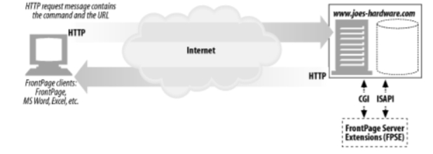
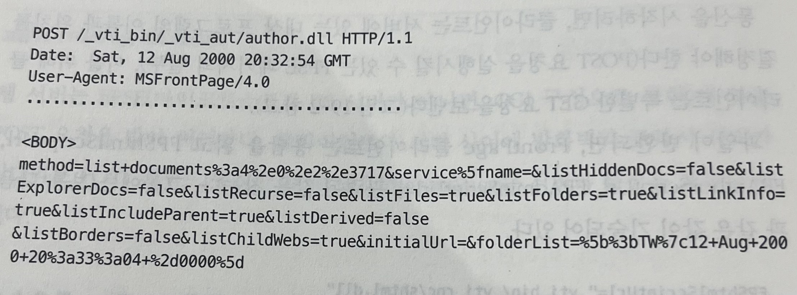
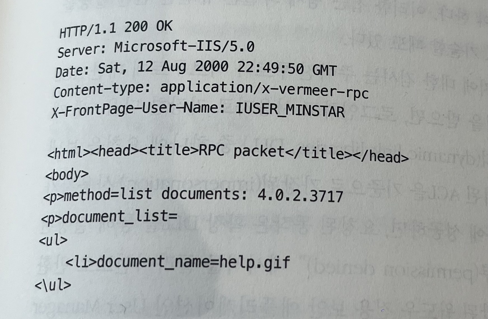
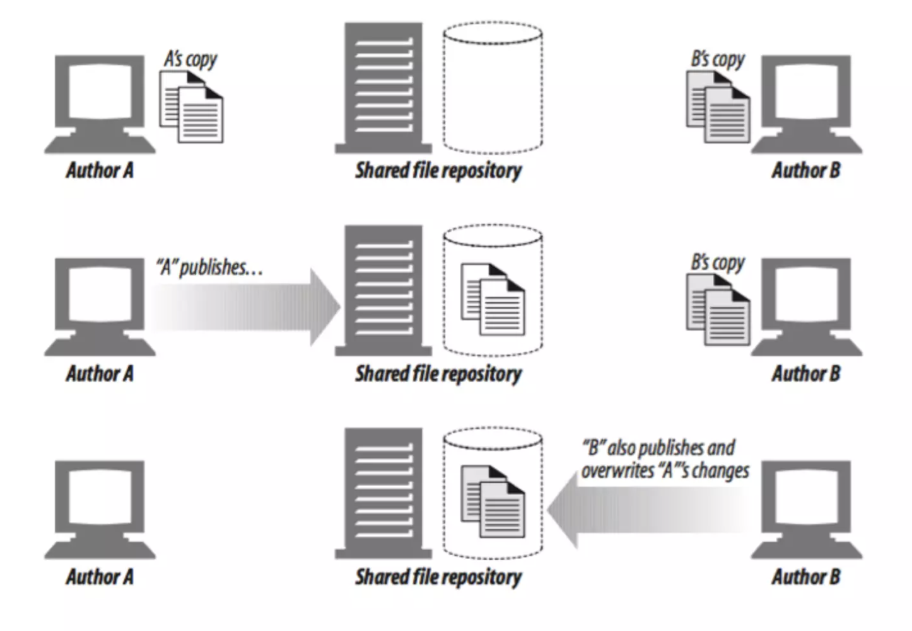

# 19. 배포시스템

- 웹의 암흑기의 배포방식(1995)
  - HTML을 텍스트편집기에서 수작업 개발 > FTP를 통해 웹 서버에 올림
  - 협업하기 어렵고 보안에 취약
- 현대의 배포방식
  - 현대의 배포 도구를 이용하면 웹 콘텐츠의 생성, 배포, 관리를 더 쉽게 할 수 있다. 이제 웹 콘텐츠를 화면에서 직접 보면서 작성할 수 있고, 단 한 번의 클릭으로 모든 파일이 하나씩 배포되고 있다는 알림을 받으면서 서버에 콘텐츠를 배포할 수 있다.

HTTP에 기반을 둔 웹 콘텐츠 배포 기술인 FrontPage와 DAV에 알아볼 예정이다.

## 19.1 배포지원을 위한 FrontPage(FP) 서버 확장

### FrontPage(FP)

다양한 기능을 제공하는 마이크로소프트사의 웹 개발 및 배포 도구 집합  
FrontPage의 최신 버전은 FrontPage 2003으로 열 한번째 버전이고, 이 버전을 마지막으로 FrontPage 개발을 중단했다.

### 19.1.1 FrontPage 서버 확장

"어디서든 배포한다" 전략의 하나로, MS사는 FrontPage 서버 확장(FrontPage Server Extention, FPSE)이라는 서버 측 소프트웨어 제품군 출시했다.

FP 클라이언트와 FPSE 사이에서 사용하는 FrontPage 배포 프로토콜은 HTTP POST 요청 위에 RPC 계층을 구현했다. 이를 이용하면 웹 사이트에 있는 문서를 갱신하고, 검색을 수행하고, 웹 개발자들 간에 공동 작업을 할 수 있게 FrontPage 클라이언트가 서버에 명령을 보낼 수 있다.



웹 서버는 FPSE에 맞춘 POST 요청을 받아 처리한다. 클라이언트와 서버 사이에 방화벽과 프락시 서버가 있더라도 POST 메서드 통신만 할 수 있으면 FrontPage는 서버와 통신을 계속할 수 있다.

### 19.1.2 FrontPage 용어

#### 가상서버

같은 서버에 올라가 있는 여러 웹사이트는 각각 유일한 도메인 이름과 IP주소를 가진다.  
가상서버는 웹 서버 한개에서 웹 사이트 여러개를 호스팅하며, 각 사이트는 브라우저에서 자체 전용 서버가 있는 것 처럼 보인다.

- 가상 서버를 지원하는 웹 서버를 다중호스팅 웹 서버라고 부른다.
- 여러개의 IP주소로 구성된 장비는 다중-홈 서버라고 부른다.

#### 루트 웹

보통 웹 서버의 최상위 콘텐츠 디렉터리이거나 다중 호스팅 환경에서 가상 웹 서버의 최상위 콘텐츠 디렉터이다. 루트웹에 접근하려면 페이지명을 기술하지 않고 서버의 URL만 기술하면 된다. 웹 서버에는 오직 한개의 루트웹만 있다.

#### 서브 웹

루트웹의 하위디렉터리거나 완전한 FPSE 확장 웹인 다른 서브 웹의 하위디렉터리이다

### 19.1.3 FrontPage RPC 프로토콜

FP클라이언트와 FPSE는 자체 RPC 프로토콜을 사용해 통신한다. 이 프로토콜은 RPC 메서드와 그와 관련한 변수를 POST 요청의 본문에 기술해서 HTTP POST를 감싼다.

#### 요청

POST 요청의 본문에는 "`method=<command>`" 형식의 FPSE에 보내는 RPC 명령과 함께 필요한 모든 매개변수가 기술되어 있다.



```
method=list+documents:4.0.1.3717
&service_name=
&listHiddenDocs=false
&listExplorerDocs=false
```

- service_name  
  메서드가 수행되어야 하는 웹 사이트의 URL 폴더나 한단계 아래 폴더가 존재해야만 한다.
- listHiddenDocs  
  'true' : 웹에 있는 숨겨진 문서가 보인다.  
  'hidden'문서는 '\_'로 시작하는 경로 컴포넌트가 기술된 URL이다.
- listExplorerDocs  
  'true':태스크 리스크를 나열

#### 응답

RPC 프로토콜은 메서드 대부분은 반환 값이 있다. 가장 일반적인 반환값은 성공 메서드와 에러다.



## 19.2 WebDAV와 공동 저작

웹 분산 저작과 버저닝(Web Distributed Authoring and Versioning, WebDAV)은 공동 저작에 적합한 플랫폼을 제공하기 위한 HTTP의 확장이다. 예를 들어 다국적 다언어를 지원하는 웹 사이트를 배포한다면 잠금(locking)기능과 버저닝 같은 공동 작업 기능에 안전하고 믿을 만한 배포 기능까지 갖춘 탄탄한 시스템이 필요할 것이다.

(이 책의 현재 활발한 협업 관련 기술 > SVN)

...

### 19.2.16 WebDAV의 미래

WebDAV는 현재도(?) 잘 지원되고 있다.

클라이언트 : IE 5.x이상(!!!!), 윈도우 익스플로러, 마이크로소프트 오피스  
서버 : IIS 5.x이상, mod_dav가 적용된 아파치, 그 외 다수..  
윈도우 XP(!!!!!)와 Mac OS 10.x(!!!!)는 특별히 WebDAV를 지원한다.

...

### 19.2.1 WebDAV메서드

WebDAV가 추가한 새로운 메서드

- PROPFIND : 리소스의 속성을 읽음
- PROPPATCH : 한 개 이상의 리소스에 대해 한 개 이상의 속성을 설정
- MKCOL : 콜렉션 생성
- COPY : 특정 원본지에서 특정 목적지로 리소스나 리소스의 집합을 복사
- MOVE : 특정 소스에서 특정 목적지에 리소스나 리소스의 집합을 이동
- LOCK : 하나 이상의 리소스를 잠금
- UNLOCK : 기존에 잠겨있는 리소스를 잠금 해제

수정한 HTTP 메서드

- DELETE
- PUT
- OPTIONS

### 19.2.2 WebDAV와 XML

요청과 응답 관련 정보를 보통 메세지 헤더에 담아 전달하는데, 이것은 하나의 요청에 있는 여러개 리소스나 계층 관계에 있는 리소스들에 대한 정보를 헤더에 선택적으로 기술하기 어려운 점 등 한계가 있다.  
WebDAV는 이 문제를 해결하려고 XML을 지원한다. XML은 구조화된 데이터를 표현할 때 사용하는 포맷으로, 메타 마크업 언어다.

WebDAV는 XML을 다음과 같은 용도로 사용한다.

- 데이터를 어떻게 처리할 것인지 설명하는 명령 포맷
- 서버의 복잡한 응답을 표현하는데 사용하는 포맷
- 콜렉션과 리소스를 처리하는데 사용하는 커스텀 정보 포맷
- 데이터 자체를 표현할 수 있는 유연한 포맷
- 대부분의 국제화 관련 문제에 대한 훌륭한 해결책

### 19.2.3 WebDAV 헤더

WebDAV는 새로운 메서드들의 기능을 더 넓혀주는 여러 HTTP 헤더를 도입했다.

#### DAV

WebDAV를 제공하는 서버와 통신할 때 사용.

```
DAV = "DAV" ":" "1" ["," "2"] ["," 1#extend]
```

#### Depth

여러 수준의 계층 구조로 분류된 리소스에 제공할 범위를 나타냄  
Depth헤더를 사용하는 메서드 : LOCK, COPY, MOVE

```
Depth = "Depth" ":" ("0" | "1" | "infinity")
```

#### Destination

COPY와 MOVE 메서드가 목적지 URI를 식별하는데 쓰임

```
Destination = "목적지" ":" 절대 URI
```

#### If

조건 집한을 정의한다.  
사용하는 메서드 : PUT, COPY 등..

#### Lock-Token

제거되어야 할 잠금을 명시하는 용도로 UNLOCK 메서드에서 사용한다.

#### ++...

### 19.2.4 WebDAV 잠금과 덮어쓰기 방지

공동작업과 관련된 문제



이 문제를 개선하기 위해 WebDAV는 잠금이라는 개념을 지원하지만, 잠금 자체는 그 문제에 대한 완벽한 해결책은 아니다. 완벽한 해결책을 만들려면 버저닝과 메세징을 지원해야 한다.

#### WebDAV가 지원하는 잠금 형식

- 리소스나 콜렉션에 대한 배타적 쓰기 잠금
  - 잠금 소유자만 쓸 수 있다. 이 잠금 형식은 잠재적인 충돌을 완벽히 제거한다.
- 리소스나 콜렉션에 대한 공유된 쓰기 잠금
  - 그룹이 하나의 문서에서 작업할 수 있게 한다.

### 19.2.5 LOCK 메서드

한개의 LOCK 요청으로 여러개의 리소스를 잠글 수 있다.  
WebDAV잠금은 클라이언트가 서버에 연결되어있지 않아도 된다.

### 19.2.6 UNLOCK 메서드

리소스에 있는 잠금을 해제한다. 1. 다이제스트 인증을 성공적으로 완료, 2. Lock-Token 헤더에 보내는 잠금 토큰이 맞는지 검사 => WebDAV에서 UNLOCK이 성공  
만약 잠금 해제에 성공한다면 204 No Content 상태 코드를 클라이언트에 반환

### 19.2.7 속성과 META데이터

속성 -> 저작자 이름, 수정한 날짜, 내용 등급 등 리소스의 정보를 기술  
META 태그 -> 콘텐츠 일부로써 그 정보들을 포함하는 메커니즘을 제공

###PROPFIND메서드
