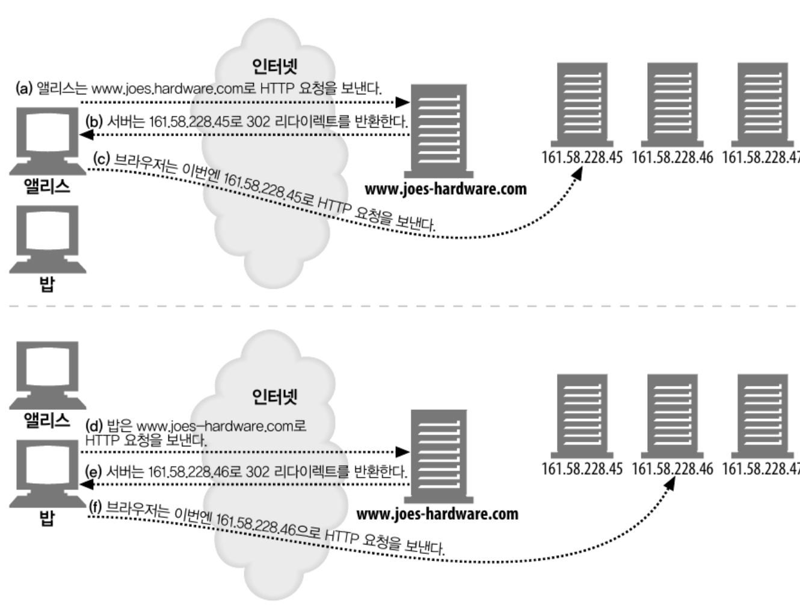
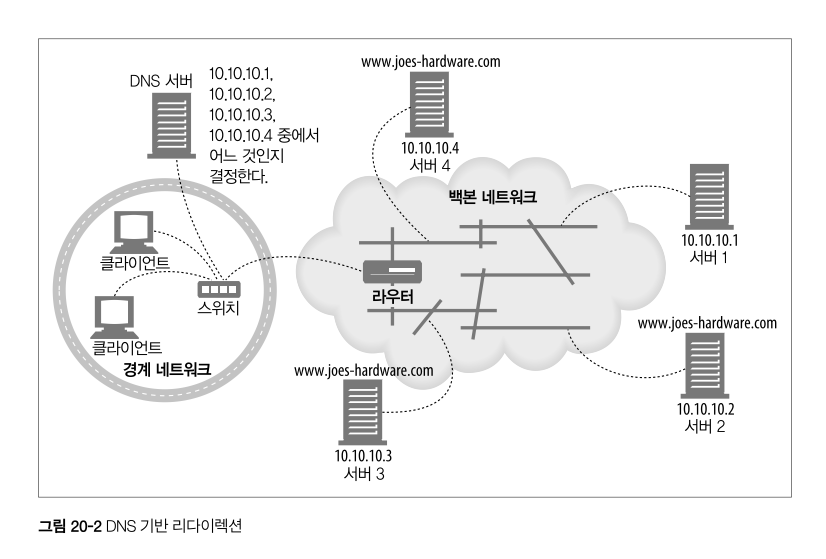
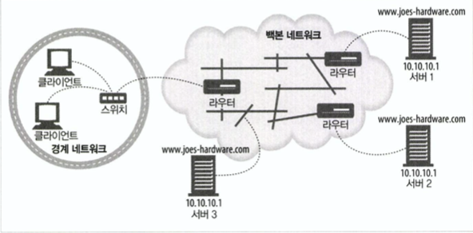
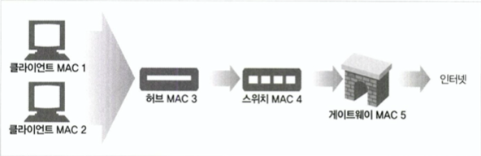
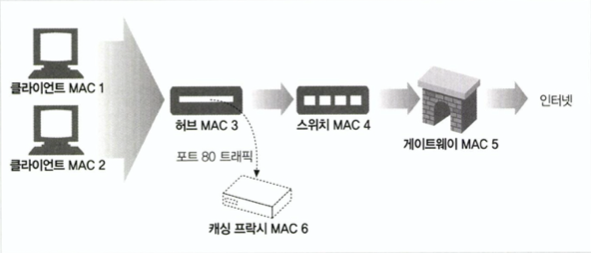
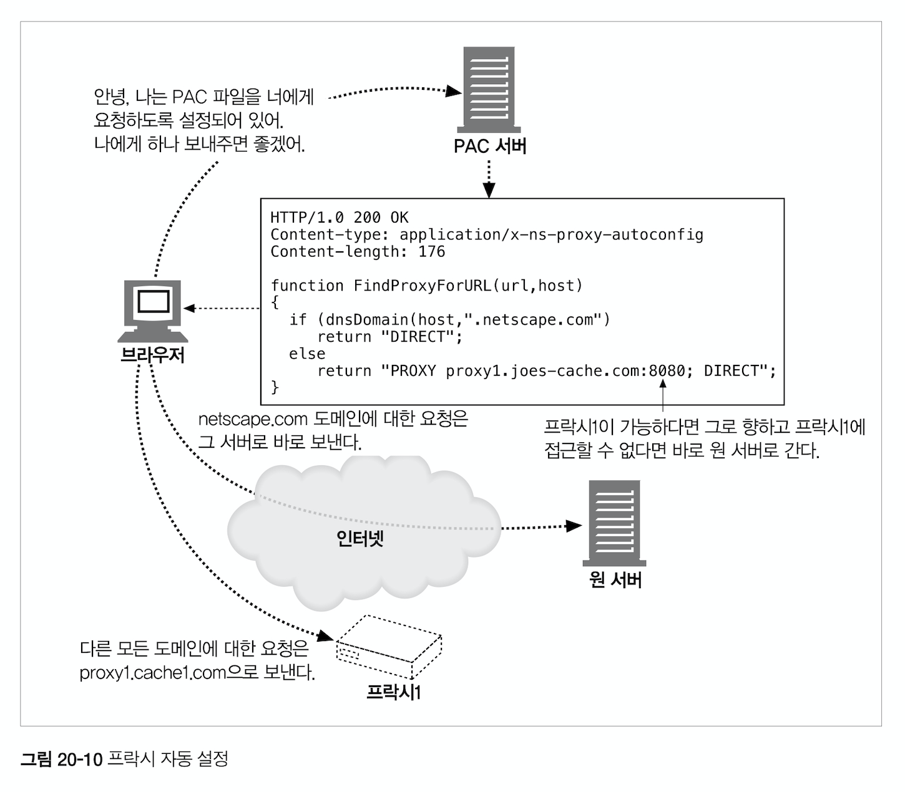

# 20장 리다이렉션과 부하 균형

리다이렉션 기술은 HTTP 메시지의 최종 목적지를 결정하는 네트워크 도구, 기법, 프로토콜을 말한다.  
리다이렉션 기술은 보통 메시지가 프락시, 캐시, 서버 팜의 특정 웹 서버 중 어디에서 끝나는지 판별하기 위해 사용한다.  
이 장에서 우리는 다양한 리다이렉션 기법들과 동작 방식, 어떤 부하 균형(load-balancing) 능력을 갖고 있는지 살펴본다.

## 20.1 왜 리다이렉트인가?

현대의 웹에서 리다이렉션은 피할 수 없는 현실이다.  
HTTP 애플리케이션은 언제나 다음 세 가지를 원하는데 

- 신뢰할 수 있는 HTTP 트랜잭션의 수행
- 지연 최소화
- 네트워크 대역폭 절약

이 이유들 때문에 흔히 여러 장소에 배포된다. 이렇게 하면 
- 한 곳에서 실패한 경우 다른 곳을 이용할 수 있어 신뢰성이 개선된다.
- 클라이언트가 더 가까운 리소스에 접근할 수 있게 되어 응답 시간도 줄여준다.
- 서버가 분산되므로 네트워크 혼잡도 줄어든다.

그리하여 리다이렉션이란 최적의 분산된 콘텐츠를 찾는 것을 도와주는 기법의 집합이라고 생각할 수 있다.

리다이렉션의 구현에는 부화 균형의 과제가 포함된다.  
대부분의 리다이렉션 장치들은 몇 가지 방식의 부하 균형을 포함하여, 들어오는 메시지의 부하를 서버 집합에게 분산할 수 있다.

## 20.2 리다이렉트 할 곳
서버, 프락시, 캐시, 게이트웨이는 클라이언트로부터 받는 HTTP 요청을 처리한다는 관점에서 보면, 클라이언트 입장에서는 모두 서버라고 할 수 있다.  
이들이 공통적으로 서버의 특성을 갖고 있기 때문에, 많은 리다이렉션 기법이 이들 모두에서 동작한다.

서버로의 리다이렉트란 휘발유를 찾는 모든 운전기사를 가장 가까운 주유소로 보내주는 것과 같다.   
그리고 프락시로의 리다이렉트는 주 진입로의 트래픽을 근처에 있는 지름길로 빨아들이는 것과 같다.

## 20.3 리다이렉션 프로토콜의 개요 
리다이렉션의 목표는 HTTP 메세지를 가용한 웹 서버로 가급적 빨리 보내는 것이다. 

브라우저 설정, DNS, TCP/IP 라우팅, 그리고 HTTP는 모두 메시지를 리다이렉트하는 메커니즘을 제공한다.

DNS 리다이렉션을 비롯한 대부분의 기법들이 트래픽을 보내려는 곳이 어떤 서버냐에 관게 없이 사용될 수 있는 것에 반해  
브라우저 설정과 같은 방법응느 프락시로 향하는 리다이렉트 트래픽에 대해서만 사용할 수 있다. 

## 20.4 일반적인 리다이렉션 방법 

- 서버와 프락시 양쪽에서 공통으로 쓰이는 리다이렉션 방법 
- 트래픽을 더 최적잉ㄴ 서버나 프랑시를 통해 벡터 트래픽으로 리다이렉트 하기 위해 사용될 수 있다.

### 20.4.1 HTTP 리다이렉션
웹 서버들은 다른 곳에 요청을 보내라고 말해주는 짧은 리다이렉트 메시지를 클라이언트에게 돌려줄 수 있다.  
몇몇 웹 사이트는 HTTP 리다이렉션을 통해 간단하게 부하를 분산한다.  
요청을 처리하는 서버(리다이렉팅 서버)는 부하가 가장 적은 콘텐츠 서버를 찾아서 브라우저의 요청을 그 서버로 리다이렉트 한다. 

HTTP 리다이렉션이 갖는 장점 중 하나는 리다이렉트를 하는 서버가 클라이언트의 아이피 주소를 알아서 이론적으로 조금 더 정보에 근거해 서버를 선택할 수 있다는 점이다. 



- 서버의 리다이렉트 메시지 예시 
```
HTTP/1.0 302 Redirect
Server: Stronghold/2.4.2 Apache/1.3.6
Location: http://161.58.228.45/hammers.html
```

HTTP 리다이렉션의 단점
- 어떤 서버로 리다이렉트할지 결정하려면 원 서버는 상당히 많은 처리를 해야 한다.
- 페이지에 접근할 때마다 두 번의 왕복이 필요하기 때문에, 사용자가 더 오래 기다려야 한다.
- 리다이렉트 서버가 고장 나면, 사이트로 고장 난다.

이러한 약점 때문에, HTTP 리다이렉션은 보통 다른 기법과 조합하여 사용된다.

### 20.4.2 DNS 리다이렉션
DNS 분석자는 여러 아이피 주소를 반환하도록 설정되거나 프로그래밍 될 수 있다. 
분석자가 어떤 아이피 주소를 반환할 것인가를 결정하는 방법은 단순한 것(라운드 로빈)부터 복잡한 것(여러 서버의 로드를 검사해서 로드가 가장 적은 서버의 아이피 주소를 반환하는 것)까지 다양하다.



- DNS 라운드 로빈  
  - 가장 흔한 동시에 가장 단순한 리다이렉션 기법
  - 웹 서버 팜 전체에 대한 부하의 규형을 유지하기 위해 DNS 호스팅명 분석을 사용한다. 
  - 서버에 대한 클라이언트의 상대적인 위치나 서버의 현재 스트레스를 고려하지 않는다.

```
DNS 라운드로빈은 도메인 이름에 대해 여러 개의 A 레코드(또는 AAAA 레코드)를 DNS 설정에 추가함으로써 작동합니다. 예를 들어, example.com 도메인이 서버 A, B, C에 각각 대응되는 세 개의 IP 주소를 가지고 있다고 가정해 보겠습니다.

서버 A: 192.0.2.1
서버 B: 192.0.2.2
서버 C: 192.0.2.3

사용자가 example.com에 접근하려고 할 때, DNS 서버는 이 세 개의 IP 주소 중 하나를 선택해 사용자에게 반환합니다. 다음 사용자가 동일한 요청을 하면, DNS 서버는 다음 순서의 IP 주소를 반환합니다. 이런 식으로 각 요청에 대해 순차적으로 다른 서버의 IP 주소가 반환되어, 부하가 여러 서버에 균등하게 분산됩니다.
```

### 20.4.3 임의 캐스트 어드레싱

여러 지리적으로 흩어진 웹 서버들은 정확히 같은 아이피 주소를 갖고 클라이언트의 요청을 클라이언트와 가장 가까운 서버로 보내주기 위해 
백본 라우터의 '최단거리' 라우팅 능력에 의지한다.

이 방법은 각 웹서버가 자신을 인접한 백본 라우터를 향하는 라우터라고 광고하는 방식으로 동작한다.  
웹 서버는 라우터 통신 프로토콜을 이용해 자신과 인접한 백본 라우터와 대화한다. 


- 세 서버가 같은 아이피 주소를 향하고 있다. 
- 서버는 이 주소를 라우터에서 광고한다. 
- 서버가 라우터 프로토콜을 사용해 라우터와 통신한다.
- 라우터는 10.10.10.1을 향한 클라이언트의 요청을, 그 주소를 광고한 가장 가까운 서버로 라우팅한다.

### 20.4.4 아이피 맥 포워딩

이더넷 네트워크에서, HTTP는 패킷의 형태로 보내지며, 각 패킷은 레이어-2, 레이어-4 주소를 갖고 있다.  
레이어-2 주소는 미디어 접근 컨트롤(MAC) 주소이다.  
레이어-4 주소는 출발지와 목적지의 아이피 주소 + TCP 포트번호로 이루어져있다.  

레이어-2를 감지하는 장비(보통 스위치나 허브)는 특정 맥 주소의 패킷을 받아서 포워딩한다.

  
- 그림의 레이어-2 스위치는 맥 주소 'MAC3'에서 오는 모든 트래픽을 맥 주소 'MAC4'로 보내도록 프로그래밍되어 있다.

레이어-4를 이해하는 스위치는 레이어-4 주소를 검사하여 이 정보로 라우팅을 한다. (프락시로 보내는 등)

- 그림의 스위치는 모든 80번 포트 트래픽을 MAC3에서 MAC6(프락시 캐시)로 보내도록 프로그래밍되어 있다.
- 레이어-4 스위치는 요청을 여러 프락시 캐시로 보내서 그들 간의 부하 균형을 유지할 수 있다.

MAC 주소 포워딩은 점 대 점으로만 가능하기 때문에, 서버와 프락시는 스위치가 한 홉 거리에 위치해야 한다.

### 20.4.5 아이피 주소 포워딩
아이피 주소 포워딩은 스위치 등의 레이어-4를 이해하는 장비가 들어오는 패킷에 대해 TCP/IP 어드레싱을 검증하고 패킷을 목적지 맥 주소가 아니라 목적지 아이피 주소의 변경에 따라 라우팅하는 것이다. 

맥 포워딩보다 좋은 점은 목적지 서버가 한 홉 거리에 있을 필요가 없다는 것이다. 
그러나 이 방식일 때, 스위치는 반드시 클라이언트로 부터 들어온 TCP 커넥션과 같은 커넥션으로 응답을 돌려주어야 한다. 

```
IP 포워딩은 라우터가 패킷의 목적지 IP 주소를 검사하고, 해당 주소로 패킷을 전송하기 위해 적절한 네트워크 인터페이스를 결정하는 과정을 포함합니다. 라우터의 라우팅 테이블(routing table)은 다양한 목적지에 패킷을 전송하기 위해 사용할 수 있는 경로를 저장하고 있으며, 이 테이블을 참조하여 패킷을 어디로 보낼지 결정합니다.
```

### 20.4.6 네트워크 구성요소 제어 프로토콜(NECP)
- SE: 웹 서버나 프락시 캐시와 같이 애플리케이션 계층 요청을 처리하는 서버 구성요소
- NE: 아이피 패킷을 전달하는 라우터나 스위치 같은 네트워크 구성요소

네트워크 구성요소 제어 프로토콜은 SE와 NE가 대화할 수 있게 해 준다.  
SE는 NE에게 부하 균형 정보를 제공할 수 있는 방법을 제공하여, NE가 부하 균형을 유지할 수 있도록 한다.

여기까지 일반 리다이렉션 방법

## 20.5 프락시 리다이렉션 방법 
콘텐츠에 접글할 때에는 보안상 프락시를 통할 필요가 있거나, 캐시 콘텐츠를 빠르게 받기 위해 프락시 캐시를 사용할 때도 있다.  
그러면 웹브라우저와 같은 클라이언트들은 프락시로 가는 길을 어떻게 알까? 
다음의 세 가지 방법을 통해 프락시는 클라이언트의 요청을 다른 프락시로 리다이렉트 할 수 있다. 
이를 통해, 예를 들면 요청 받은 콘텐츠를 갖고 있지 않은 프락시 캐시는 클라이언트를 다른 캐시로 리다이렉트 한다.

### 20.5.1 명시적 브라우저 설정
브라우저의 풀다운 메뉴를 이용하여 접촉하려는 프락시 이름, 아이피 주소, 포트번호를 설정한다.  
이를 설정하면 브라우저는 모든 요청에 대해 프락시와 접촉한다.  
사용자가 변경 가능한 경우도 있고, 미리 설정이 다 되어있는 브라우저들도 있다. 

### 20.5.2 프락시 자동 설정 
브라우저가 동적으로 자신을 설정할 수 있게 하는 방법이다. 
넷스케이프 사에 의해 정의되었으며, 거의 모든 브라우저가 지원한다.

기본 아이디어는 다음과 같다.
- 브라우저는 지정된 서버에 접촉하도록 설정된다. 
- 이는 PAC파일이라는, URL별로 접촉해야 할 프락시를 지정한 파일을 찾기 위해서이다.
- 이후 브라우저는 재시작할 때마다 PAC 파일을 가져온다. 



### 20.5.3 웹 프락시 자동발견 프로토콜(WPAD)
사용자가 수동으로 설정할 필요도, 인터셉트에 의존할 필요도 없이 웹 브라우저가 자동으로 찾아내는 것을 목적으로 한다.

```
웹 프락시 자동발견 프로토콜(Web Proxy Autodiscovery Protocol, WPAD)은 사용자의 컴퓨터나 네트워크 장치가 자동으로 웹 프락시 설정을 발견하고 적용할 수 있도록 돕는 네트워크 프로토콜입니다. 이 프로토콜을 통해, 장치는 네트워크 내에서 사용할 적절한 프락시 서버를 자동으로 찾아 설정을 조정할 수 있습니다. 이는 네트워크 관리자가 대규모 네트워크 환경에서 프락시 설정을 중앙에서 관리하고, 사용자가 네트워크 설정을 수동으로 조정할 필요 없이 웹 접속 시 프락시를 이용할 수 있게 합니다.

- DHCP를 통한 WPAD: 사용자의 컴퓨터나 장치가 네트워크에 연결될 때, DHCP(Dynamic Host Configuration Protocol) 서버로부터 IP 주소를 받는 과정에서 WPAD 정보도 함께 받습니다. DHCP 서버는 WPAD 파일의 위치를 가리키는 URL을 장치에 제공합니다.

- DNS를 통한 WPAD: 장치가 DHCP를 통해 WPAD 정보를 받지 못한 경우, DNS(Domain Name System) 조회를 통해 WPAD 설정을 찾을 수 있습니다. 장치는 특정 DNS 쿼리를 사용하여 네트워크 내에서 wpad라는 이름을 가진 호스트를 찾으려 시도합니다. 해당 호스트가 발견되면, WPAD 파일의 위치를 나타내는 URL을 얻을 수 있습니다.

- WPAD 파일: WPAD 정보를 통해 얻은 URL은 실제로 PAC(Proxy Auto-Configuration) 파일을 가리킵니다. 이 PAC 파일은 특정 웹사이트나 URL에 대해 어떤 프락시 서버를 사용할지 결정하는 자바스크립트 함수를 포함하고 있습니다. 장치는 이 PAC 파일을 다운로드하고, 웹 요청을 할 때마다 PAC 파일 내의 로직에 따라 적절한 프락시 서버를 사용합니다.

보안 문제: 잘못 구성된 WPAD는 네트워크 내에서 공격자가 악의적인 PAC 파일을 제공하여 트래픽을 가로챌 수 있는 기회를 제공할 수 있습니다.
```

## 20.6 캐시 리다이렉션 방법 
캐싱 프락시 서버를 위해 사용되는 보다 복잡한 리다이렉션 기법들이 있다.   
신뢰성 높고, 고성능에, 콘텐츠 지각 디스패칭(콘텐츠가 있는지 예측)을 목적으로 하기 떄문에 더 복잡하다.

### 20.6.1 WCCP 리다이렉션
```
WCCP(Web Cache Communication Protocol) 리다이렉션은 Cisco에서 개발한 프로토콜로, 네트워크의 트래픽을 투명하게 웹 캐시 서버로 리다이렉션하여 처리하는 방법입니다. 이 프로토콜을 사용하면 네트워크 트래픽의 부하를 줄이고, 웹 접속 속도를 향상시키며, 대역폭 사용을 최적화할 수 있습니다.

- 트래픽 리다이렉션: WCCP는 네트워크 장비(주로 Cisco 라우터나 스위치)와 웹 캐시 서버 간의 통신을 관리합니다. 특정 조건에 따라 HTTP 트래픽을 웹 캐시 서버로 자동으로 리다이렉션하여 처리하게 합니다.

- 부하 분산: 여러 웹 캐시 서버를 지원하여, 네트워크 트래픽을 효율적으로 분산시킬 수 있습니다. 이를 통해 한 서버에 과부하가 걸리는 것을 방지하고, 시스템 전체의 안정성과 성능을 향상시킵니다.

- 높은 가용성: WCCP를 통해 웹 캐시 서버 그룹을 구성하면, 하나의 서버에 문제가 발생해도 다른 서버가 트래픽을 처리할 수 있어 서비스 중단을 최소화합니다.

- 투명한 리다이렉션: 사용자와 서버 측면에서 별도의 설정 변경 없이도 트래픽 리다이렉션이 가능합니다. 사용자는 웹 캐시 서버를 거쳐 데이터를 받아도, 마치 직접 웹 서버로부터 받는 것처럼 느낄 수 있습니다.
```

## 20.7 인터넷 캐시 프로토콜(ICP)

인터넷 캐시 프로토콜은 캐시들이 형제 캐시에서 일어난 캐시 적중을 찾아볼 수 있도록 해준다.  
만약 캐시가 HTTP 메시지에서 요청한 콘텐츠를 갖고 있지 않다면, 캐시는 근처의 형제 캐시 중 갖고있는 것이 있는지 찾아보고 만약 있다면 원 서버에 질의하는 것보다 비용이 더 적을 것을 기대하며 그 형제 캐시에서 콘텐츠를 가져온다.

## 20.8 캐시 배열 라우팅 프로토콜(CARP)
프락시 서버는 사용자의 요청을 가로채어, 요청한 웹 객체의 캐시 사본을 제공함으로써 인터넷으로 향하는 트래픽을 대폭 줄여준다.  
그러나 사용자의 증가에 따라 대량의 트래픽은 프락시 서버 자체에 과도한 부하를 줄 수 있다.  
이 문제의 해결책 중 하나는 부하 분산을 위해 프락시 서버를 여러 대로 늘리는 것인데, CARP는 프락시 서버의 배열이 클라이언트 시점에서는 마치 하나의 캐시처럼 보이도록 관리해주는 표준이다. 

## 20.9 하이퍼텍스트 캐싱 프로토콜(HTCP)
- HTCP는 형제들이 URL과 모든 요청 및 응답 헤더를 사용하여 서로에게 문서의 존재 여부에 대한 질의를 할 수 있도록 해줌으로써, 적중이 아닌데도 적중으로 잘못 처리될 확률을 줄인다. 
- 형제 캐시들이 서로의 캐시 안에 있는 선택된 문서의 추가 및 삭제를 모니터링하고 요청할 수 있게, 그리고 서로의 캐시된 문서에 대한 캐싱 정책을 변경할 수 있게 해준다. 
- ICP보다 요청 및 응답이 훨씬 상세하다.


