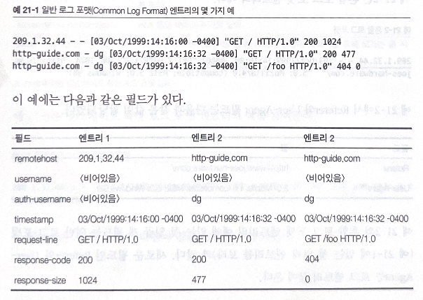

# 21. 로깅과 사용 추적

서버와 프락시가 어떤 HTTP 트랜잭션 정보를 기록하는지 알아보자.

# 21. 1 로그란 무엇인가 ?

로깅 목적

- 서버나 프락시의 문제 해결
- 웹 사이트 접근 통계

일반적인 로깅 필드

- HTTP 메서드
- 클라이언트와 서버의 HTTP 버전
- 요청받은 리소스의 URL
- 응답의 HTTP 상태코드
- 요청과 응답 메시지의 크기(엔터티 본문 포함)
- 트랜잭션 일어난 시간
- Referer와 User-Agent 헤더

# 21.2 로그 포맷

여러 표준이 존재한다.

상용 혹은 오픈 소스 HTTP 애플리케이션은 대부분 한개 이상의 표준 로그 포맷을 지원한다.

더 많은 표준을 지원하는 애플리케이션은 관리자가 리소스를 통계 분석 등에 잘 활용할 수 있게 도와준다.

## 21.2.1 일반 로그 포맷 (Common Log Format)

| 필드          | 설명                                      |
| ------------- | ----------------------------------------- |
| remotehost    | 요청한 컴퓨터의 호스트 명 혹은 IP주소     |
| username      | ident 검색\* 수행시, 인증된 요청자의 이름 |
| auth-username | 인증을 수행했다면, 인증된 요청자의 이름   |
| timestamp     | 요청 날짜와 시간                          |
| request-line  | HTTP 요청 ex) “GET /index.html HTTP/1.1”  |
| response-code | 응답으로 보내는 HTTP 상태 코드            |
| response-size | 응답 엔터티의 Content-Length              |

<aside>
💡 ident 인증? RFC 931은 인증에 사용하는 ident 프로토콜 명세를 정의했다. ident 프로토콜을 사용하여 클라이언트의 이름을 식별한다.

</aside>

## 21.2.2 혼합 로그 포맷

일반 로그 포맷에 Referer 필드와 User-Agent 필드가 추가 된 포맷

| 필드       | 설명                                       |
| ---------- | ------------------------------------------ |
| Referer    | URL을 요청자가 어디서 찾았는지에 대한 정보 |
| User-Agent | 클라이언트 애플리케이션에 대한 정보        |

## 21.2.3 넷스케이프 확장 로그 포맷

상용 HTTP 애플리케이션이 되면서 여러 로그 포맷을 도입했다.

프락시나 웹 캐시같은 HTTP 애플리케이션과 연관된 여러 환경을 지원하기 위해 포맷을 확장했다.

일반 로그 포맷에 아래의 필드들이 추가 된 확장 포맷이다.

| 필드                     | 설명                                                                 |
| ------------------------ | -------------------------------------------------------------------- |
| proxy-response-code      | 트랜잭션이 프락시를 거칠 경우, 서버에서 프락시로의 HTTP 응답 코드    |
| proxy-response-size      | 서버가 프락시에 전달하는 응답 엔터티의 Content-Length                |
| client-request-size      | 클라이언트가 프락시로 보내는 요청의 본문이나 엔터티의 Content-Length |
| proxy-request-size       | 프락시가 서버로 보내는 요청의 본문이나 엔터티의 Content-Length       |
| client-request-hdr-size  | 클라이언트 요청 헤더의 바이트 길이                                   |
| proxy-response-hdr-size  | 프락시가 요청자에게 보내는 응답 헤더의 바이트 길이                   |
| proxy-request-hdr-size   | 프락시가 서버로 전송하는 요청 헤더의 바이트 길이                     |
| server-response-hdr-size | 서버 응답 헤더의 바이트 길이                                         |
| proxy-timestamp          | 요청과 응답이 프락시를 통해 오가는 총 시간                           |

### 넷스케이프 확장 로그 포맷

209.1.32.44 - - [03/0ct/1999:14:16:00-0400] "GET / HTTP/1.0" 200 1024 200 1024 0 0
215 260 279 254 3

## 21.2.4 넷스케이프 확장 2 로그 포맷

| 필드                      | 설명                                                             |
| ------------------------- | ---------------------------------------------------------------- |
| route                     | 프락시가 클라이언트에 요청을 만드는데 사용하는 경로              |
| client-finish-status-code | 클라이언트의 종료 상태 코드. FIN : 완료, INTR: 인터럽트, TIMEOUT |
| proxy-finish-status-code  | 프락시의 종료 상태 코드. FIN : 완료, INTR: 인터럽트, TIMEOUT     |
| cache-result-code         | 캐시 결과 코드                                                   |

### 넷스케이프 캐시 코드

## 21.2.5 스퀴드 프락시 로그 포맷

오픈소스 커뮤니티를 통해 수년간 확장 및 개선되어 온 프로젝트.

많은 차세대 프락시 캐시들이 스퀴드 애플리케이션을 활용하기 위해 자체 로그 포맷으로 적용했다.

- 스퀴드 로그 엔트리 포맷

| 필드                                            | 설명                                                      |
| ----------------------------------------------- | --------------------------------------------------------- |
| timestamp                                       | 요청이 도착한 시간                                        |
| time-elapsed                                    | 요청과 응답이 프락시를 통해 오고간 총 시간                |
| host-ip                                         | 클라이언트의 호스트 ip                                    |
| result-code/status                              | result: 프락시가 어떤 일을 했는지 스퀴드 방식으로 기술    |
| code: 프락시가 클라이언트에 보낸 HTTP 응답 코드 |
| size                                            | 프락시가 클라이언트에게 보낸 HTTP 응답 헤더와 본문의 길이 |
| method                                          | 클라이언트 요청 메써드                                    |
| url                                             | 클라이언트 요청 URL                                       |
| rfc931-ident                                    | 클라이언트에 인증된 사용자 이름                           |
| hierachy/from                                   | hierachy: 프락시가 클라이언트로 요청을 보내면서 거친 경로 |
| from: 프락시가 요청을 만들게 한 서버의 이름     |
| content-type                                    | 프락시 응답 엔터티의 타입                                 |

# 21.3 적중 계량하기

서버는 결산을 위한 상세 로그를 저장한다.

로깅은 아래 내용들을 추적하기에 유용하다.

- URL에 사람들이 얼마나 접근했는지
- 광고가 얼마나 노출되었는지
- 콘텐츠의 검색 빈도

클라이언트와 서버 사이에는 수많은 요청이 캐시로 처리되어 서버의 로그 파일에는 누락이 발생한다.

콘텐츠 제공자는 어쩔 수 없이 로깅을 하기 위해 **중요한 페이지의 캐시**를 하지 않는다. 원 서버는 리소스에 대한 접근을 로깅할 수 있지만 요청에 대한 속도는 느려지고 서버와 네트워크의 부하가 가증된다.

프락시 캐시들이 자체 로그를 유지함으로써 캐시 파기는 피할 수 있다.

**적중 계량(Hit Metering) 규약 :** 캐시가 정기적으로 캐시 접근 통계를 원 서버에 보고해야 한다.

## 21.3.1 개요

캐시와 서버가 접근 정보를 공유하고 사용할 수 있는 캐시 리소스의 양을 제어할 수 있는 기능에 관한 HTTP 확장.

접근 로깅시 발생하는 문제의 완벽한 해결책은 아니지만 적어도 서버가 원하는 통계 정보를 받아볼 수 있으며 캐시로 성능을 향상시킬 수 있다.

## 21.3.2 Meter 헤더

캐시나 서버는 Meter헤더에 사용량이나 보고에 관한 지시자를 기술한다.

| 지시자                | 약어 | 주체 | 설명                                                                                                                         |
| --------------------- | ---- | ---- | ---------------------------------------------------------------------------------------------------------------------------- |
| will-report-and-limit | w    | 캐시 | 캐시는 사용량을 보고하고 서버가 기술한 모든 사용 제한에 복종한다.                                                            |
| wont-report           | x    | 캐시 | 캐시는 사용 제한에 복종하지만, 사용량 보고는 하지 않는다.                                                                    |
| wont-limit            | y    | 캐시 | 캐시는 사용량 보고를 하지만 사용 제한은 없다.                                                                                |
| count                 | c    | 캐시 | “사용횟수/재사용횟수” 순으로 정수로 기술한다.                                                                                |
| max-uses              | u    | 서버 | 캐시를 사용해서 응답할 수 있는 최대 횟수                                                                                     |
| max-reuses            | r    | 서버 | 캐시를 재사용해서 응답할 수 있는 최대 횟수                                                                                   |
| do-report             | d    | 서버 | 서버가 프락시에게 사용량 보고를 요구한다.                                                                                    |
| dont-report           | e    | 서버 | 서버가 사용량 보고를 원하지 않는다.                                                                                          |
| timeout               | t    | 서버 | 서버가 리소스를 계량할 때 시간 제한을 거는데 사용한다. 캐시는 기술된 타임아웃 시간 정각이나 1분 전후로 보고를 전송해야 한다. |
| wont-ask              | n    | 서버 | 서버는 계량 정보를 원하지 않는다.                                                                                            |

일반적인 HTTP 요청에 프락시가 보내는 요청과 서버의 응답에 Meter 헤더가 추가로 기술되어 있다.

- 프락시가 적중 계량을 할 수 있음을 서버에게 알림
- 서버는 프락시에 적중 횟수를 요구
- 클라이언트 요청 처리 되며 캐시 됨
- 이후 프락시는 서버에 리소스에 대한 재검사를 하며 서버로 보내는 조건적 요청에 리소스의 정보를 기술한다.

# 21. 4 개인 정보 보호에 대해

로깅은 서버와 프락시에서 수행하는 관리 기능으로써 모든 사용자의 트랜잭션에 적용된다. 많은 사용자들은 HTTP 프로토콜을 사용한다는 사실조차 모르며 자신의 HTTP 트랜잭션이 로깅되고 있다는 사실을 모른다.

웹 앱 개발자와 관리자는 사용자의 HTTP 트랜잭션을 추적하고 있다는 사실을 유념해야 한다. 이 정보의 유출로 인해 나쁜 목적으로 사용될 수 있다.

사무실 같은 곳에서 직원이 놀지 않고 있다는 것을 확인하려고 직원을 추적하는게 맞는 일일지는 모르겠으나 관리자는 사람들의 트랜잭션을 감시하고 있다는 사실을 공지해야 한다.

로깅은 관리자와 개발자에게 유용한 도구지만 로깅을 당하는 사용자들의 인지나 허가가 없다면 사생활 침해가 된다는 것을 유념해야 한다.
