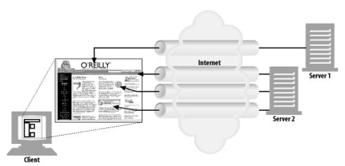
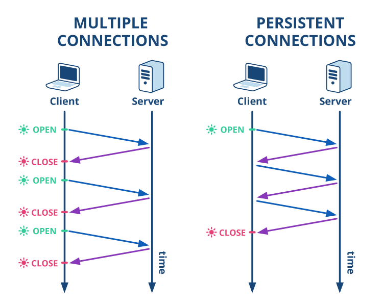
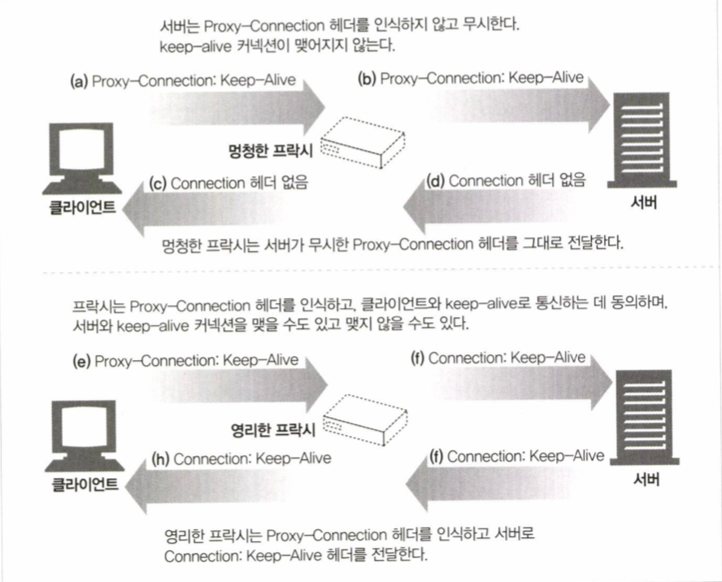
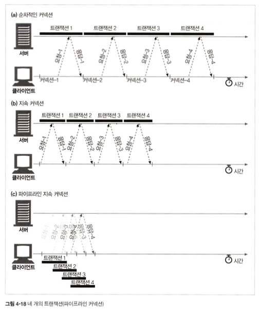
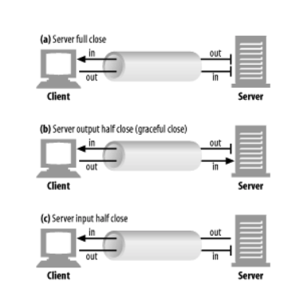

# 4장 커넥션 관리

이 장에서 배울 내용은 다음과 같다:

- HTTP는 어떻게 TCP 커넥션을 사용하는가
- TCP 커넥션의 지연, 병목, 막힘
- 병렬 커넥션, keep-alive 커넥션, 커넥션 파이프라인을 활용한 HTTP의 최적화
- 커넥션 관리를 위해 따라야 할 규칙들

## 4.1 TCP 커넥션

- 전 세계의 모든 HTTP 통신은 TCP/IP를 통해 이루어진다.
- TCP/IP는 지구상의 컴퓨터와 네트워크 장비에서 널리 쓰이고 있는 `패킷 교환 네트워크 프로토콜들의 계층화된 집합`이다.
- 클라이언트 애플리케이션은 전세계 어디에서든 서버 애플리케이션으로 TCP/IP 커넥션을 맺을 수 있다.
- TCP/IP 커넥션을 맺으면, 클라이언트-서버 간 주고받는 메시지가 손상되지 않고, 순서가 바뀌지 않는 것이 보장된다.

#### TCP 커넥션 예시

> http://www.joes-hardware.com:80/power-tools.html ⏎
>
> 1. 브라우저가 호스트 명(www.joes-hardware.com)을 추출한다.
> 2. 브라우저가 추출한 호스트 명에 대한 IP 주소 (202.43.78.3)를 찾는다.
> 3. 브라우저가 포트 번호(80)를 얻는다.
> 4. 브라우저가 202.43.78.3의 80포트로 TCP 커넥션을 생성한다.
> 5. 브라우저가 서버로 HTTP GET 요청 메시지를 보낸다.
> 6. 브라우저가 서버에서 온 HTTP 응답 메시지를 읽는다.
> 7. 브라우저가 커넥션을 끊는다.

### 4.1.1 신뢰할 수 있는 데이터 전송 통로인 TCP

- TCP는 HTTP에게 안정적인 인터넷 연결과 충돌 없는 바이트 전달 순서를 보장함으로써 신뢰할 만한 통신 방식을 제공한다.

### 4.1.2 TCP 스트림은 세그먼트로 나뉘어 IP 패킷을 통해 전송된다.

- HTTP가 메시지를 전송하고자 할 때, TCP는 세그먼트라는 단위로 데이터 스트림을 잘게 나누고 세그먼트를 IP 패킷이라고 불리는 봉투에 담아 인터넷을 통해 데이터를 전달한다.
- 각각의 IP 패킷들은 다음으로 이루어진다:
  - IP 패킷 헤더
  - TCP 세그먼트 헤더
  - TCP 데이터 조각


### 4.1.3 TCP 커넥션 유지하기

- TCP 커넥션은 네 가지 값으로 식별한다.
  ```
  <발신지 IP 주소, 발신지 포트, 수신지 IP 주소, 수신지 포트>
  ```
- 컴퓨터는 여러 개의 TCP 커넥션을 갖지만, 네 가지 값 중에 최소 하나의 값은 다름으로서 유일한 커넥션을 생성한다. 네 가지 구성요소가 모두 같은 커넥션은 있을 수 없다.

### 4.1.4 TCP 소켓 프로그래밍

대부분의 운영체제는 TCP 커넥션 관련 기능을 제공하는 소켓 API를 지원한다. 이 API의 인터페이스를 이용한 통신 프로그래밍을 소켓 프로그래밍이라고 한다.

<details>
  <summary>클라이언트-서버가 TCP 소켓 인터페이스를 통해 상호작용하는 방법
  </summary>
    
</details>

📚 [네트워크 소켓 프로그래밍](https://iot.knu.ac.kr/home/tech/ISL-TR-21-02-NSP.pdf)

## 4.2 TCP의 성능에 대한 고려

이 절에서는 TCP 성능에 관련된 7가지 주요 고려사항을 다룬다.  
HTTP가 TCP의 바로 위 계층이기 때문에, HTTP 트랜잭션의 성능은 TCP 성능에 영향을 받는다.  
TCP 성능의 특성을 이해함으로서 HTTP 커넥션의 최적화 요소를 더 잘 이해하고, 나아가 더 좋은 성능의 HTTP 애플리케이션을 설계할 수 있다.

### 4.2.1 HTTP 트랜잭션 지연

HTTP 요청 과정(DNS 찾기-연결-요청-처리-응답-종료)에서 트랜잭션 처리에 해당하는 시간은 상대적으로 매우 짧다.  
즉, 대부분의 HTTP 지연은 TCP 네트워크 지연 때문에 발생한다는 것을 알 수 있다.  
원인에는 여러가지가 있다:

1. 클라이언트가 URI를 통해 웹 서버의 IP 주소와 포트 번호를 알아내야 할 때, 처음 방문하는 호스트이면 DNS 이름 분석 인프라를 사용하여 URI의 호스트 명을 IP 주소로 변환하는데 수십 초의 시간이 걸린다. (현재는 밀리초 단위로 가능)
2. 다음으로 클라이언트가 TCP 커넥션 요청을 서버에 보내고, 서버의 커넥션 허가 응답을 기다린다. 새로운 TCP 커넥션 시 항상 1~2초의 시간이 소요된다. (현재는 1초 미만으로 가능)
3. 커넥션이 맺어지면 클라이언트는 새로 생성된 TCP 파이프를 통해 HTTP 요청을 전송한다. 웹 서버는 데이터가 도착하면 TCP 커넥션에서 요청 메시지를 읽고 처리한다. 이 과정에서 시간이 소요된다.
4. 웹 서버가 HTTP 응답을 보내는 것 역시 시간이 소요된다.

이는 하드웨어의 성능, 네트워크와 서버의 전송 속도, 요청과 응답 메시지의 크기, 클라이언트-서버 간 거리에 따라 크게 달라진다.

### 4.2.2 성능 관련 중요 요소

4.2.3 ~ 4.2.7절에 해당한다. 고성능의 HTTP 소프트웨어를 개발하고 있다면, 각 항목을 이해하는 것이 좋다.

### 4.2.3 TCP 커넥션 핸드셰이크 지연

새로운 TCP 커넥션을 열 때면, TCP 소프트웨어는 커넥션 설정을 위해 두 개의 IP 패킷을 전송해야 한다.
이를 핸드셰이크라고 하는데, 그 과정은 다음과 같다:

1. 클라이언트는 새로운 TCP 커넥션을 위해 'SYN(커넥션 생성 요청)'라는 플래그를 가지는 작은 TCP 패킷을 서버에 보낸다.
2. 서버는 커넥션을 받아 몇 가지 매개변수를 산출하고, 커넥션 요청 수락을 의미하는 SYN, ACK 플래그를 포함한 TCP 패킷을 클라이언트에 보낸다.
3. 클라이언트가 서버에 커넥션 설정 성공을 알리는 신호를 보낸다. 클라이언트는 이 확인응답 패킷에 데이터를 함께 보낼 수 있다.

위 과정은 프로그래머에게 보이지 않는다. HTTP 프로그래머는 새로운 TCP 커넥션 생성 시의 지연만을 감지한다.  
1, 2과정에서 많은 지연이 일어나므로, 작은 데이터를 주고받는 일반적인 HTTP 트랜잭션의 경우 50%이상의 지연을 TCP 구성에 쓰게 된다.

### 4.2.4 확인응답 지연

인터넷 자체는 패킷 전송을 보장하지 않으므로, TCP는 확인응답 체계를 통해 자체적으로 데이터 전송을 확인한다.  
예를 들어, 만일 TCP 세그먼트의 수신자가 송신자로부터 확인응답을 메시지를 받지 못하면, 오류가 있는 것으로 판단하고 데이터를 다시 전송하게 되어있다.

확인응답은 크기가 작기 때문에, TCP는 확인응답을 데이터 패킷에 편승('piggyback')시켜 네트워크를 좀 더 효율적으로 사용하기 위해 '확인응답 지연'알고리즘을 구현한다. 확인응답 지연은 송출할 확인응답을 특정 시간(보통 0.1~0.2초) 동안 버퍼에 저장해 두고, 확인응답을 같이 실어 보내기 위해 같은 방향으로 가는 송출 데이터 패킷을 찾는 알고리즘이다. 만일 송출 데이터를 찾지 못하면 확인응답은 별도 패킷으로 전송된다.

그러나 안타깝게도 HTTP 동작 방식은 요청과 응답 두가지 형식으로만 이루어지기 때문에, 편승시킬 수 있는 기회가 적다. 그러므로 확인응답 지연 알고리즘이 오히려 지연만을 발생시킬 확률이 높다. 운영체제에 따라 확인응답 지연 관련 기능을 수정 또는 비활성화할 수는 있으나, TCP 설정 수정은 내부 알고리즘의 작동을 이해하고 신중히 해야 한다.

### 4.2.5 TCP 느린 시작(slow start)

TCP의 데이터 전송 속도는 TCP 커넥션이 만들어진 지 얼마나 지났느냐에 따라 달라질 수 있다. TCP 커넥션은 인터넷의 갑작스러운 부하와 혼잡 방지를 위해 처음에는 최대 속도를 제한하고, 전송이 성공함에 따라 속도 제한을 높여나가며 '튜닝'하기 때문이다. 이를 TCP 느린 시작이라고 부른다.


이 혼잡제어 기능 때문에, 새로운 커넥션은 튜닝된 커넥션보다 느리다. 이 더 빠른 튜닝 커넥션을 사용하기 위해, HTTP에는 이미 존재하는 커넥션을 재사용하는 기능이 있다.

### 4.2.6 네이글(Nagle) 알고리즘과 TCP_NODELAY

TCP는 데이터 스트림 인터페이스를 제공하여, 애플리케이션이 어떤 크기의 데이터도(단 1바이트여도) 보낼 수 있도록 지원한다. 하지만 각 TCP 세그먼트는 40바이트 상당의 플래그와 헤더를 포함하여 전송하기 때문에, 작은 크기의 데이터를 많이 전송한다면 네트워크 성능이 크게 떨어진다.

네이글 알고리즘은 이를 개선하기 위해 패킷 전송 전에 많은 양의 TCP 데이터를 한 개의 덩어리로 합친다. 그리고 최대 크기가 되기 전에는 전송하지 않는다.
다만, 모든 패킷이 확인응답을 받았을 때는 최대 크기보다 작은 패킷의 전송을 허락한다. 다른 패킷들이 전송 중이면 데이터를 버퍼에 저장하고, 전송 후 확인응답을 받거나 충분한 양의 패킷이 쌓이면 버퍼에 쌓아둔 데이터를 전송한다.

이 알고리즘은 HTTP 성능에 여러 문제를 발생시킨다.

- 크기가 작은 HTTP 메시지는 앞으로 생길지 안 생길지 모르는 추가 데이터를 기다리며 전송이 지연된다.
- 확인응답 지연과 함께 쓰일 경우, 네이글 알고리즘은 확인응답이 도착할 때까지 데이터 전송을 멈추고 확인응답 지연 알고리즘은 확인응답을 지연시킨다.

HTTP 애플리케이션에서 성능 향상을 위해 TCP_NODELAY 파라미터 값을 설정하며 네이글 알고리즘을 비활성화할 수 있다. 이 설정을 했다면, 작은 크기의 패킷이 너무 많이 생기지 않도록 개발해야 한다.

### 4.2.7 TIME_WAIT의 누적과 포트 고갈

TCP 커넥션의 종단에서 커넥션이 끊기면, 종단에서는 커넥션의 IP 주소와 포트 번호를 메모리의 작은 제어영역(control block)에 2분 정도(2MSL) 기록해두어, 2MSL 동안 같은 주소와 포트번호의 새로운 커넥션이 생성되지 않도록 방지한다. 운영체제에서 2MSL을 더 짧은 값으로 수정할 수 있지만, 패킷이 중복되어 TCP 데이터가 충돌하지 않도록 조심해야 한다.

이같은 커넥션 종료 지연(TIME_WAIT)은 일반적으로는 문제가 없으나 성능 테스트 시 문제가 될 수 있다. 순간순간 포트를 재활용하면서 테스트하는 것이 불가능하기 때문이다.
이 문제를 해결하기 위해 여러 개의 가상 IP 주소를 쓸 수도 있다.

## 4.3 HTTP 커넥션 관리

### 4.3.1 흔히 잘못 이해하는 Connection 헤더
HTTP connection 헤더 필드는 _커넥션 토큰을 쉼표로 구분_하여 가지고 있으며, 그 값들은 다른 커넥션에 전달되지 않는다.

__Connection 헤더에 전달 할 수 있는 세 가지 종류의 토큰__
- `HTTP 필드명` : 이 커넥션에만 해당되는 헤더들 나열
    - 현재 커넥션만을 위한 정보이므로 다음 커넥션에 전달되면 안된다.
    - 다른 곳으로 전달하는 시점에 삭제되어야 한다.
    - 홉별(hop-by-hop) 헤더 명을 기술하여야 한다.(두 서버에게만 영향)
- `임시적인 토큰 값` : 커넥션에 대한 비표준 옵션
- `close 값` : 커넥션 작업이 완료되면 종료되어야 함

HTTP 애플리케이션이 Connection 헤더와 함께 메세지를 전달받으면, 수신자는 송신자에게 온 요청에 기술되어 있는 모든 옵션을 적용한다.
다음 hop에 메세지를 전달하기 전에 Connection 헤더와 Connection 헤더에 기술되어 있던 모든 헤더를 삭제한다.
(이외 홉별 헤더 : Proxy-Authenticate, Proxy-Connection, Transfer-Encoding, Upgrade)

### 4.3.2 순차적인 트랜잭션 처리에 의한 지연
순차적 처리는 하나의 트랜잭션이 새로운 커넥션을 필요로 한다면, 커넥션의 응답이 올때까지 다음 트랜잭션을 처리하지 않는다는 것이다.
이는 트랜잭션 지연이 발생하며, 다른 트랜잭션에도 영향을 미쳐 사용자는 웹페이지가 느리다거나 빈 화면을 보게 되는 등의 불편함을 겪게 될 수 있다.

## 4.4 병렬 커넥션
__여러 개의 TCP 커넥션을 통한 동시 HTTP 요청__



### 4.4.1 병렬 커넥션은 페이지를 더 빠르게 내려받는다
단일 커넥션 대역폭 제한, 커넥션 동작하지 않는 시간 활용
각 커넥션의 지연시간 겹치게 하여 지연시간 축소
남는 대역폭은 나머지 객체를 내려받는데에 활용

### 4.4.2 병렬 커넥션이 항상 더 빠르지는 않다.
클라이언트의 네트워크 대역폭이 좁을 때는 객체를 병렬로 내려받는데 제한이 생긴다.
다수의 커넥션은 메모리를 많이 소모하여 성능 문제를 발생시킨다.
  - 클라이언트가 100개의 커넥션을 맺고 있다면, 서버는 백명의 사용자의 10,000개의 커넥션을 떠안게 된다.
_브라우저는 대부분 4개의 병렬 커넥션만 허용, 서버는 특정 클라이언트로부터 과도한 수의 커넥션이 맺어지면 임의로 끊을 수 있다_

### 4.4.3 병렬 커넥션이 더 빠르게 느껴질 수 있다.
화면에 여러 개의 객체가 동시에 보이면서 내려받기 때문에 사용자 입장에서 더 빠르게 느낄 수 있다.

## 4.5 지속 커넥션
__커넥션을 맺고 끊는 데서 발생하는 지연을 제거하기 위한 TCP 커텍션의 재활용__

- 사이트 지역성(site locality) : 서버에 HTTP 요청을 하기 시작한 애플리케이션은 웹페이지 내의 이미지 등을 가져오기 위해서 그 서버에 또 요청하게 되는 것
- 처리가 완료된 후에도 계속 연결 상태로 있는 TCP 커넥션을 지속 커넥션이라 하며, 클라이언트나 서버가 커넥션을 끊기 전까지는 트랜잭션 간에도 커넥션을 유지한다.
- 지속 커넥션을 재활용함으로써 **커넥션 준비 시간 절약**, **TCP 느린 시작 지연**을 피할 수 있다.

### 4.5.1 지속 커넥션 vs 병렬 케넥션
__병렬 케녁션 단점__
- 각 트랜잭션마다 새로운 커넥션을 맺고 끊기 때문에 시간과 대역폭이 소요된다.
- 각각의 새로운 커넥션은 TCP 느린 시작 때문에 성능이 떨어진다.
- 실제로 연결할 수 있는 병렬 커넥션의 수에는 제한이 있다.

__지속 커넥션 장단점__
- 장점
  - 커넥션을 맺기 위한 사전 작업의 지연을 단축시킨다.
  - 튜닝된 커넥션을 유지한다.
  - 커넥션 수를 줄여준다.
- 단점
  - 계속 연결된 상태로 있는 수 많은 커넥션이 쌓이게 된다.
  - 로컬 리소스, 원격 클라이언트와 서버 리소스에 불필요한 소모가 발생한다.

<p>→ 지속 커넥션과 병렬 커넥션을 함께 사용할 때 가장 효과적이다.</p>

### 4.5.2 HTTP/1.0+의 Keep-Alive 커넥션

- 커넥션을 맺고 끊는 데 필요한 작업이 없어서 시간이 단축되었다.
- TCP 느린 시작이 일어나지 않기 때문에 요청 및 응답 시간이 줄어들었다.

### 4.5.3 Keep-Alive 동작
HTTP/1.1부터는 Keep-Alive를 사용하지 않기로 명세가 나왔지만, 여전히 Keep-Alive 핸드셰이크가 서버-브라우저 간에 사용되고 있기 때문에 처리할 수 있도록 개발해야한다.
처리하기 위해서 클라이언트는 요청에 `Connection:Keep-Alive` 헤더를 포함시킨다. 서버는 응답 메시지에 같은 헤더를 포함시켜 응답한다.
클라이언트는 응답에 이 헤더가 없을 때는 서버가 커넥션을 끊을 것이라고 추정한다.


### 4.5.4 Keep-Alive 옵션
클라인트나 서버는 keep-alive 요청을 받았다고 해서 무조건 따를 필요는 없다. 언제든지 이것을 끊을 수 있으며 keep-alive 커넥션의 수를 제한할 수도 있다.
옵션들은 Keep-Alive헤더의 쉼표로 구분된다.

- timeout : 커넥션이 얼마간 유지될 것인지
- max : 커넥션이 몇 개의 HTTP 트랜잭션을 처리할 때까지 유지될 것인지
- 이름[=값] : 디버깅을 주목적으로 하는, 처리되지는 않는 임의 속성들 지원

```
Connection : Keep-Alive
Keep-Alive: max=5, timeout=120
```

### 4.5.6 Keep-Alive 커넥션 제한과 규칙
- HTTP/1.0에서는 default가 아니기 때문에, 클라이언트는 keep-alive 커넥션 사용을 위해서는 `Connection: Keep-Alive` 요청헤더를 보내야한다.
- 커넥션 유지하려면 모든 메세지에 `Connection: Keep-Alive`  헤더를 포함해야 한다. 보내지 않으면 서버는 요청을 처리한 후 커넥션을 끊을 것이다.
- 클라이언트는 응답헤더에 `Connection: Keep-Alive` 가 없다면 서버가 응답 후에 커넥션을 끊을 것임을 알 수 있다.
- 커넥션이 끊어지기 전에 엔터티 본문의 길이를 알 수 있어야 커넥션을 유지할 수 있다. 정확하지 않은 Conent-Length 값은 트랜잭션이 끝나는 시점에 기존의 메세지 끝과 새로운 메세지 시작을 정확히 알 수 없다.
- 프락시와 게이트웨이는 메세지를 전달하거나 캐시에 넣기 전에 Connection 헤더에 명시된 모든 헤더 필드와 Connection 헤더를 제거해야한다.

### 4.5.6 Keep-Alive와 멍청한(dumb)프락시
> 프락시는 Connection 헤더를 이해하지 못해서 헤더들을 삭제하지 않고 요청 그대로를 다음 프락시에 전달한다.


- (a) : 클라이언트가 `Connection: Keep-Alive`  헤더 메세지를 보냄 → 프락시 서버는 이해 못함
  -커넥션 헤더는 ‘홉별 헤더’다!! → 홉별 헤더는 한 개의 전송 링크에만 적용된다.
- (b) : 프락시 서버는 connection 헤더를 이해하지 못하기 때문에 서버에 그대로 전달

- (c) : **서버는 프락시가 커넥션 유지를 요청하는 것으로 판단**하고 이에 동의하여 `Connection: Keep-Alive`  헤더를 포함한 응답

- (d): 서버에게 받은 응답 메세지를 클라이언트에게 전달. **클라이언트는 프락시가 커넥션을 유지하는 것에 동의했다고 추정**

  - 서버 : 커넥션을 유지하기를 요청한 것으로 판단해 커넥션을 끊지 않음
  - 프락시:  받았던 모든 데이터를 그대로 클라이언트에게 전달 후 서버가 커넥션을 끊기를 기다림
  - 클라이언트: 프락시와 커넥션이 유지되고 있다고 추정하여 다음 요청을 보냄

→ 클라이언트가 동일한 커넥션을 통해 다음 요청을 하게 될 경우, 프락시는 이를 무시하게 되고 **브라우저는 아무런 응답 없이 로드중**으로 표시 된다.

### 4.5.7 Proxy-Connection 살펴보기
- 클라이언트는 비표준인 proxy-connection 확장 헤더를 프락시에 전달하여, 프락시가 proxy-connection을 무조건 전달하더라도 서버에서 이를 무시하기 때문에 별 문제가 되지 않는다.
- 영리한 프락시는 proxy-connection을 서버에 전달할 때 connection헤더로 바꾸어 원하던 효과를 얻는다.
    - 클라이언트와 서버 사이에 하나의 프락시만 있을 경우 가능
    - 2개 이상의 프락시가 있을 경우, 효과를 보장하지 못함



### 4.5.8 HTTP/1.1 지속 커넥션
- 지속 커넥션 default 값으로 활성화 되어 있음
- 모든 커넥션을 지속 커넥션으로 취급
- 커넥션을 끊기 위해서는 `Connection: close`헤더를 명시해야 함
    - `Connection: close`를 보내지 않는 것이 서버가 커넥션을 영원히 유지한다는 의미는 아님

### 4.5.9 지속 커넥션의 제한과 규칙
- 클라이언트가 `Connection: close` 헤더를 포함해 보내면 클라이언트는 그 커넥션으로 추가적인 요청을 할 수 없다.
- 추가적인 요청을 보내지 않을 것이라면 `Connection: close` 헤더를 포함해야 한다.
- 커넥션에 있는 모든 메시지는 자신의 길이 정보를 정확히 가지고 있을 때 커넥션을 지속시킬수 있다. (Content-Length 값, 청크 전송 인코딩)
- HTTP/1.1 프락시는 클라이언트, 서버 각각에 대해 별도의 지속 커넥션을 맺고 관리해야 한다.
- HTTP/1.1 프락시 서버는 클라이언트가 커넥션 관련 기능에 대한 클라이언트의 지원 범위를 알고 있지 않은 한 지속 커넥션을 맺으면 안 된다.
- 서버는 메세지를 전송하는 중간에 커넥션을 끊지 않을 것이며, 끊기 전 적어도 한 개의 요청에 응답할 것이지만 언제든지 커넥션을 끊을 수 있다.
- HTTP/1.1 애플리케이션은 중간에 끊어지는 커넥션을 복구할 수 있어야 한다.
- 클라이언트는 전체 응답을 받기 전 커넥션이 끊어지면, 요청을 반복해서 보내도 문제가 없는 경우에는 요청을 다시 보낼 준비가 되어 있어야 한다.
- 서버 과부하를 방지하기 위해 최소 2개의 지속 커넥션을 유지해야 한다.


## 4.6 파이프라인 커넥션
__공유 TCP 커넥션을 통한 병렬 HTTP 요청 - 하나의 커넥션으로 다수의 request, response를 처리할 수 있다.__

- HTTP 클라이언트는 커넥션이 지속 커넥션인지 확인하기 전까지는 파이프라인을 이어서는 안 된다.
- HTTP 응답은 요청 순서와 같아야 한다.
- HTTP 클라이언트는 커넥션이 언제 끊어지더라도, 완료되지 않은 요청이 파이프라인에 있으면 언제든 다시 요청을 보낼 준비가 되어 있어야 한다.
- HTTP 클라이언트는 **POST 요청같이 반복해서 보낼 경우 문제가 생기는 요청은 파이프라인을 통해 보내면 안된다. 비멱등 요청을 재차 보내면 문제가 생길 수 있다.**

*멱등 : 여러번 수행하더라도 결과가 변하지 않는 것*


## 4.7 커넥션 끊기에 대한 미스터리
### 4.7.1 '마음대로' 커넥션 끊기
클라이언트, 프락시, 서버는 에러가 있는 상황에서는 헤더의 중간이나 다른 엉뚱한 곳에서 커넥션을 끊을 수 있다.
지속 커넥션이 일정 시간 동안 요청하지 않는 유휴상태가 되면 서버는 그 커넥션을 끊을 수 있다.

### 4.7.2 Content-Length와 Truncation
각 HTTP 응답은 본문의 정확한 크기 값을 가지는 Content-Length 헤더를 가지고 있어야 한다.
클라이언트나 프락시가 커넥션이 끊어졌다는 HTTP 응답을 받은 후, 실제 전달된 엔터티의 길이와 Content-Length의 값이 일치하지 않거나 존재하지 않는다면 수신자는 데이터의 정확한 길이를 서버에게 물어봐야 한다.
프락시 서버는 Content-Length를 정정하려 하지 말고 메시지를 받은 그대로 전달해야 한다.

### 4.7.3 커넥션 끊기의 허용, 재시도, 멱등성
커넥션은 에러가 없어도 언제든 끊을 수 있기 때문에, 클라이언트가 트랜잭션을 수행 중에 전송 커넥션이 끊기게 되면 커넥션을 다시 맺고 한 번 더 전송을 시도해야 한다.
파이프라인 커넥션에서의 이슈 : 여러 요청을 큐에 쌓아놓음
  - GET, HEAD, PUT, DELETE, TRACE와 같이 한 번 혹은 여러 번 실행됐는지에 상관없이 같은 결과값을 반환(멱등성)한다면 커넥션을 다시 맺는데 이슈가 없다.
  - POST와 같이 비멱등성 요청은 파이프라인을 통해 요청하면 알 수 없는 결과를 초래할 수 있다. **비멱등이 요청을 다시 보낸다면, 이전 요청에 대한 응답을 받을 때까지 기다려야 한다.**

### 4.7.4 우아한 커넥션 끊기


<전체 끊기와 절반 끊기>
- 전체 끊기 : `close()`를 호출하면 TCP 입력 채널과 출력 채널의 커넥션을 모두 끊는다.
- 절반 끊기 : `shutdown()`을 호출하면 입력 채널이나 출력 채널 중 하나를 개별적으로 끊는다.

<리셋에러>

- 단순한 HTTP 애플리케이션은 전체 끊기만을 사용할 수 있지만, 파이프라인 지속 커넥션을 사용할 때 기기들에 예상치 못한 쓰기 에러를 발생하는 것을 방지하고자 ‘절반 끊기’를 사용해야 한다.
- 절반 끊기를 사용할 경우 `출력 채널`을 끊는 것이 안전하다.
- ‘connection reset by peer’ : 만약 클라이언트에서 이미 끊긴 입력 채널에 데이터를 전송하면 서버의 운영체제에서 메시지를 보낸다. 심각한 에러로 취급되어 버퍼에 저장된, 아직 읽히지 않은 데이터를 모두 삭제한다.

<우아하게 끊기>

- 애플리케이션이 자신의 출력 채널을 먼저 끊고 다른 쪽에 있는 기기의 출력 채널이 끊기는 것을 기다리는 것이다.
- 양쪽에서 더는 데이터를 전송하지 않을 것이라는 것을 알려주면 커넥션은 리셋의 위험 없이 온전히 종료된다.