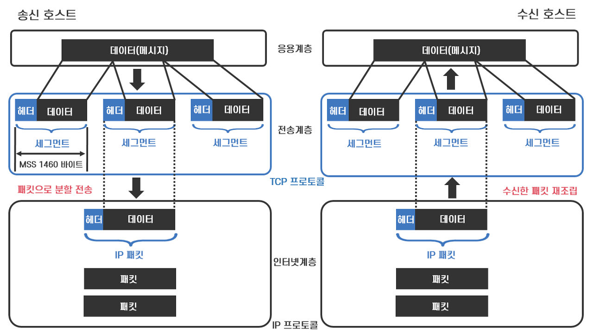
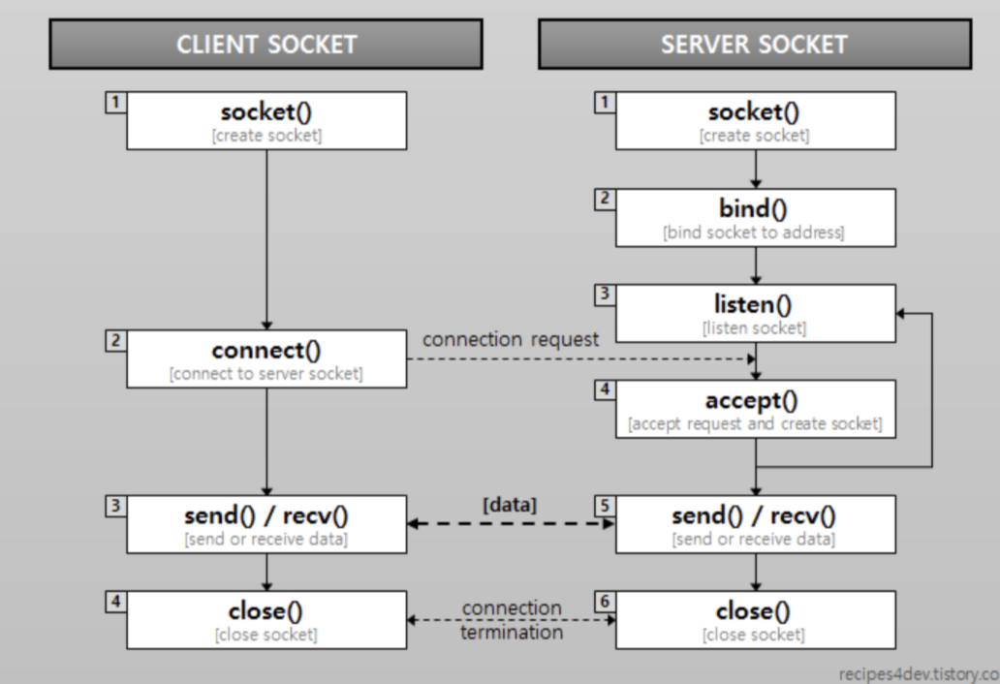
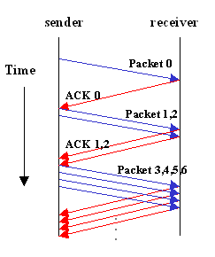

# 4장 커넥션 관리

이 장에서 배울 내용은 다음과 같다:

- HTTP는 어떻게 TCP 커넥션을 사용하는가
- TCP 커넥션의 지연, 병목, 막힘
- 병렬 커넥션, keep-alive 커넥션, 커넥션 파이프라인을 활용한 HTTP의 최적화
- 커넥션 관리를 위해 따라야 할 규칙들

## 4.1 TCP 커넥션

- 전 세계의 모든 HTTP 통신은 TCP/IP를 통해 이루어진다.
- TCP/IP는 지구상의 컴퓨터와 네트워크 장비에서 널리 쓰이고 있는 `패킷 교환 네트워크 프로토콜들의 계층화된 집합`이다.
- 클라이언트 애플리케이션은 전세계 어디에서든 서버 애플리케이션으로 TCP/IP 커넥션을 맺을 수 있다.
- TCP/IP 커넥션을 맺으면, 클라이언트-서버 간 주고받는 메시지가 손상되지 않고, 순서가 바뀌지 않는 것이 보장된다.

#### TCP 커넥션 예시

> http://www.joes-hardware.com:80/power-tools.html ⏎
>
> 1. 브라우저가 호스트 명(www.joes-hardware.com)을 추출한다.
> 2. 브라우저가 추출한 호스트 명에 대한 IP 주소 (202.43.78.3)를 찾는다.
> 3. 브라우저가 포트 번호(80)를 얻는다.
> 4. 브라우저가 202.43.78.3의 80포트로 TCP 커넥션을 생성한다.
> 5. 브라우저가 서버로 HTTP GET 요청 메시지를 보낸다.
> 6. 브라우저가 서버에서 온 HTTP 응답 메시지를 읽는다.
> 7. 브라우저가 커넥션을 끊는다.

### 4.1.1 신뢰할 수 있는 데이터 전송 통로인 TCP

- TCP는 HTTP에게 안정적인 인터넷 연결과 충돌 없는 바이트 전달 순서를 보장함으로써 신뢰할 만한 통신 방식을 제공한다.

### 4.1.2 TCP 스트림은 세그먼트로 나뉘어 IP 패킷을 통해 전송된다.

- HTTP가 메시지를 전송하고자 할 때, TCP는 세그먼트라는 단위로 데이터 스트림을 잘게 나누고 세그먼트를 IP 패킷이라고 불리는 봉투에 담아 인터넷을 통해 데이터를 전달한다.
- 각각의 IP 패킷들은 다음으로 이루어진다:
  - IP 패킷 헤더
  - TCP 세그먼트 헤더
  - TCP 데이터 조각



### 4.1.3 TCP 커넥션 유지하기

- TCP 커넥션은 네 가지 값으로 식별한다.
  ```
  <발신지 IP 주소, 발신지 포트, 수신지 IP 주소, 수신지 포트>
  ```
- 컴퓨터는 여러 개의 TCP 커넥션을 갖지만, 네 가지 값 중에 최소 하나의 값은 다름으로서 유일한 커넥션을 생성한다. 네 가지 구성요소가 모두 같은 커넥션은 있을 수 없다.

### 4.1.4 TCP 소켓 프로그래밍

- 대부분의 운영체제는 TCP 커넥션 관련 기능을 제공하는 소켓 API를 지원한다. 이 API의 인터페이스를 이용한 통신 프로그래밍을 소켓 프로그래밍이라고 한다.

  <details>
  <summary>클라이언트-서버가 TCP 소켓 인터페이스를 통해 상호작용하는 방법</summary>
  
  </details>

## 4.2 TCP의 성능에 대한 고려

이 절에서는 TCP 성능에 관련된 7가지 주요 고려사항을 다룬다.  
HTTP가 TCP의 바로 위 계층이기 때문에, HTTP 트랜잭션의 성능은 TCP 성능에 영향을 받는다.  
TCP 성능의 특성을 이해함으로서 HTTP 커넥션의 최적화 요소를 더 잘 이해하고, 나아가 더 좋은 성능의 HTTP 애플리케이션을 설계할 수 있다.

### 4.2.1 HTTP 트랜잭션 지연

HTTP 요청 과정(DNS 찾기-연결-요청-처리-응답-종료)에서 트랜잭션 처리에 해당하는 시간은 상대적으로 매우 짧다.  
즉, 대부분의 HTTP 지연은 TCP 네트워크 지연 떄문에 발생한다는 것을 알 수 있다.  
원인에는 여러가지가 있다:

1. 클라이언트가 URI를 통해 웹 서버의 IP 주소와 포트 번호를 알아내야 할 때, 처음 방문하는 호스트이면 DNS 이름 분석 인프라를 사용하여 URI의 호스트 명을 IP 주소로 변환하는데 수십 초의 시간이 걸린다. (현재는 밀리초 단위로 가능)
2. 다음으로 클라이언트가 TCP 커넥션 요청을 서버에 보내고, 서버의 커넥션 허가 응답을 기다린다. 새로운 TCP 커넥션 시 항상 1~2초의 시간이 소요된다. (현재는 1초 미만으로 가능)
3. 커넥션이 맺어지면 클라이언트는 새로 생성된 TCP 파이프를 통해 HTTP 요청을 전송한다. 웹 서버는 데이터가 도착하면 TCP 커넥션에서 요청 메시지를 읽고 처리한다. 이 과정에서 시간이 소요된다.
4. 웹 서버가 HTTP 응답을 보내는 것 역시 시간이 소요된다.

이는 하드웨어의 성능, 네트워크와 서버의 전송 속도, 요청과 응답 메시지의 크기, 클라이언트-서버 간 거리에 따라 크게 달라진다.

### 4.2.2 성능 관련 중요 요소

4.2.3 ~ 4.2.7절에 해당한다. 고성능의 HTTP 소프트웨어를 개발하고 있다면, 각 항목을 이해하는 것이 좋다.

### 4.2.3 TCP 커넥션 핸드셰이크 지연

새로운 TCP 커넥션을 열 때면, TCP 소프트웨어는 커넥션 설정을 위해 두 개의 IP 패킷을 전송해야 한다.
이를 핸드셰이크라고 하는데, 그 과정은 다음과 같다:

1. 클라이언트는 새로운 TCP 커넥션을 위해 'SYN(커넥션 생성 요청)'라는 플래그를 가지는 작은 TCP 패킷을 서버에 보낸다.
2. 서버는 커넥션을 받아 몇 가지 매개변수를 산출하고, 커넥션 요청 수락을 의미하는 SYN, ACK 플래그를 포함한 TCP 패킷을 클라이언트에 보낸다.
3. 클라이언트가 서버에 커넥션 설정 성공을 알리는 신호를 보낸다. 클라이언트는 이 확인응답 패킷에 데이터를 함께 보낼 수 있다.

위 과정은 프로그래머에게 보이지 않는다. HTTP 프로그래머는 새로운 TCP 커넥션 생성 시의 지연만을 감지한다.  
1, 2과정에서 많은 지연이 일어나므로, 작은 데이터를 주고받는 일반적인 HTTP 트랜잭션의 경우 50%이상의 지연을 TCP 구성에 쓰게 된다.

<!-- 이를 해결하기 위해 TCP 구성으로 인한 지연을 제거하기 위해 HTTP가 이미 존재하는 커넥션을 재활용할 수 있다.  -->

### 4.2.4 확인응답 지연

인터넷 자체는 패킷 전송을 보장하지 않으므로, TCP는 확인응답 체계를 통해 자체적으로 데이터 전송을 확인한다.  
예를 들어, 만일 TCP 세그먼트의 수신자가 송신자로부터 확인응답을 메시지를 받지 못하면, 오류가 있는 것으로 판단하고 데이터를 다시 전송하게 되어있다.

확인응답은 크기가 작기 때문에, TCP는 확인응답을 데이터 패킷에 편승('piggyback')시켜 네트워크를 좀 더 효율적으로 사용하기 위해 '확인응답 지연'알고리즘을 구현한다.  
확인응답 지연은 송출할 확인응답을 특정 시간(보통 0.1~0.2초) 동안 버퍼에 저장해 두고, 확인응답을 같이 실어 보내기 위해 같은 방향으로 가는 송출 데이터 패킷을 찾는 알고리즘이다. 만일 송출 데이터를 찾지 못하면 확인응답은 별도 패킷으로 전송된다.

그러나 안타깝게도 HTTP 동작 방식은 요청과 응답 두가지 형식으로만 이루어지기 때문에, 편승시킬 수 있는 기회가 적다. 그러므로 확인응답 지연 알고리즘이 오히려 지연만을 발생시킬 확률이 높다.  
운영체제에 따라 확인응답 지연 관련 기능을 수정 또는 비활성화할 수는 있으나, TCP 설정 수정은 내부 알고리즘의 작동을 이해하고 신중히 해야 한다.

### 4.2.5 TCP 느린 시작(slow start)

TCP의 데이터 전송 속도는 TCP 커넥션이 만들어진 지 얼마나 지났느냐에 따라 달라질 수 있다. TCP 커넥션은 인터넷의 갑작스러운 부하와 혼잡 방지를 위해 처음에는 최대 속도를 제한하고, 전송이 성공함에 따라 속도 제한을 높여나가며 '튜닝'하기 때문이다. 이를 TCP 느린 시작이라고 부른다.



이 혼잡제어 기능 때문에, 새로운 커넥션은 튜닝된 커넥션보다 느리다. 이 더 빠른 튜닝 커넥션을 사용하기 위해, HTTP에는 이미 존재하는 커넥션을 재사용하는 기능이 있다.

### 4.2.6 네이글(Nagle) 알고리즘과 TCP_NODELAY

TCP는 데이터 스트림 인터페이스를 제공하여, 애플리케이션이 어떤 크기의 데이터도(단 1바이트여도) 보낼 수 있도록 지원한다. 하지만 각 TCP 세그먼트는 40바이트 상당의 플래그와 헤더를 포함하여 전송하기 때문에, 작은 크기의 데이터를 많이 전송한다면 네트워크 성능이 크게 떨어진다.

네이글 알고리즘은 이를 개선하기 위해 패킷 전송 전에 많은 양의 TCP 데이터를 한 개의 덩어리로 합친다. 그리고 최대 크기가 되기 전에는 전송하지 않는다.
다만, 모든 패킷이 확인응답을 받았을 때는 최대 크기보다 작은 패킷의 전송을 허락한다.  
다른 패킷들이 전송 중이면 데이터를 버퍼에 저장하고, 전송 후 확인응답을 받거나 충분한 양의 패킷이 쌓이면 버퍼에 쌓아둔 데이터를 전송한다.

이 알고리즘은 HTTP 성능에 여러 문제를 발생시킨다.

- 크기가 작은 HTTP 메시지는 앞으로 생길지 안 생길지 모르는 추가 데이터를 기다리며 전송이 지연된다.
- 확인응답 지연과 함께 쓰일 경우, 네이글 알고리즘은 확인응답이 도착할 때까지 데이터 전송을 멈추고 확인응답 지연 알고리즘은 확인응답을 지연시킨다.

HTTP 애플리케이션에서 성능 향상을 위해 TCP_NODELAY 파라미터 값을 설정하며 네이글 알고리즘을 비활성화할 수 있다. 이 설정을 했다면, 작은 크기의 패킷이 너무 많이 생기지 않도록 개발해야 한다.

### 4.2.7 TIME_WAIT의 누적과 포트 고갈

TCP 커넥션의 종단에서 커넥션이 끊기면, 종단에서는 커넥션의 IP 주소와 포트 번호를 메모리의 작은 제어영역(control block)에 2분 정도(2MSL) 기록해두어, 2MSL 동안 같은 주소와 포트번호의 새로운 커넥션이 생성되지 않도록 방지한다. 운영체제에서 2MSL을 더 짧은 값으로 수정할 수 있지만, 패킷이 중복되어 TCP 데이터가 충돌하지 않도록 조심해야 한다.

이같은 커넥션 종료 지연(TIME_WAIT)은 일반적으로는 문제가 없으나 성능 테스트 시 문제가 될 수 있다. 순간순간 포트를 재활용하면서 테스트하는 것이 불가능하기 때문이다.
이 문제를 해결하기 위해 여러 개의 가상 IP 주소를 쓸 수도 있다.

## 4.3 HTTP 커넥션 관리

## 4.4 병렬 커넥션

## 4.5 지속 커넥션

## 4.6 파이프라인 커넥션

## 4.7 커넥션 끊기에 대한 미스터리
