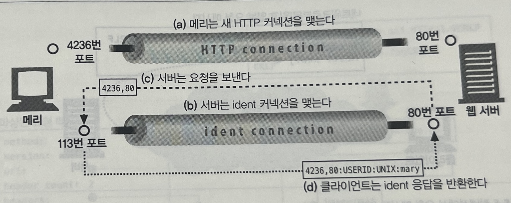
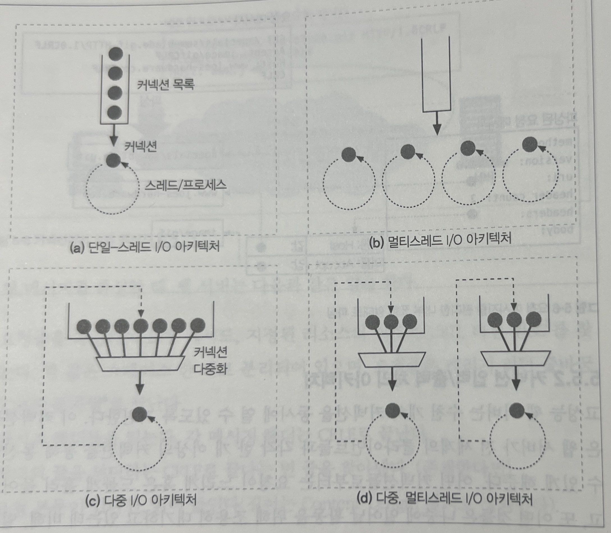

# 5. 웹 서버

HTTP 프로토콜 구현

웹 리소스의 관리

웹 서버 관리

TCP 커넥션 처리

# 다채로운 웹 서버

## 다목적 소프트웨어 웹 서버

네트워크에 연결된 표준 컴퓨터 시스템에서 동작한다.

- Microsoft
- Apache
- ngninx

## 임베디드 웹 서버

일반 소비자용 제품에 내장될 목적으로 만들어진 작은 웹 서버

- 프린터
- 가전제품

# 웹서버가 하는 일

1. 커넥션을 맺는다
2. 요청을 받는다
3. 요청을 처리한다
4. 리소스에 접근한다
5. 응답을 만든다
6. 응답을 보낸다
7. 트랜잭션을 로그로 남긴다

## 1. 클라이언트 커넥션 맺기

- 클라이언트가 이미 서버에 지속적 커넥션을 갖고 있다면 사용하고, 그렇지 않다면 새로운 커넥션을 맺는다.
- 클라이언트의 IP 주소를 ‘역방향 DNS’를 사용해서 호스트명으로 변환하고, 접근 제어와 로깅을 위해 사용한다.
- IETF ident 프로토콜을 통해 클라이언트 사용자를 알아낸다.
    - 서버에게 어떤 사용자 이름이 HTTP 커넥션을 초기화 했는지 찾아낼 수 있게 해준다.
    - 웹 서버 로깅에서 유용하게 사용한다.
    - 113번 포트를 사용하여 새 커넥션이 필요한지 여부를 판단한다.
    - 공공 인터넷에서는 방화벽, 보안 등의 이슈로 잘 동작하지 않는다.

## 2. 요청 메시지 수신

- 네트워크 커넥션에서 데이터를 읽고 파싱하여 요청 메시지 구성
- 커넥션 입출력 처리 아키텍처
    - 단일 스레드
    - 멀티 프로세스와 멀티스레드
    - 다중 I/O 서버
        - 모든 커넥션이 동시에 활동을 감시하며 수행해야 하는 일이 발생시 작은양을 순차적으로 처리한다.
    - 다중 멀티스레드

## 3. 요청 처리

- 요청의 메서드에 따라 처리한다. (추후에 자세히 다룬다!)

## 4. 리소스의 매핑과 접근

- HTML, JPEG 등 정적인 콘텐츠 제공
- 리소스 생성 애플리케이션을 통해 동적 콘텐츠 제공

### Docroot

- 웹 서버 파일 시스템의 리소스가 보관된 폴더 루트
- 요청 URI를 웹서버의 파일 시스템 안의 파일 이름으로 사용
- 가상 호스팅 docroot를 사용하여 한 웹서버에서 서로 다른 호스트명을 가진 요청을 동일한 동작으로 처리
- 사용자들이 하나의 웹 서버에서 개인의 웹 사이트를 갖게 할 수 있다.

### 디렉터리 목록

- 요청한 URL에 대응되는 디렉터리 안에서 index.html 을 색인하고 반환
- index.html 파일이 없다면 해당 디렉터리의 파일들의 속성을 열거한 html 반환

### 동적 콘텐츠 리소스 매핑

- 요청에 맞게 콘텐츠를 생성하는 프로그램에 URI를 매핑한다.
- 실행 가능한 프로그램이 위치한 특정 디렉터리로 매핑하거나, 특정 확장자만 실행하게 설정이 가능하다.

### 서버사이드 인클루드(Server-Side Includes, SSI)

- 리소스의 콘텐츠를 클라이언트에게 보내기 전에 처리한다(?)
- 스냅 동적 콘텐츠 (?) [예시](https://image.msscdn.net/thumbnails/images/prd_img/20210906/2112059/detail_2112059_2_big.jpg?w=1000)

### 접근 제어

## 5. 응답 만들기

요청 처리 후 응답 상태 코드, 응답 헤더, 응답 본문을 포함한 응답 메시지를 반환한다.

### 응답 엔터티

응답 본문은 다음을 포함한다.

- MIME 타입을 서술하는 Content-Type 헤더
- 응답 본문의 길이를 서술하는 Content-Length 헤더
- 실제 응답 본문의 내용

### MIME 타입 결정하기

웹 서버는 응답 본문의 MIME 타입을 결정해야 하는 책임이 있다.

- mime.types
    - 파일 확장자별 MIME 타입이 담겨 있는 파일을 탐색한다.
- 매직 타이핑(Magic Typing)
    - 표준 확장자 없는 경우 알려진 패턴에 대한 테이블(매직 파일)에서 찾아 볼 수 있다.
- 유형 명시(Explicit typing)
    - 특정 파일이나 디렉터리 안의 파일들이 어떤 MIME 타입을 갖도록 웹 서버를 설정할 수 있다.
- 유형 협상(Type Negotiation)
    - 한 리소스가 여러 종류의 문서 형식에 속하도록 설정할 수 있으며, 사용자와의 협상 과정(?)을 통해 사용하기 가장 좋은 형식을 판별할 수도 있다.

### 리다이렉션

요청을 수행하기 위해 브라우저가 다른 곳으로 가도록 리다이렉트 할 수 있다. 리다이렉션 응답은 3XX 상태 코드로 지칭된다.

- 영구히 리소스가 옮겨진 경우
- 임시로 리소스가 옮겨진 경우
- URL 증강: 상태 정보를 포함하여 확장된 URL을 포함한 요청을 다시 보낸다. (트랜잭션 상태를 유지 용이)
- 부하 균형
- 친밀한 다른 서버가 있을 때: 클라이언트에 대한 정보를 갖고 있는 다른 서버로 리다이렉트 한다.
- 디렉터리 이름 정규화: 빼먹은 빗금(’/’)을 자동으로 추가한다.

### 6. 응답 보내기

여러 클라이언트와 커넥션 상태를 유지하고 추적하는데 서버의 리소스를 계속 사용하고 있다.

지속적인 커넥션은 Content-Length 헤더를 바르게 계산하는 등의 주의를 기울여서 관리한다.

### 7. 로깅

웹 서버는 트랜잭션이 완료되었을 때 로그를 기록한다.
