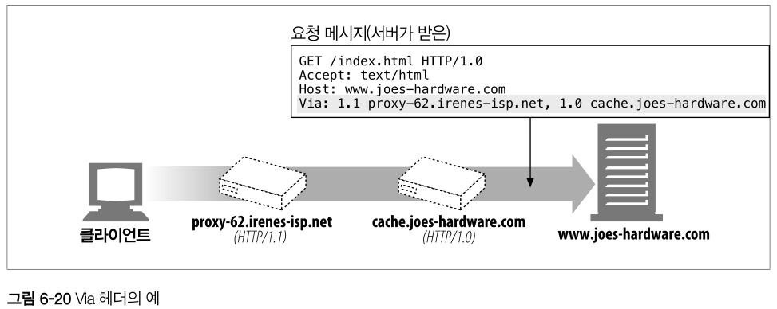
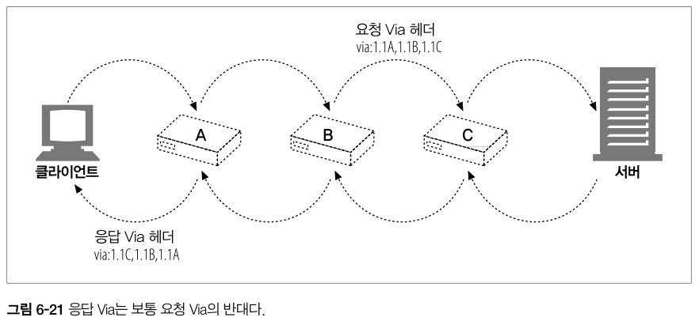
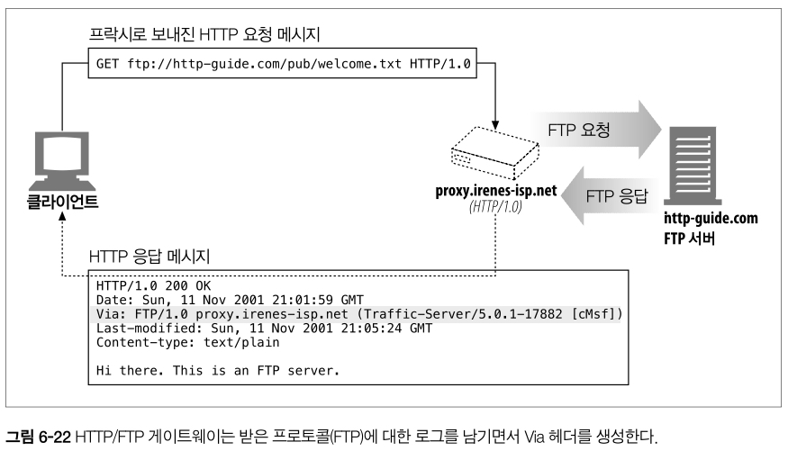
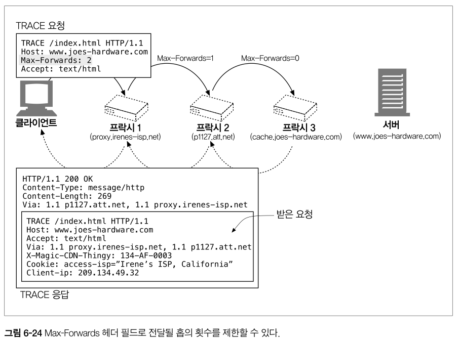
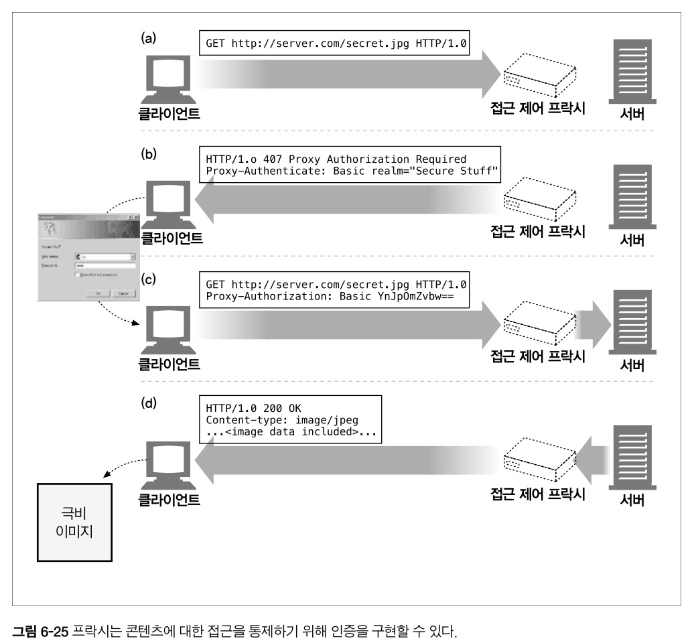
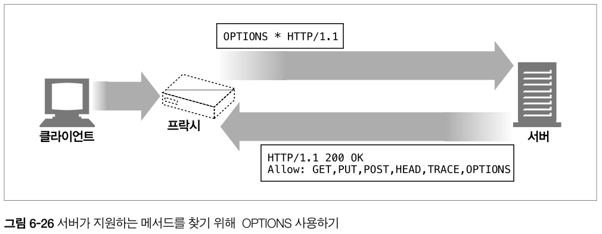

# HTTP Study - 6. Proxy

# 프락시란?

클라이언트와 서버 사이에 위치하여 HTTP 메세지를 정리하는 중개자

웹 서버이기도 하고 웹 클라이언트이기도 하다.

→ 클라이언트의 요청을 받게 되므로. 웹 서버처럼 요청과 커넥션을 적절히 다루고 응답을 돌려줘야 한다.
→ 동시에 요청을 서버로 보내기도 하므로, 요청을 보내고 응답을 받는 HTTP 클라이언트처럼 동작해야 한다.

⇒ 직접 HTTP 프락시를 만든다면, HTTP **클라이언트와 서버 양쪽의 규칙을 모두 준수**해야 함


<br /><br />

## 개인 프락시 / 공유 프락시

- **개인 프락시** : 하나의 클라이언트만을 위한 프락시
- **공유 프락시** : 여러 클라이언트가 함께 사용하는 프락시

대부분의 프락시들은 공유 프락시의 형태

<br /><br />

## 게이트웨이?

- **프락시** : 같은 프로토콜을 사용하는 둘 이상의 어플리케이션 연결
- **게이트웨이** : 서로 다른 프로토콜을 사용하는 둘 이상을 연결
  - 게이트웨이는 클라이언트와 서버가 서로 다른 프로토콜로 말하더라도,
    서로 간의 트랜잭션을 완료할 수 있도록 해주는 ‘프로토콜 변환기’처럼 동작


- A의 경우, 클라이언트와 서버 둘 다 양쪽에게 HTTP로 말하고 있으므로 HTTP 프락시
- B의 경우, HTTP 프론트엔드, POP 이메일 백엔드를 향하고 있으므로 HTTP/POP 게이트웨이

실질적으로는 프락시와 게이트웨이의 차이점은 모호하다.

- 브라우저와 서버는 다른 버전의 HTTP를 구현하기 떄문에, 프락시 또한 때때로 프로토콜 변환을 하기도 한다.
- 상용 프락시 서버의 경우, SSL 보안 프로토콜, Sockts 방화벽, FTP 접근, 웹 기반 어플리케이션 지원을 위해 게이트웨이 기능을 구현

<br /><br /><br />

# 프락시 사용 이유

보안 개선 / 성능 향상 / 비용 절약 + 모든 HTTP 트래픽 감시 및 수정 가능

### 1. 어린이 필터


어린이에게 부적절한 사이트의 접근을 강제로 거부하는 필터 프락시 예시

<br />

### 2. 문서 접근 제어


회사 내 각기 다른 조직에서 관리되는 다양한 종류, 수많은 웹 서버들에 대한 접근 제어를 중앙 프락시에서 설정 가능

<br />

### 3. 보안 방화벽


특정 조직 안에 들어오거나 나가는 응용 레벨 프로토콜의 흐름을 네트워크의 한 지점에서 통제
바이러스 제거 웹, 이메일 프락시가 사용할 수 있는, 트래픽을 세심히 살펴볼 수 있는 Hook 제공

<br />

### 4. 웹 캐시


문서의 사본 관리, 요청이 오면 빠르게 제공

<br />

### 5. 대리 프락시


웹 서버인 것 처럼 위장해 진짜 웹 서버 요청을 받지만, 응답을 내려주는 것이 아닌
요청 받은 콘텐츠의 위치를 찾아내기 위해 다른 서버와 커뮤니케이션 담당 (느린 웹 서버 성능 가속 = 서버 가속기)

<br />

### 6. 콘텐츠 라우터


인터넷 트래픽 조건과 콘텐츠의 종류에 따라 요청을 특정 웹 서버로 유도

<br />

### 7. 트랜스코더


콘텐츠를 클라이언트에 전달하기 전에, 본문 포맷팅 가능

- 크기를 줄이기 위해 자신을 거쳐가는 gif 이미지 → jpg 변환
- 이미지 색 강도 줄이기 / 텍스트 파일 압축 / 문서 외국어 변환 가능

<br />

### 8. 익명화 프락시


HTTP 메세지에서 신원 확인이 가능한 헤더들 삭제 (ip, from, referer, 쿠키, url 세선) = 익명성 보장

<br /><br /><br />

# 프락시의 위치

프락시는 어떻게 사용하느냐에 따라 **어디에든 배치 가능**하다.

<br />

## 프락시 서버가 배치될 수 있는 방법

### 1. 출구(Egpress) 프락시

로컬 네트워크의 출구에 프락시 배치

- 로컬 네트워크 < - > 더 큰 인터넷
- 회사 밖의 악의적인 해커들을 막는 방화벽 제공을 위해 / 인터넷 요금 절약 및 성능 개선을 위해 사용
- 부적절한 콘텐츠 브라우징을 막는 필터링 출구 프락시

<br />

### 2. 접근(입구) 프락시

ISP 접근 지점에 프락시 배치

- 사용자들의 다운로드 속도 개선, 인터넷 대역폭 비용 절감을 위해 사용

> ISP(Internet Service Provider)<br />
> 인터넷에 접속하는 수단을 제공하는 주체

<br />

### 3. 대리 프락시

웹 서버 바로 앞에 위치

- 모든 요청을 처리하는 역할 + 필요할 때만 웹 서버에 자원 요청
- 일반적으로 웹 서버의 이름과 IP 주소로 스스로를 가장 → 모든 요청을 받게 된다.

<br />

### 4. 네트워크 교환 프락시

네트워크 사이 인터넷 피어링 교환 지점에 배치

- 캐시를 이용하여 인터넷 교차로의 혼잡 완화, 트래픽 감시를 위해 사용

<br /><br />

## 프락시 계층

프락시들은 프락시 계층이라고 불리는 연쇄를 구성할 수 있다. (부모와 자식 관계)

- 서버쪽에 가까운 프락시를 부모(인바운드 프락시),<br />
  클라이언트 쪽에 가까운 프락시를 자식(아웃바운드 프락시)라 말한다.


정적 프락시 계층의 예시

<br />

### 프락시 계층 콘텐츠 라우팅

계층은 정적일 수도 동적일 수도 있다.


동적 프락시 계층의 예시
’접근 프락시’는 상황에 맞게 부모 프락시나 원 서버에게 라우팅

<br />

동적으로 부모를 선택하는 몇가지 예시

1. 부하 균형 : 부모들의 작업량 수준에 근거하여 부모 선택
2. 지리적 인접성 근거 : 원 서버의 지역을 담당하는 부모 선택
3. 프로토콜/타입 라우팅 : URI에 근거하여 라우팅
   (특정 종류의 URI 가지고 있으면, 특별한 프락시 서버로 보내져 처리될 수 있다.)
4. 유료 서비스 가입자 라우팅 : 유료 서비스 구독자들의 URI는 대형 캐시나 성능 개선을 위한 압축 엔진으로 라우팅

동적 라우팅 로직은 제품마다 다르게 구현된다.

- 제품 : 설정 파일, 스크립트 언어, 동적으로 실행 가능한 플러그인 등

<br />

### 프락시의 트래픽 처리 방법

클라이언트 트래픽이 프락시로 가도록 하는 방법

1. 클라이언트 수정
   1. 많은 웹 클라이언트들은 수동, 자동 프락시 설정 기능 지원
2. 네트워크 수정
   1. 스위칭 장치, 라우팅 장치를 통해 HTTP 트래픽을 지켜보다가 가로채어 프락시로 전송
3. DNS 이름공간 수정
   1. DNS 이름 테이블을 수동으로 편집하거나 사용할 적절한 프락시나 서버를 게산해주는 동적 DNS 서버를 사용하여 프락시의 이름 조정 가능
4. 웹 서버 수정
   1. 웹 서버의 리다이렉트 대상을 프락시로 설정


<br /><br /><br />

# 클라이언트 프락시 설정

브라우저가 프락시를 설정하는 방법에는 여러가지가 있다.

1. 수동 설정
2. 브라우저 기본 설정
3. 프락시 자동 설정 (PAC)
4. WPAD 프락시 발견

<br /><br />

## 1. 수동 설정

구글 크롬, 마이크로소프트 익스 등 많은 웹 클라이언트가 간편하게 프락시 수동으로 설정 가능

사용 방법은 다르지만 공통적인 로직은 같다.

- 프락시의 호스트와 포트 지정
- ISP는 그들의 요구에 맞춰 미리 설정된 브라우저나 웹 트래픽을 프락시 서버로 리다이렉트하는 맞춤형 운영 체제 구입

아무래도 수동으로 설정해야 하기 때문에 유연한 대처는 불가능하다.

<br /><br />

## 2. 프락시 자동 설정 (PAC)

프락시 설정을 상황에 맞게 계산해주는 작은 자바스크립트 프로그램

PAC 파일의 URI를 브라우저에 설정해야 사용 가능

- 브라우저는 URI로부터 PAC 파일을 가져와 매 접근마다 적절한 프락시 서버를 계산

<br />

### PAC 파일

- `.pac` 확장자
- MIME type: ‘`application/x-ns-proxy-autoconfig`’
- `FindProxyForUrl(url, host)` 함수 정의해야 함
- 예시
  ```jsx
  function FindProxyForURL(url, host) {
    if (url.substring(0, 5) == "http:") {
      return "PROXY http-proxy.mydomain.com:8080";
    } else if (url.substring(0, 4) == "ftp:") {
      return "PROXY ftp-proxy.mydomain.com:8080";
    } else {
      return "DIRECT";
    }
  }
  ```

<br /><br />

## 3. WPAD 프락시 발견

WPAD(웹 프락시 자동발견 프로토콜)은 브라우저에게 알맞는 PAC 파일을 자동으로 찾아주는 알고리즘이다.

- PAC URI를 찾기 위해 WPAD를 사용하면
- 주어진 URI에서 PAC 파일을 가져오고 → 실행 → 알아낸 프락시 서버를 이용하여 요청 처리

WPAD는 PAC 파일을 적절하게 가져오기 위해 다음의 기법을 하나씩 시도

- 동적 호스트 발견 규약 (DHCP)
- 서비스 위치 규약 (SLP)
- DNS 잘 알려진 호스트 명
- DNS SRV 레코드
- DNS TXT 레코드 안의 서비스 URI

<br /><br /><br />

# 프락시 요청의 미묘한 특징들

## 1. 프락시 URI는 서버 URI와 다르다.

웹 서버와 웹 프락시의 문법은 서로 같지만 한 가지 예외가 존재한다. = URI가 달라진다.

- 클라이언트가 웹 서버로 요청을 보낼 때
  ```
  GET /index.html HTTP/1.0
  User-Agent: SuperBrowserv1.3
  ```
- 클라이언트가 프락시로 요청을 보낼 때
  ```
  GET http://www.marys-antiques.com/index.html HTTP/1.0
  User-Agent: SuperBrowser v1.3
  ```

기존 클라이언트 : 단일한 서버와 직접 대화

단일 서버는 자신의 호스트 명과 포트번호를 알고 있다!

- 부분 URI 전송

프락시가 도입되고 난 이후 클라이언트 : 프락시와 대화 → 프락시가 목적지 서버와 대화

프락시는 목적지 서버의 이름을 모른다!

- 완전한 URI 전송

<br />

> **가상 호스팅**<br /><br />가상 호스팅에서도 부분 URI를 사용하면, 웹 서버는 그 요청이 접근하고자 하는 웹 사이트의 호스트명을 모른다.<br />→ 호스트와 포트에 대한 정보가 담겨있는 Host 헤더를 요구하는 방법으로 해결

<br /><br />

## 2. 대리(인터셉트) 프락시는 부분 URI를 받는다.

대리 프락시는 클라이언트가 그 존재를 모른다

- 대리 프락시는 원 서버의 호스트 명과 아이피 주소를 사용해 원 서버를 대신
- 부분 URI를 받게 된다. ⇒ 문제 없음

<br /><br />

## 3. 프락시는 프락시 요청과 서버 요청을 전부 다룰 수 있다.

트래픽이 프락시 서버로 리다이렉트 되는데에는 수많은 방법 존재

→ 다목적 프락시 서버는 완전 URI와 부분 URI 방식을 모두 지원해야 한다.

<br /><br />

## 4. 전송 중 URI 변경

사소한 URI 변경이라도, 다운스트림 서버와 상호운용성 문제를 일으킬 수 있으므로 URI 변경은 매우 중요.

따라서 일반적으로 프락시 서버는 가능한 한 관대해야 한다.

- 기본 HTTP 포트를 명시적인 :80으로 변경하는 것
- 잘못 사용된 글자를 → 올바르게 이스케이프 하는 것

⇒ 이처럼 당연한 URI 변경도 문제를 야기할 수 있다.

> 빈 경로를 ‘/’로 고치는 것이 유일한 예외

<br /><br />

## 5. URI 클라이언트 자동확장과 호스트 명 분석

브라우저는 요청 URI를 상황에 따라 다르게 분석

- 프락시가 없다면 URI에 대응하는 IP 주소를 찾는다.
- 호스트명이 발견되면 그에 대응하는 IP 주소들을 연결에 성공할 때까지 시도

만약 호스트명이 발견되지 않는다면, 호스트명의 확장을 제공한다.

- 웹 사이트의 가운데 부분만 입력 (`naver` → `www.naver.com`)
- 해석할 수 없는 URI는 서드파티 사이트로 넘겨 그 곳에서 사용자가 의도했을 만한 URI 예측
- DNS는 사용자가 호스트명의 앞부분만 입력한다면 자동으로 관련 도메인을 검색하도록 설정


명시적인 프락시를 사용할 때의 URI 분석


대리 프락시를 사용할 때의 URI 분석

(1) 사용자는 브라우저의 URI 창에 ‘`oreilly`’ 타이핑

(2) a에서 브라우저는 ‘`oreilly`’를 찾지만 → b 에서 찾을 수 없다 응답 반환

(3) a에서 브라우저는 ‘`oreilly`’를 ‘`www.oreilly.com`’으로 **확장**하여 전송
→ b에서 실제 서버 주소 응답 반환

(4) 대리 프락시에 의해 a 요청 종료 (but, 클라이언트는 그걸 모른다.) → b 응답 반환

(5) 대리 프락시가 실제 원 서버와 연결할 준비가 되어 연결이 성립 → 하지만 원 서버는 죽어있다.

- 이런 경우에는 호스트 헤더에 들어있는 호스트 명을 다시 분석하든, IP 주소에 대한 역방향 DNS 룩업을 해서든 다른 IP 주소 시도

<br /><br />

# 메시지 추적

클라이언트에서 서버로 향하는 도중 둘 이상의 프락시를 지난다.

프락시는 여러 벤더에 의해 개발되기 때문에 서로 다른 기능과 버그들을 갖고 있으며 여러 조직에 의해 관리된다.

프락시가 점점 더 흔해지면서, **프락시를 넘나드는 메시지의 흐름을 추적하고 문제점을 찾아내는 것도 필요**한 일이 되었다.

<br />

## Via 헤더

메시지가 지나는 각 중간 노드(프락시나 게이트웨이)의 정보를 나열한다.

메시지가 또 다른 노드를 지날때마다 중간노드는 Via 목록의 끝에 반드시 추가되어야한다.

```jsx
Via: 1.1 proxy-62.irenes-isp.net, 1.0 cache.joes-hardware.com
```

`[구현한 프로토콜] [불리는 이름]`

첫번째 프락시는 HTTP/1.1 프로토콜을 구현했으며 proxy-62.irenes-isp.net이라 불리고

두번째 프락시는 HTTP/1.0을 구현했고 cache.joes-hardware.com로 불린다.



<br />

### Via 헤더 필드의 사용 목적

- 메시지의 전달을 추적하기 위해
- 메시지 루프를 진단하기 위해
- 요청을 보내고 그에 대한 응답을 돌려주는 과정에 관여하는 모든 메시지 발송자들의 프로토콜을 다루는 능력을 알아보기 위해
- 네트워크의 라우팅 루프를 탐지하기 위해

<br />

### Via 문법

Via 헤더 필드는 쉼표로 구분된 **경유지(waypoint)의 목록**

각 경유지는 개별 프락시 서버나 게이트웨이 홉을 나타내며 그들 중간 노드의 **프로토콜과 주소에 대한 정보**를 담고있다.

```jsx
Via: 1.1 proxy-62.irenes-isp.net, 1.0 cache.joes-hardware.com
```

```jsx
Via = "Via" ":" (waypoint) ["," (waypoint)...]

waypoint = (received-protocol received-by [comment])

received-protocol = [protocol-name "/"] protocol-version

received-by = (host [":" port]) | pseudonym
```

```jsx
waypoint => 프로토콜이름(선택. 기본은 HTTP) 프로토콜버전(필수) 노드이름(필수) 코멘트(선택)
```

- 프로토콜 이름
  - 중개자가 받은 프로토콜
  - 만약 HTTP라면 생략 가능
  - 비 HTTP 프로토콜은 게이트웨이가 다른 프로토콜(HTTPS, FTP)을 위해 HTTP 요청에 접속할 때 발생
- 프로토콜 버전
  - 수신한 메시지의 버전
  - HTTP의 경우 표준 버전 번호(1.0, 1.1 등)가 사용된다.
  - Via필드에 포함되므로 애플리케이션들은 자신 이전의 모든 중개자들이 어떤 버전을 다룰 수 있는지 알 수 있다.
- 노드 이름
  - 중개자의 호스트와 포트 번호(포트번호는 선택. 생략 시 사용하는 프로토콜의 기본 포트로 간주)
  - 정보보호를 이유로 진짜 호스트명을 감추고, 가명으로 대체할 수 있다.
- 노드 코멘트
  - 중개자 노드를 서술하는 선택적인 코멘트.
  - 벤더나 버전정보 등
  - 장치에서 일어난 이벤트에 대한 진단 정보 등

<br />

### Via 요청과 응답 경로

요청메시지와 응답메시지 모두 프락시를 지나므로 둘 모두 Via 헤더를 가진다.

보통 같은 TCP 커넥션을 오가므로, **응답 Via헤더는 거의 언제나 요청 Via헤더와 반대다.**



<br />

### Via와 게이트웨이

몇몇 프락시는 서버에게 비 HTTP 프로토콜을 사용할 수 있는 게이트웨이 기능을 제공

프로토콜 변화를 기록하는 Via헤더를 통해 HTTP 애플리케이션은 프락시 연쇄에서 프로토콜 능력과 변환이 있었는지 알수 있다.



<br />

### Server 헤더와 Via 헤더

Server 응답 헤더 필드는 원 서버에 의해 사용되는 소프트웨어를 알려준다.

```jsx
Server: Apache/1.3.14 (Unix) PHP/4.0.4
Server: Netscape-Enterprise/4.1
Server: Microsoft-IIS/5.0
```

Server헤더는 원 서버를 위해 존재하기 때문에,

- 응답 메시지가 프락시를 통과할 때 **프락시는 Server 헤더를 수정할 수 없다.**
- 대신 프락시는 **Via 항목을 추가해야한다.**

<br />

### Via가 개인정보 보호와 보안에 미치는 영향

문자열 안에 정확한 호스트명이 들어가기를 원하지 않는 경우가 있다.

- Via 노드 이름전달이 가능하지 않다면, 보안 경계선의 일부인 프락시는 호스트명을 그 호스트에 대한 적당한 가명으로 교체해야한다.
- 이로 인해 실제 이름을 알기 어렵게 되었다고 하더라도 일반적으로 프락시는 각 프락시 서버에 대한 Via경유지 항목을 유지하려 노력해야한다.

아주 강력한 보안 요구사항을 갖고 있는 조직들을 위해, 프락시는 정렬된 일련의 Via경유지 항목들을 하나로 합칠 수 있다.

```jsx
Via: 1.0 foo, 1.1 devirus.company.com, 1.1 access-logger.company.com
```

```jsx
Via: 1.0 foo, 1.1 concealed-stuff
```

- 조건
  - 수신된 프로토콜 값이 같아야한다.
  - 여러 경유지들이 모두 같은 조직의 통제하에 있어야한다.
  - 호스트가 이미 가명으로 교체되지 않은 경우여야 한다.

<br /><br />

## TRACE 메서드

프락시 서버는 메시지가 전달될 때 메시지를 변경할 수 있으며, 이를 통해 헤더를 추가, 변경, 삭제하거나 본문을 다른 형식으로 변환할 수 있다.  
이러한 프락시 네트워크를 쉽게 진단하기 위해 HTTP 프락시 네트워크를 통해 메시지의 변화를 관찰할 수 있는 방법이 필요하다.

TRACE 메서드를 사용하면 프락시 흐름을 디버깅하는데 매우 유용하다. ==> 하지만 TRACE 메서드는 널리 구현되지 않아서 사용이 제한적이다.

TRACE 요청이 목적지 서버에 도착했을 때, 서버는 전체 요청 메시지를 HTTP응답 메시지의 본문에 포함시켜 송신자에게 그대로 돌려보낸다. TRACE응답이 도착했을때 클라이언트는 서버가 받은 메시지와 그 메시지가 지나간 프락시의 목록을 검사할 수 있다.

TRACE 응답의 Content-Type는 `message/http`, 상태는 `200 OK`

<br />

### Max-Forwards 헤더

TRACE나 OPTIONS 요청의 **프락시 홉 개수를 제한하기 위해 사용**

- 전달되는 메시지가 무한루프에 빠지지 않는지 프락시 연쇄 테스트를 하거나 연쇄 중간의 특정 프락시 서버들의 효과를 체크할 때 유용



<br />

### 프락시 인증

프락시는 **접근 제어 장치**로서 제공될 수 있다



(a) 제한된 콘텐츠에 대한 요청이 프락시 서버에 도착했을 때, 프락시 서버는 접근 자격을 요구하는 407 Proxy Authorization Required 상태 코드를 Proxy-Authenticate 헤더 필드와 함께 반환한다. (Proxy-Authenticate 헤더 필드 : 어떻게 그러한 자격을 제출할 수 있는지 설명해주는 헤더)

(b) 클라이언트는 407 응답을 받으면, 요구되는 자격을 수집한다.

(c) 자격을 획득하면, 클라이언트는 요구되는 자격을 Proxy-Authentication 헤더 필드에 담아 요청을 보낸다.

(d) 자격이 유효하다면, 프락시는 원 요청을 연쇄에 따라 통과시킨다. 유효하지 않다면 407 응답을 보낸다.

단, 프락시 인증은 인증에 참여하는 프락시가 프락시 연쇄상에 여러개 있을 때는 일반적으로 잘 동작하지 않는다.

<br />

### 프락시 상호운용성

### 지원하지 않는 헤더와 메서드 다루기

프락시 서버는 넘어오는 모든 헤더 필더들을 이해하지 못할 수도 있다.

몇몇 헤더는 프락시 자신보다 새로운 것일수도 있고, 특정 애플리케이션만을 위해 특별히 만들어진 것일 수도 있다.

프락시는 **이해할 수 없는 헤더필드는 반드시 그대로 전달**해야하며, 같은 이름의 헤더필드가 **여러개 있는 경우에는 그들의 상대적인 순서도 반드시 유지**해야한다.

<br />

### OPTIONS: 어떤 기능을 지원하는지 알아보기

HTTP OPTIONS메서드는 서버나 웹 서버의 특정 리소스가 **어떤 기능을 지원하는지**(ex. 지원하는 메서드) 클라이언트(또는 프락시)가 알아볼 수 있게 해준다.

서로 다른 기능 수준의 서버와 프락시가 더 쉽게 상호작용할 수 있도록 클라이언트는 OPTIONS를 이용해 **서버의 능력을 먼저 알아낼 수 있다**.



- 200 OK 응답과 함께, 어떤 메서드가 지원되는지 서술하는 Allow 헤더가 전달된다.
- HTTP/1.1이 명시한 헤더는 Allow헤더 뿐이지만 더 많은 정보를 위해 OPTIONS는 선택적인 응답본문을 허용한다. 하지만 이에 대해 정의된 것은 없다.

<br />

### Allow헤더

- 지원되는 메서드들을 열거한다.
- 새 리소스가 지원했으면 하는 메서드를 추천하기 위해 요청 헤더로 사용될 수 있다.
  - 서버는 추천 받은 메서드를 모두 지원해야 할 의무는 없다.
  - 그 요청에 대한 응답에는 실제로 지원하는 메서드들을 열거하는 Allow헤더를 포함시켜야한다.
- 프락시가 지정된 모든 메서드를 이해할 수 없다고 해도 프락시는 Allow 헤더 필드를 수정할 수 없다. 클라이언트는 원 서버와 대화하는 다른 경로를 갖고 있을 수 있기 때문이다.
