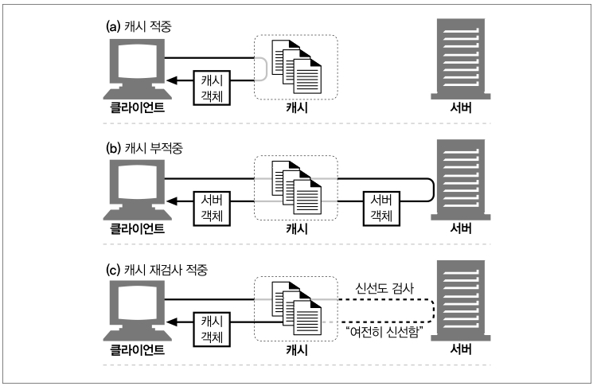
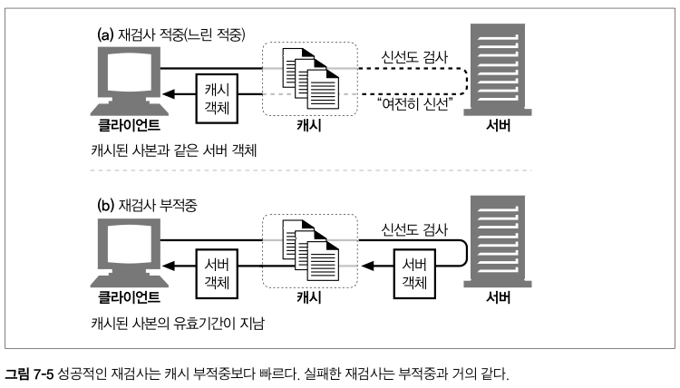
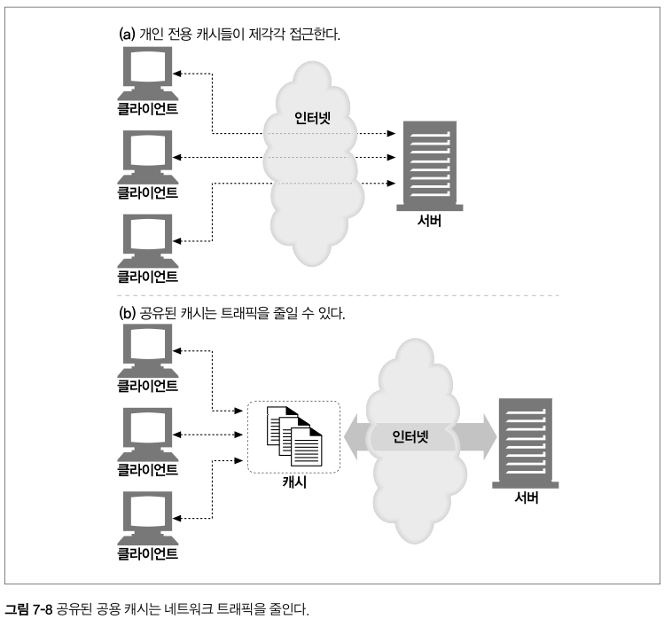
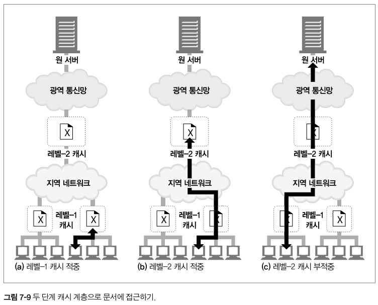
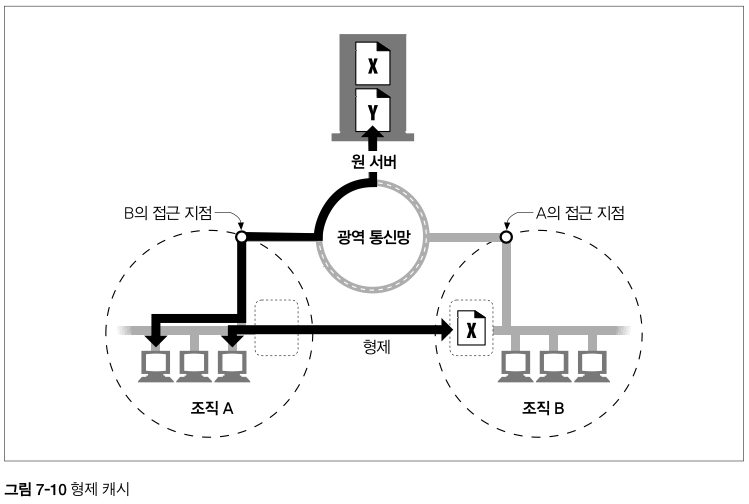

# 7장 캐시

# 웹캐시

자주 쓰이는 문서의 사본을 자동으로 보관하는 HTTP장치

 

**혜택**

- 불필요한 데이터 전송을 줄여서, 네트워크 요금으로 인한 비용을 줄인다.
- 네트워크 병목을 줄여준다. 대역폭을 늘리지 않고도, 페이지를 빨리 불러올 수 있게 한다.
- 원서버에 대한 요청을 줄여준다. 서버는 부하를 줄일 수 있으며, 더 빨리 응답할 수 있게 된다.
- 거리로 인한 지연을 줄여준다.

  

# 불필요한 데이터 전송

복수의 클라이언트가 자주 쓰이는 원서버 페이지에 접근한다면, 서버는 같은 문서를 각각의 클라이언트들에게 한번씩 전송해야한다.

- 불필요한 반복의 데이터 전송 ⇒ 값비싼 네트워크 대역폭을 잡아먹고, 전송을 느리게 만들며, 웹 서버에 부하를 준다.

**캐시를 이용하면?**

첫번째 서버의 응답이 캐시에 보관되고, 이후에 들어오는 요청은 캐시된 사본이 응답으로 사용된다.

⇒ **원 서버가 중복해서 트래픽을 주고받는 낭비가 줄어든다.**

  

# 대역폭 병목

캐시는 또한 네트워크 병목을 줄여준다.

원격서버보다 로컬 네트워크 클라이언트에 더 넓은 대역폭을 제공한다.

클라이언트가 서버에 접근할때의 속도는 그 경로에 있는 가장 느린 네트워크의 속도와 같다. 만약 클라이언트가 빠른 LAN에 있는 캐시로부터 사본을 가져온다면, 캐싱은 성능을 개선할 수 있을 것이다.

문서의 크기와 대역폭의 차이에 따라 속도차이가 매우 크게 난다.

ex) 5MB 크기의 파일을 전송하는데에 이더넷 LAN이라면 1초 / 56-Kbps모뎀(전화식 모뎀)이라면 12분 이상

  

# 갑작스런 요청 쇄도 (Flash Crowds)

캐싱은 갑작스런 요청 쇄도에 대처하기 위해 특히 중요하다.

갑작스런 사건(뉴스 속보, 스팸 메일, 유명 인사와 관련된 사건 등)으로 인해 많은 사람이 거의 동시에 웹 문서에 접근할 때 이런 일이 발생한다. 이 결과로 초래된 불필요한 트래픽 급증은 네트워크와 웹 서버의 심각한 장애를 야기시킨다.

  

# 거리로 인한 지연

대역폭이 문제가 되지 않더라도, 거리가 문제가 될 수 있다.

라우터가 발생시키는 인터넷 트래픽 지연과 빛의 속도 그 자체도 유의미한 지연을 유발한다.

기계실 근처에 캐시를 설치해서 문서가 전송되는 거리를 수천킬로미터에서 수십미터로 줄일 수 있다.

  

# 적중과 부적중

그러나, 캐시가 세상 모든 문서의 사본을 저장하지는 않는다.

캐시에 요청이 도착했을 때,

(a) 만약 그에 대응하는 사본이 있다면 그를 이용해 처리될 수 있다. ⇒ `캐시 적중(cache hit)`

(b) 만약 대응하는 사본이 없다면, 그냥 원서버로 전달이 된다. ⇒ `캐시 부적중(cache miss)`

 

## 재검사(Revalidation)

원서버 콘텐츠는 변경될 수 있기 때문에, 캐시는 반드시 그들이 가지고 있는 사본이 최신버전인지 서버를 통해 점검해야한다.

 

### 언제 재검사를 하는가?

캐시는 스스로 원할때면 언제든지 사본을 재 검사할 수 있다.

그러나 캐시가 가지고 있는 문서의 양에 비해 네트워크 대역폭이 부족하기 때문에,

⇒ 대부분의 캐시는 클라이언트가 사본을 요청하였으며 그 사본이 검사를 할 필요가 있을 정도로 오래된 경우에만 재검사를 한다.

캐시는 사본의 재검사가 필요할 때, 원 서버에 작은 재검사 요청을 보낸다.

캐시된 객체를 확인하기 위해 제공되는 몇가지 도구 중 가장 많이 쓰이는 것은 `If-Modified-Since` 헤더이다.

GET 요청에 이 헤더를 추가하면 캐시된 이후에 변경된 경우에만 사본을 보내달라는 의미가 된다.

이 요청에 의해 발생할 수 있는 케이스는 다음 세가지이다.

- 서버 콘텐츠가 변경되지 않은 경우 `(재검사 적중)`
- 서버 콘텐츠가 변경된 경우 `(재검사 부적중)`
- 객체가 삭제된 경우

 

### 재검사 적중 (느린 적중)

콘텐츠가 변경되지 않았다면, 서버는 아주 작은 304 Not Modified 응답을 보낸다.

- 그 사본이 여전히 유효함을 알게 된 캐시는 사본이 신선하다고 임시로 다시 표기한 뒤, 클라이언트에게 제공한다.
- 순수 캐시 적중보다는 느리지만, 캐시 부적중보다는 빠르다.

 

### 재검사 부적중

만약 서버 개체가 캐시된 사본과 다르다면, 서버는 콘텐츠 전체와 함께 평범한 HTTP 200 OK 응답을 클라이언트에게 보낸다.

 

### 객체 삭제

만약 서버 객체가 삭제되었다면, 서버는 404 Not Found 응답을 돌려보내며, 캐시는 사본을 삭제한다.

 

## 적중률

캐시가 요청을 처리하는 비율을 캐시 적중률(혹은 캐시 적중비), 혹은 문서 적중률(혹은 문서 적중비)라고 부른다.

0부터 1까지의 값으로 되어있지만, 흔히 퍼센트로 표현된다.

- 0% 모든 요청이 캐시 부적중
- 100% 모든 요청이 캐시 적중

캐시가 얼마나 큰지 ,캐시 사용자들의 관심사가 얼마나 비슷한지, 캐시된 데이터가 얼마나 자주 변경되거나 개인화되는지, 캐시가 어떻게 설정되어있는지에 달려있다.

오늘날 적중률 40%면 웹 캐시로 괜찮은 편이다.

보통 크기의 캐시라도 충분한 분량의 자주 쓰이는 문서들을 보관하여 상당히 트래픽을 줄이고 성능을 개선할 수 있다.

 

## 바이트 적중률

문서가 모두 같은 크기가 아니기 때문에 문서 적중률이 모든 것을 말해주지는 않는다.

몇몇 큰 객체는 덜 접근되지만 크기 때문에 전체 트래픽에는 더 크게 기여한다.

이러한 이유로, 어떤 사람들은 바이트 단위 적중률을 선호한다.

캐시를 통해 제공된 모든 바이트의 비율을 표현한다. 이 측정값은 트래픽이 절감된 정도를 포착해낸다.

100% : 모든 바이트가 캐시에서 왔으며, 어떤 트래픽도 인터넷으로 나가지 않았음을 의미한다.

- 문서 적중률 : 얼마나 많은 웹 트랜잭션을 외부로 내보내지 않았는지 보여준다.
  - 트랜잭션은 고정된 소요시간을 포함하게되는데, 문서 적중률을 개선하면 전체 대기시간이 줄어든다.
- 바이트 단위 적중률 : 얼마나 많은 바이트가 인터넷으로 나가지 않았는지 보여준다.
  - 바이트 단위 적중률의 개선은 대역폭 절약을 최적화한다.

 

## 적중과 부적중의 구별

불행히도, HTTP는 클라이언트에게 응답이 캐시 적중이었는지 아니면 원 서버 접근인지 말해주는 방법을 제공하지 않는다. 응답 코드는 동일하게 200 OK 를 받는다.

캐시에서 왔는지 알아내는 방법

- Date 헤더
  - 응답의 Date헤더값과 현재 시각을 비교하여 응답 생성일이 더 오래되었다면 캐시된 것
- Age 헤더
  - 수신자에게 응답이 얼마나 오래되었는지 말해준다.
  - 초 단위의 변화량
  - Age: delta-seconds (ex. Age: 60)

  

# 캐시 토폴로지 (**연결 방식)**

- 개인 전용 캐시(private cache)
  - : 한명에게만 할당된 캐시
  - 한 명이 사용자가 자주 찾는 페이지를 담는다.
- 공용 캐시(public cache)
  - : 공유된 캐시
  - 사용자 집단에게 자주 쓰이는 페이지를 담는다.

 

### 개인 전용 캐시

많은 에너지나 저장 공간을 필요로 하지 않으므로, 작고 저렴하다.

웹브라우저는 개인 전용 캐시를 내장하고 있다. 대부분의 브라우저는 자주 쓰이는 문서를 개인용 컴퓨터의 디스크와 메모리에 캐시해놓고, 사용자가 캐시 사이즈와 설정을 수정할 수 있도록 허용한다. 캐시에 어떤 것들이 있는지 확인하기 위해 브러우저 안을 들여다보는 것도 가능하다.

[about://cache](about://cache)

 

### 공용 프락시 캐시

캐시 프락시 서버 혹은 프락시 캐시등이 공유된 프락시 서버

로컬 캐시에서 문서를 제공하거나 혹은 사용자 입장에서 서버에 접근한다.

공유된 공용 캐시에서 캐시는 자주 찾는 객체를 단 한번만 가져와 공유된 사본을 제공함으로써 네트워크 트래픽을 줄인다.

 

### 프락시 캐시 계층들

작은 캐시에서 캐시 부적중이 발생했을 때 더 큰 부모 캐시가 걸러 남겨진 트래픽을 처리하도록 하는 계층을 만드는 방식이 합리적인 경우가 많다.

클라이언트 주위에는 작고 저렴한 캐시를 사용하고 계층 상단에는 많은 사용자들에 의해 공유되는 문서를 유지하기 위해 더 크고 강력한 캐시를 사용하자는 것이다.

캐시 계층이 깊다면 요청은 캐시의 긴 연쇄를 따라가게 될 것이다. 프락시 연쇄가 길어질수록 각 중간 프락시는 현저한 성능 저하가 발생할 것이다.

- 두개 혹은 세개의 프락시만 거치도록 스스로 제한하지만, 새로운 세대의 고성능 프락시 서버들은 프락시 연쇄의 길이가 문제가 되지 않도록 할 것이다.

 

### 캐시망, 콘텐츠 라우팅, 피어링

몇몇 네트워크 아키텍처는 단순한 캐시 계층 대신 복잡한 캐시망을 만든다.  
캐시망의 프락시 캐시는 서로 대화하여, 어떤 부모 캐시와 대화할 것인지, 아니면 요청이 캐시를 완전히 우회해서 원 서버로 바로 가도록 할 것인지에 대한 캐시 커뮤니케이션 결정을 동적으로 내린다.

캐시망 안에서의 콘텐츠 라우팅을 위해 설계된 캐시들은 다음 일들을 모두 할 수 있다.

- URL에 근거하여 특정 부모 캐시를 동적으로 선택한다.
- 부모 캐시에게 가기 전에, 캐시된 사본을 로컬에서 찾아본다.
- 다른 캐시들이 그들의 캐시된 콘텐츠에 부분적으로 접근할 수 있도록 허용하되, 그들의 캐시를 통한 인터넷 트랜짓(Internet transit)은 허용하지 않는다.

 

복잡한 캐시 사이의 관계는, **서로 다른 조직들이 상호 이득을 위해 그들의 캐시를 연결하여 서로를 찾아볼 수 있도록** 해준다. **선택적인 피어링을 지원**하는 캐시는 `형제 캐시`라고 불린다.

HTTP는 형제 캐시를 지원하지 않기 때문에, 사람들은 인터넷 캐시 프로토콜(ICP)이나 하이퍼텍스트 캐시 프로토콜(HTCP) 같은 프로토콜을 이용해 HTTP를 확장했다.

> 피어링 : 인터넷 서비스 제공자끼리 서로 네트워크를 연결하고 트래픽을 교환하는 것을 의미
