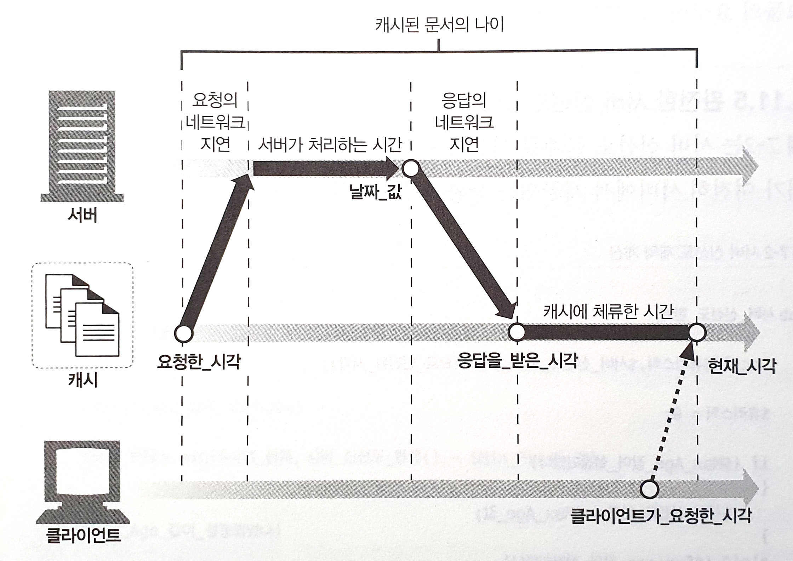

## 7.7 캐시 처리 단계

오늘날 상용 프락시 캐시는 매우 고성능으로 HTTP와 그 외 다른 기술의 고급 기능을 지원하도록 만들어져있어 꽤 복잡하다. 그러나 원래 웹 캐시의 기본적인 동작은 대개 단순하다.  
HTTP GET 메시지 하나를 처리하는 기본적인 캐시 처리 절차는 일곱 단계로 이루어져 있다.

7.7.1. 요청 받기 - 캐시는 네트워크로부터 도착한 요청 메시지를 읽는다.  
7.7.2. 파싱 - 캐시는 메시지를 파싱하여 URL과 헤더들을 추출한다.  
7.2.3. 검색 - 캐시는 로컬 복사본이 있는지 검사하고, 사본이 없다면 사본을 받아온다(그리고 로컬에 저장한다.)  
7.2.4. 신선도 검사 - 캐시는 캐시된 사본이 충분히 신선한지 검사하고, 신선하지 않다면 변경사항이 있는지 서버에게 물어본다.  
7.2.5. 응답 생성 - 캐시는 새로운 헤더와 캐시된 본문으로 응답 메시지를 만든다.  
7.2.6. 발송 - 캐시는 네트워크를 통해 응답을 클라이언트에게 돌려준다.  
7.2.7. 로깅 - 선택적으로, 캐시는 로그파일에 트랜잭션에 대해 서술한 로그 하나를 남긴다.

## 7.8 사본을 신선하게 유지하기

캐시된 데이터는 서버의 데이터와 일치하도록 관리되어야 한다. HTTP는 이를 위해 문서 만료와 서버 재검사라는 단순한 매커니즘을 갖고 있다.

### 7.8.1 문서 만료

HTTP는 Cache-Control과 Expires라는 특별한 헤더들을 이용하여 원 서버가 각 문서에 유효기간을 붙일 수 있게 해준다.  
캐시 문서가 만료되기 전이면, 캐시는 서버와의 접촉 없이 사본을 제공할 수 있다. 그러나 캐시 문서가 만료되면 반드시 변경 사항이 있는지 서버와 검사해야 하며, 있는 경우 신선한 사본을 새 유효기간과 함께 얻어와야 한다.

### 7.8.2 유효기간과 나이

서버는 응답 본문과 함께 하는, HTTP/1.0 + Expires나 HTTP/1.1 Cache-Control: max-age 응답 헤더를 이용해서 유효기간을 명시한다.

- Cache-Control: max-age  
  max-age 값은 문서의 최대 나이를 정의한다. 최대 나이는 문서가 처음 생성된 이후부터, 더 이상 신선하지 않다고 간주될 때까지 경과한 시간의 합법적인 최댓값(초 단위)이다.  
  `Cache-Control: max-age=484200`
- Expires  
  절대 유효기간을 명시한다. 유효기간이 경과했다면 그 문서는 더이상 신선하지 않다.  
  `Expires: Fri, 05 Jul 2002, 05:00:00 GTM`

### 7.8.3 서버 재검사

캐시된 문서가 만료되었다는 것은 서버 상태로 실제로 반드시 다르다는 것이 아니라, 이제 검사할 시간이 되었음을 뜻한다. 이 때 캐시가 원 서버에서 문서가 변경되었는지 여부를 물어볼 필요가 있으므로 이를 '서버 재검사'라고 부른다.

- 재검사 결과 콘텐츠가 변경되었다면, 캐시는 그 문서의 새로운 사본을 가져와 오래된 데이터 대신 저장한 뒤 클라이언트에게도 보내준다.
- 재검사 결과 콘텐츠가 변경되지 않았다면, 캐시는 새 만료일을 포함한 헤더들만 가져와서 캐시 안의 헤더들을 갱신한다.

이를 통해 캐시는 문서가 만료되었을 때 한 번만 서버와 재검사하면 된다. 신선하지 않은 콘텐츠는 제공하지 않고, 서버 트래픽을 절약하고 사용자 응답을 개선할 수 있다.

### 7.8.4 조건부 메서드와의 재검사

HTTP의 조건부 메서드는 재검사를 효율적으로 만들어준다. 예를 들어 HTTP는 캐시가 '조건부 GET' 요청을 보낼 수 있게 해주는데 이는 서버가 갖고 있는 문서가 캐시가 갖고있는 것과 다른 경우에만 객체 본문을 보내달라고 요청한다. HTTP는 다섯가지 조건부 요청 헤더를 정의하는데, 가장 유용한 것은 `If-Modified-Since`와 `If-None-Match`이다. 모든 조건부 헤더는 `If-` 접두어로 시작한다.

### 7.8.5 If-Modified-Since: 날짜 재검사

가장 흔히 쓰이는 캐시 재검사 헤더이다. 흔히 IMS 요청으로 불린다. 서버에게 리소스가 특정한 날짜 이후로 변경된 경우에만 요청한 본문을 보내달라고 한다.

- 만일 문서가 주어진 날짜 이후에 변경되었다면, 조건이 참이되고 따라서 GET 요청은 평범하게 성공한다. 새 문서, 새로운 만료 날짜와 그 외 정보들이 담긴 헤더들과 함께 캐시에게 반환된다.
- 만약 문서가 주어진 날짜 이후에 변경되지 않았다면 조건은 거짓이고, 서버는 작은 304 Not Modified 응답 메시지를 클라이언트에게 돌려준다. 효율을 위해 본문은 보내지 않는다. 응답은 헤더를 포함하지만, 갱신이 필요한 것만을 보내준다.

### 7.8.6 If-None-Match: 엔터티 태그 재검사

최근 변경 일시 재검사가 적절히 행해지기 어려운 상황이 몇 가지 있다.

- 어떤 문서는 일정 시간 간격으로 다시 쓰여지지만 실제로는 같은 데이터를 포함하고 있다. 내용에는 변화 없이 변경시각이 바뀔 수 있다.
- 어떤 문서의 변경은 전 세계의 캐시들이 그 데이터를 다시 읽기엔 다소 사소한 것일 수도 있다. (예: 철자나 주석 변경)
- 어떤 서버들은 그들이 갖고 있는 페이지에 대한 최근 변경 일시를 정확하게 판별할 수 없다.
- 1초보다 작은 간격으로 갱신되는 문서를 제공하는 서버들에게는, 변경일에 대한 1초의 정밀도는 충분하지 않을 수 있다.

캐시가 객체에 대한 여러 개의 사본을 갖고 있는 경우, 그 사실을 서버에게 알리기 위해 하나의 If-None-Match 헤더에 여러 개의 엔터티 태그를 포함시킬 수 있다.

```
If-None-Match: "v2.6"
If-None-Match: "v2.4", "v2.5", "v2.6"
If-None-Match: "foobar","A34FAC0095","Profiles in Courage"
```

### 7.8.7 약한 검사기와 강한 검사기

캐시는 캐시된 버전이 서버가 갖고 있는 것에 대해 최신인지 확인하기 위해 엔터티 태그를 사용한다. 이 경우, 엔터티 태그와 최근 변경일시는 둘 다 캐시 검사기다.  
HTTP/1.1은 콘텐츠가 조금 변경되었더라도 그 정도면 같은 것으로 서버가 주장할 수 있도록 해주는 '약한 검사기(weak validator)'를 지원한다.  
강한 검사기(strong validator)는 콘텐츠가 바뀔 때마다 바뀐다.  
즉, 강한 엔터티 태그는 대응하는 엔터티 값이 어떻게 바뀌든 매번 반드시 같이 바뀌어야 한다. 약한 엔터티 태그는 대응하는 엔터티에 유의미한 변경이 있을 때마다 같이 변경되어야 한다.

### 7.8.8 언제 엔터티 태그를 사용하고 언제 Last-Modified 일시를 사용하는가

HTTP/1.1 클라이언트는 서버가 엔터티 태그를 반환했다면, 반드시 엔터티 태그 검사기를 사용해야 한다.  
서버가 Last-Modified 값만을 반환했다면, 클라이언트는 If-Modified-Since 검사를 사용할 수 있다.  
앤터티 태그와 최근 변경 일시가 모두 사용 가능하다면, HTTP/1.0과 HTTP/1.1 캐시 모두 적절히 응답할 수 있도록 클라이언트는 각각을 위해 두 가지의 재검사 정책을 모두 사용해야 한다.

## 7.9 캐시 제어

HTTP는 문서 만료 전까지 얼마나 오랫동안 캐시될 수 있게 할 것인지 서버가 설정할 수 있도록 여러 가지 방법을 정의한다. 우선순위대로 나열해보면 서버는,

### 7.9.1 `Cache-Control: no-store` 헤더를 응답에 첨부할 수 있다.

캐시가 그 응답의 사본을 만드는 것을 금지한다. 캐시는 클라이언트에게 no-store 응답을 전달 후 객체를 삭제할 것이다.

### 7.9.2 `Cache-Control: max-age` 헤더를 응답에 첨부할 수 있다.

### 7.9.3 `Expires` 날짜 헤더를 응답에 첨부할 수 있다.

더 이상 사용하지 않기를 권하는(deprecated) Expires 헤더는 초 단위의 시간 대신 실제 만료 날짜를 명시한다.  
 몇몇 서버는 문서를 항상 만료되도록 하기 위해 Expires: 0 응답 헤더를 돌려보내지만, 이는 문법 위반이며 몇몇 소프트웨어와 문제를 일으킬 수 있다.

### 7.9.4 `Cache-Control: must-revalidate` 헤더를 응답에 첨부할 수 있다.

캐시가 이 객체의 신선하지 않은 사본을 원 서버와의 최초의 재검사 없이는 제공해서는 안 됨을 의미한다.

### 7.9.5 휴리스틱 만료

만약 응답이 Cache-Control: max-age 헤더나 Expires 헤더 중 어느 것도 포함하지 않고 있다면, 캐시는 경험적인 방법(heuristic)으로 최대 나이를 계산할 것이다.  
 유명한 휴리스틱 만료 알고리즘의 하나인 LM 인자 알고리즘의 로직은 다음과 같다.

- 캐시된 문서가 마지막으로 변경된 것이 상당히 예전이라면, 안정적인 문서로 추정하여 더 오래 보관하고 있어도 안전하다고 판단한다.
- 캐시된 문서가 최근에 변경되었다면, 자주 변경되는 문서로 추정하여 짧은 기간 동안만 캐시한다.

### 7.9.6 클라이언트 신선도 제약

웹브라우저는 브라우저나 프락시 캐시의 신선하지 않은 콘텐츠를 강제로 갱신시켜주는 리프레시나 리로드 버튼을 갖고 있다.
리프레시 버튼은 Cache-Control 요청 헤더가 추가된 GET 요청을 발생시켜 강제로 재검사하거나 서버로부터 콘텐츠를 무조건 가져온다. 정확한 리프레시 동작은 각 브라우저, 문서, 중간 캐시 설정에 따라 다르다.  
클라이언트는 Cache-Control 요청 헤더를 사용하여 만료 제약을 엄격하게 하거나 느슨하게 할 수 있다.

### 7.9.7 주의할 점

문서 만료는 완벽한 시스템이 아니다. 만일 퍼블리셔가 잘못해서 유효기간을 까마득한 미래로 설정해버릴 수도 있다. 이런 이유로 많은 퍼블리셔가 유효기간을 길게 잡지 않는다.

## 7.10 캐시 제어 설정

### 7.10.1 아파치로 HTTP 헤더 제어하기

아파치 웹 서버는 HTTP 캐시 제어 헤더를 설정할 수 있는 여러 가지 매커니즘을 제공한다. 이 메커니즘 중 많은 것이 디폴트가 아니어서 활성화시킬 필요가 있다. 이러한 몇 가지 기능은 다음과 같다.

- mod_headers 모듈 : 개별 헤더들을 설정할 수 있게 해준다.
- mode_expires 모듈 : 적절한 만료 날짜가 담긴 Expires 헤더를 자동으로 생성하는 프로그램 로직을 제공한다.
- mod_cern_meta 모듈 : HTTP 헤더들의 파일을 특정 객체와 연결시켜준다. 제어하고자 하는 파일에 각각 대응되는 메타파일들을 생성하게 되므로, 각 메타파일에 원하는 헤더를 추가하면 된다.

### 7.10.2 HTTP-EQUIV를 통한 HTML 캐시 제어

## 7.11 자세한 알고리즘

HTTP 명세는 문서의 나이와 캐시 신선도를 계산하는, 자세하지만 조금 이해하기 어렵고 종종 혼란스러운 알고리즘을 제공한다.

### 7.11.1 나이와 신선도 수명

캐시된 문서가 제공하기에 충분히 신선한지 알려주려면, 캐시는 **캐시된 사본의 나이**와 **신선도 수명**만 계산하면 된다.

```
$충분히_신선한가 = ($나이 < $신선도_수명);
```

문서의 나이는 서버가 문서를 보낸 후 그 문서가 '나이를 먹은' 시간의 총합이다.  
캐시는 문서 응답이 업스트림 캐시에서 왔는지 서버에서 왔는지 모를 수 있기 때문에 Age 헤더를 통해 명시적으로든, 또는 서버가 생성한 Date 헤더를 통해 계산하든 간에 문서의 나이를 판별해야 한다.

문서의 신선도 수명은 아직 문서가 신선하다고 볼 수 있는 수명이다. 어떤 클라이언트는 약간 신선하지 않은 문서라도 받아들이려고 할 수도 있다(Cache-Control: max-stale 헤더를 사용해서).  
다른 클라이언트는 조만간 신선하지 않게 될 문서조차 받아들이지 않으려 할 수도 있다(Cache-Control: min-fresh 헤더를 사용해서).  
캐시는 서버 만료 정보와 클라이언트 신선도 요구사항을 조합해서 최대 신선도 수명을 판별한다.

### 7.11.2 나이 계산

응답의 나이는 응답이 서버에서 생성되었을(혹은 서버로부터 재검사되었을) 때부터 지금까지의 총 시간이다.

캐시는 응답이 캐시에 도착했을 때 Date나 Age 헤더를 분석해서 얼마나 오래된 것인지 알 수 있다. 또한 그 문서가 로컬 캐시에 얼마나 오래 머물렀는지 알 수 있다. 이 둘을 합하면 이 값들은 응답의 전체 나이가 된다.

```
$나이 = $문서가_우리의_캐시에_도착했을_때의_나이 +
       $사본이_우리의_캐시에_머무른_시간;
```

캐시는 캐시된 사본이 로컬에서 얼마나 오랫동안 캐시되었는지 아주 쉽게 알아낼 수 있따. 그러나 캐시에서 온 응답의 나이를 알아내는 것은 더 어려운데, 모든 서버가 동기화된 시계를 갖고 있지는 않으며 응답이 어디에서 왔는지도 모르기 때문이다. 완전한 나이 계산 알고리즘은 이를 바로잡으려 시도한다.

- 겉보기 나이는 Date 헤더에 기반한다.  
  가장 단순한 기초적 나이 계산은 그냥 겉보기 나이를 사용하는 것이다.

  ```
  $겉보기_나이 = $응답을_받은_시간 - $Date_헤더값;
  $문서가_우리의_캐시에_도착했을_때의_나이 = $겉보기_나이;
  ```

  웹 애플리케이션, 특히 캐시 프락시는 시계 값이 차이나는 서버와 상효작용 하는 경우를 대비해야 한다. 이와 같은 두 컴퓨터 간의 시계 설정 차이로 인한 문제를 클록 스큐라고 부른다.

- 점층적 나이 계산
  HTTP/1.1은 동기화된 시계가 존재하지 않는다는 문제에 대한 우회책으로, 문서가 프락시나 캐시를 통과할 때마다 그 장치들이 Age 헤더에 상대적인 나이를 누적해서 더하도록 한다.  
  Age 헤더 값은 문서가 프락시들을 통과하면서 점점 늘어난다. 각 중간 애플리케이션은 자신의 내부 시계를 이용해서 쉽게 문서의 체류 시간을 계산할 수 있다.

- 네트워크 지연에 대한 보상  
  Date 헤더는 언제 문서가 원 서버를 떠났는지 나타내지만, 문서가 캐시로 옮겨가는 도중에 얼마나 시간을 소비했는지는 말해주지 않는다.
  캐시는 언제 문서를 요청했고 언제 도착했는지 알고 있다. HTTP/1.1은 이를 이용해 계산한 전체 왕복 시간을 더함으로써 네트워크 지연을 보수적으로 교정한다.

### 7.11.3 완전한 나이 계산 알고리즘



### 7.11.4 신선도 수명 계산

어떤 문서의 신선도 수명은 문서가 특정 클라이언트에게 제공해주기에는 더 이상 신선하지 않게 될 때까지 얼마나 오랜 시간 동안 가져올 수 있도록 허용되는지 말해준다.  
신선도 수명은 서버와 클라이언트의 제약조건에 의존한다. 캐시는 사용자를 위해 봉사하므로, 반드시 그들의 요구에 충실히 따라야 한다.

### 7.11.5 완전한 서버 신선도 알고리즘

## 7.12 캐시와 광고

캐시는 성능을 개선하고 트래픽을 줄인다. 사용자를 도와 더 좋은 경험을 제공하고, 네트워크 사업자들이 트래픽을 줄일 수 있도록 도와준다.

### 7.12.1 광고 회사의 딜레마

캐시는 호화로운 기사나 광고를 사용자의 스크린에 빠르면서도 더 잘 보여줌으로써, 더 많은 콘텐츠를 소비하고 더 많은 광고를 보게 한다.  
그러나 여기엔 문제가 있다. 캐시는 원 서버가 실제 접근 횟수를 알 수 없게 숨길 수 있다. 만약 캐싱이 완벽하게 동작한다면 원 서버는 HTTP 접근을 전혀 수신하지 않게 된다. 인터넷 캐시가 그 접근들을 모두 흡수하기 때문이다. 만약 접근 횟수에 따라 돈을 벌고 있다면, 달갑지 않은 일일 것이다.

### 7.12.2 퍼블리셔의 응답

오늘날 광고회사들은 캐시가 광고 시청 수를 가로채지 못하도록 모든 종류의 '캐시 무력화' 기법을 사용한다. 불행히도, 광고의 시청 수를 관리하려는 과하게 의욕적인 시도는, 몇몇 콘텐츠 제공자가 그들의 사이트에 대한 캐싱의 긍정적인 효과를 감소시키고 있다.
이상적으로는, 콘텐츠 제공자는 캐시가 그들의 트래픽을 흡수하도록 내버려 두어야 하며, 캐시는 그들에게 적중이 얼마나 많이 일어나는지 알려주어야 한다.

### 7.12.3 로그 마이그레이션

이상적인 해결책 하나는 서버로 요청이 가지 않도록 하는 것이다. 캐시는 모든 적중의 로그를 유지할 수 있고, 이 로그를 서버에게 나누어 줄 수 있을 것이다.  
불행히도, 적중 로그는 그 크기 때문에 옮기기 어렵다. 인증과 프라이버시 이슈도 있다.
그러므로 효과를 보려면 공동 사업 협력이 필요하다. 광고 수익을 교정해주는 지원 인프라를 개발하기 위해 몇몇 벤처 기업들이 설립되었다.

### 7.12.4 적중 측정과 사용량 제한

RFC 2227, "HTTP를 위한 간단한 캐시 적중량 측정과 사용량 제한(Simple Hit-Metering and Usage-Limiting for HTTP)"은 더 간단한 방법을 정의한다. 이 프로토콜은 HTTP에 때때로 특정 URL에 대한 캐시 적중 횟수를 정기적으로 서버에게 돌려주는 Meter라고 하는 새 헤더 하나를 추가한다. 이 방법은, 서버가 캐시된 문서가 적중한 횟수의 정기적인 업데이트를 캐시로부터 받는다.
