# 8. 통합점: 게이트웨이, 터널, 릴레이

HTTP는 웹의 모든 리소스에 대한 상호 프로토콜로 쓰인다.

다른 프로토콜이나 애플리케이션간의 통신에 HTTP가 어떻게 쓰이는지 알아본다.

- 게이트웨이: 서로 다른 프로토콜과 애플리케이션 간의 HTTP 인터페이스
- 애플리케이션 인터페이스: 서로 다른 웹 앱간 통신
- 터널: HTTP 커넥션을 통해서 HTTP가 아닌 트래픽을 전송
- 릴레이: 단순한 HTTP 프락시, 한번에 한개의 홉에 데이터 전달

# 8.1 게이트웨이

웹이 복잡해지면서 많은 리소스를 주고 받기 위해 하나의 애플리케이션으로 처리하기가 어려워졌다. 이를 해결하기 위해 리소스와 애플리케이션을 연결하는 역할을 하기 위해 게이트웨이가 고안되었다.

애플리케이션 요청 > 게이트웨이 > 동적인 콘텐츠를 생성, 데이터베이스에 질의 > 응답

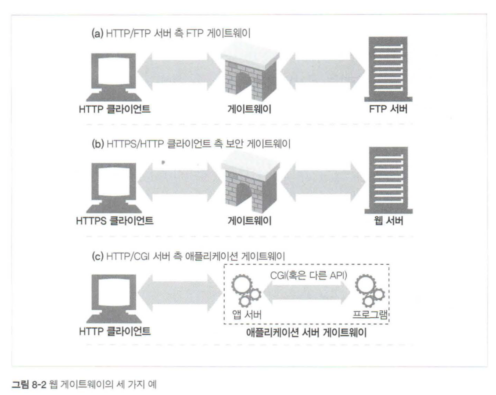

(a). FTP URL이 담긴 HTTP 요청 > FTP 커넥션 > HTTP 응답

(b). 암호화된 SSL > 암호 해석된 일반 HTTP를 서버에 요청 (서버에 암호화 기능 제공)

(c). 애플리케이션 서버 게이트웨이 API를 통해 HTTP 연결 (단순 조회에 사용 - 일기예보, 주식시세 등)

## 클라이언트 측 게이트웨이와 서버측 게이트웨이

웹 게이트웨이는 한쪽에서는 HTTP로 통신하고 다른 한쪽에서는 HTTP가 아닌 다른 프로토콜로 통신한다.

> 상이한 HTTP 버전 사이에서 변환을 수행하는 웹 프락시는 게이트웨이와 같다. 양쪽에서 HTTP로 통신하기 때문에 기술적으로는 프락시다.

빗금 구분자 “/” 를 통해 클라이언트와 서버 프로토콜을 구분한다. ex) HTTP/NNTP

- 서버 측 게이트웨이는 클라이언트와 HTTP로 통신, 서버와는 외래 프로토콜로 통신
- 클라이언트 측 게이트웨이는 클라이언트와 외래 프로토콜로 통신, 서버와는 HTTP로 통신

# 8.2 프로토콜 게이트웨이

게이트웨이는 프락시처럼 HTTP 트래픽을 바로 보낼 수 있다.

브라우저 등을 통해 FTP 요청 등에 대해 게이트웨이 설정을 했다면 다른 요청은 웹 서버에 바로 요청되나, FTP URL을 포함한 요청은 설정한 게이트웨이가 요청을 받는다.

## HTTP/\*: 서버 측 웹 게이트웨이

클라이언트에서 HTTP 요청 > 외래 프로토콜로 전환 > FTP 커넥션 > HTTP 응답으로 반환

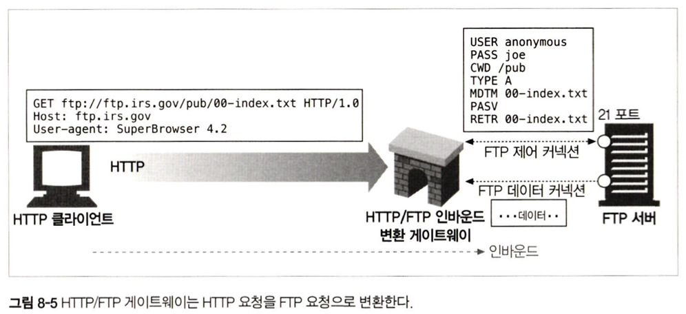

## HTTP/HTTPS: 서버 측 보안 게이트웨이

(기업 내부의)모든 웹 요청을 암호화함으로써 개인 정보 보호와 보안을 제공하는데 게이트웨이를 사용할 수 있다.

클라이언트는 일반 HTTP를 사용하여 웹을 탐색하지만 게이트웨이는 자동으로 사용자의 모든 세션을 암호화한다.

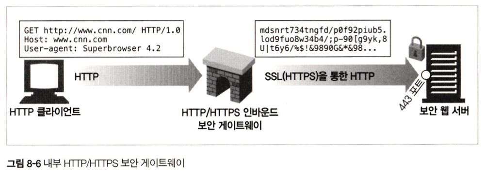

## HTTPS/HTTP: 클라이언트 측 보안 가속 게이트웨이

HTTPS/HTTP 게이트웨이는 보안 가속기로 유명하다. 웹 서버의 앞단에 위치하며 인터셉트 게이트웨이나 리버스 프락시 역할을 수행한다. HTTPS 트래픽을 받아서 복호화하고 웹 서버로 보낼 일반 HTTP 요청을 만든다.

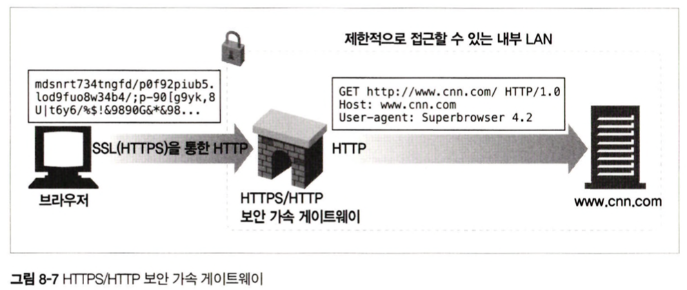

# 8.3 리소스 게이트웨이

일반적인 형태의 게이트웨이는 애플리케이션 서버로 목적지 서버와 게이트웨이를 한 개의 서버로 결합한다.

> 애플리케이션 서버 : HTTP로 클라이언트와 통신하며 애플리케이션 서버에 연결하는 서버 측 게이트웨이

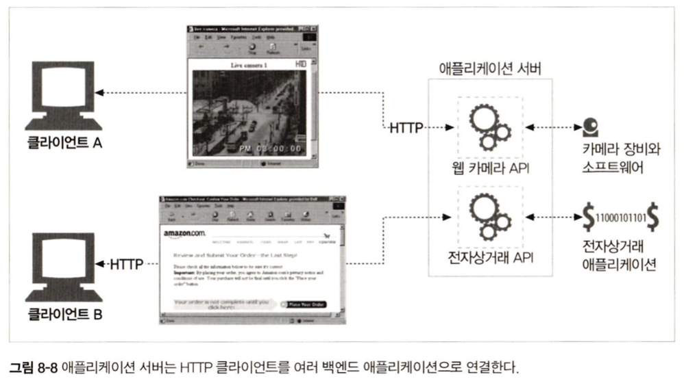

- 클라이언트 A 요청 > 웹 카메라 API > 카메라 애플리케이션 이미지
- 클라이언트 B 요청 > 전자상거래 API > 전자상거래 애플리케이션 결과

애플리케이션 게이트웨이에서 유명했던 최초의 API는 공용 게이트웨이 인터페이스(Common Gateway Interface, CGI)였다.

> CGI : HTTP 요청 > 프로그램 실행, 출력 수집 > 응답 회신하는 웹 서버가 사용하는 표준화된 인터페이스 집합이다.

초기 웹 서버는 단순하게 제작하였으며 게이트웨이의 인터페이스를 구현하는 단순한 접근 방식은 계속 이어지고 있다. 상용 웹 서버는 웹 서버와 웹 애플리케이션간의 통신에 사용할 정교한 인터페이스를 제공한다.

게이트웨이를 통해야 받을 수 있는 리소스 요청이 들어오면, 서버는 헬퍼 애플리케이션을 생성하여 요청을 처리한다. 헬퍼 애플리케이션은 필요한 데이터를 전달 받아 클라이언트로 전달할 응답이나 응답 데이터를 서버에 반환한다. (서버에 반환한다??)

> 서버 내부에서 처리되므로 어디서 처리되는 지 보이지 않는다.

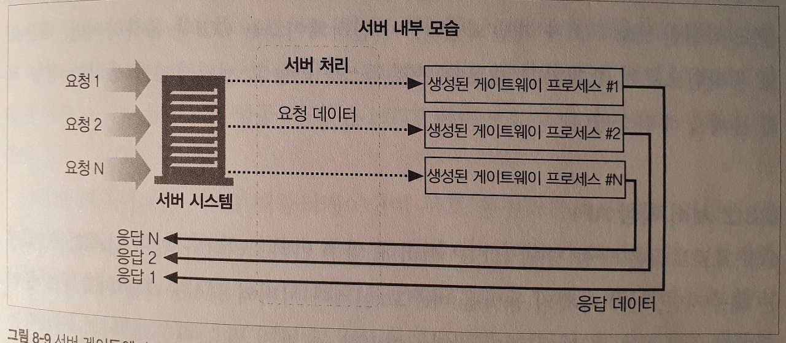

## 공용 게이트웨이 인터페이스

최초의 서버 확장이자 지금까지도 가장 널리 쓰이는 서버 확장

동적인 HTML, 신용카드 처리, 데이터베이스 질의 제공하는데 사용

CGI 애플리케이션이 서버와 분리되면서 펄(Perl), Tcl, C 등 다양한 셸 언어를 포함하여 수많은 언어로 구현할 수 있게 됨

단순하기 때문에 거의 모든 HTTP 서버가 지원

내부에서 어떤 처리를 하는지 사용자들에게는 보이지 않는다.

**장점**

- 거의 모든 리소스 형식과 서버의 접점에서 필요에 따라 어느 변형이든 처리하는 단순한 기능 제공
- 인터페이스는 문제가 많은 확장으로부터 서버를 보호

**단점**

- 모든 CGI 요청마다 새로운 프로세스를 만드는 부하가 생김
- 서버의 성능을 제한하며 서버 장비에 부담

Fast CGI는 데몬으로 동작함으로써 요청마다 새로운 프로세스를 만들고 제거하면서 생기는 성능저하 문제를 해결

> 데몬으로 동작 ? CGI의 문제점을 해결하기 위해 상시 프로세스를 두고 요청이 들어오면 동작하게 만드는 것

<aside>
💡 일반적인 경우

1.  Client로 부터 page요청 받음. (예>[http://www.example.com/index.html](http://www.example.com/index.html))

2.  해당 index.html 을 Client로 전달. (즉, 고정된 Data 전달)

CGI를 사용한 경우

1.  Client로 부터 page요청 받음. (예>[http://www.example.com/cgi-bin/sample.pl](http://www.example.com/cgi-bin/sample.pl))

2.  Web server가 해당 요청을 CGI를 통해 CGIs로 전달. (요청은 GET/POST 모두 가능)

3.  CGIs 가 전달받은 정보를 기반으로 html 생성하여 Web Server로 전달. (전달받은 정보에 따라 html이 다양하게 생성)

4.  Web Server에서 Client로 정보 전달

</aside>

[출처: [https://technote.kr/14](https://technote.kr/14)]

## 서버 확장 API

서버 자체의 동작을 바꾸고 싶거나 서버의 처리능력을 끌어올리는 방법 ?

웹 개발자 모듈을 HTTP와 직접 연결할 수 있는 서버 확장 API를 제공하여, 코드를 서버에 연결하거나 서버의 컴포넌트를 교체할 수 있게 하였다.

유명한 서버 대부분은 확장 API를 한개 이상 제공한다. 서버의 아키텍처에 의존하기 때문에 각 서버에 맞춰 특화된 API를 제공한다. 예로, 프론트페이지 제작자가 웹 출판 서비스를 하게 지원해주는 마이크로소프트의 프론트페이지 서버 확장이 있다.

# 8.4 애플리케이션 인터페이스와 웹 서비스

웹 애플리케이션이 더 많은 형식의 리소스를 제공함에 따라서 HTTP는 애플리케이션을 연결하는 도구로써 사용할 수 있다.

데이터를 교환하려는 두 애플리케이션 사이에서 프로토콜 인터페이스를 맞추어야 하는 까다로운 이슈가 있다. HTTP 헤더로는 표현하기 힘든 정보를 교환해야 할 때, HTTP 확장이나 HTTP위에 프로토콜을 덧씌워서 사용 한다. (19장에서 이어서 설명)

인터넷 커뮤니티는 웹 앱이 서로 통신하는데 사용할 표준과 프로토콜 집합을 개발하였다. 이러한 표준은, 웹 서비스가 독립형 웹 애플리케이션 그 자체를 의미하지만, 그냥 그대로 웹 서비스로 불리게 되었다. 웹 서비스는 애플리케이션이 정보를 공유하는데 사용하는 새로운 메커니즘을 의미하며 HTTP 같은 표준 웹 기술 위에서 개발한다.

웹 서비스는 SOAP를 통해 XML을 사용하여 정보를 교환한다. SOAP(Simple Object Access Protocol)은 HTTP 메시지에 XML 데이터를 담는 방식에 관한 표준이다.

# 8.5 터널

웹 터널은 HTTP 프로토콜을 지원하지 않는 애플리케이션에 HTTP 애플리케이션을 사용해 접근하는 방법을 제공한다. HTTP 커넥션을 통해서 HTTP가 아닌 트래픽 전송, 다른 프로토콜을 HTTP위에 올려서 전송할 수 있다. 웹 터널을 이용해서 웹 트래픽만을 허용하는 방화벽이 있더라도 HTTP가 아닌 트래픽을 전송할 수 있다.

## CONNECT로 HTTP 터널 커넥션 맺기

웹 터널은 HTTP의 CONNECT 메서드를 사용하여 커넥션을 맺는다.

터널 게이트웨이가 목적 서버와 포트에 TCP 커넥션을 맺고 클라이언트와 서버 간에 오는 데이터 전달을 요청한다.

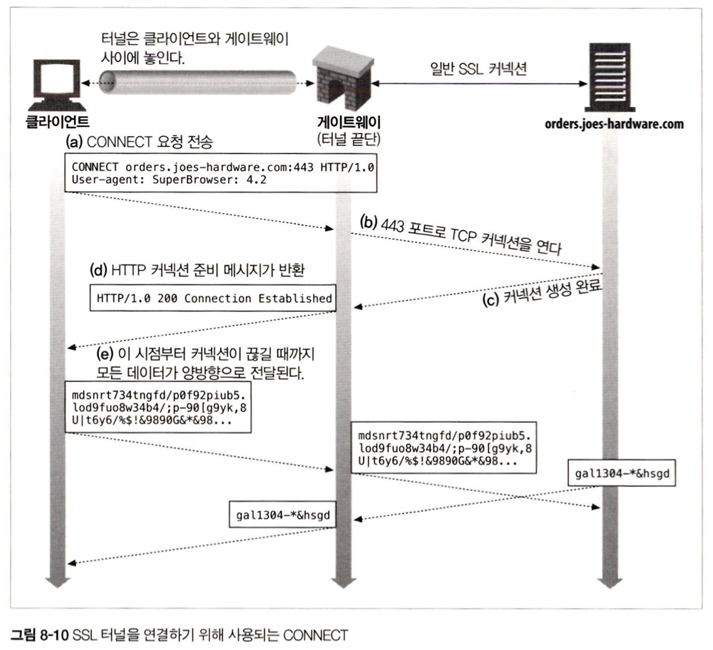

(a). 클라이언트는 게이트웨이에 터널을 연결하기 위해 CONNECT 요청을 보낸다.

(b),(c). CONNECT 메서드는 TCP 커넥션을 맺는다.

(d). 클라이언트에게 HTTP 200 Connecton Established 응답을 전송한다.

(e). 터널 연결 완료. HTTP 터널을 통해 전송된 클라이언트의 모든 데이터는 TCP 커넥션에 전달되고, 서버로부터 전송된 모든 데이터 역시 클라이언트에게 전달된다.

CONNECT 메서드는 모든 서버나 프로토콜에 TCP 커넥션을 맺는데 사용할 수 있다.

### CONNECT 요청

CONNECT로 시작하는 HTTP 헤더

```jsx
CONNECT home.netscape.com:443 HTTP/1.0
User-agent: Mozilla/4.0
```

### CONNECT 응답

게이트 웨이에서 200 응답을 기다린다. Content-Type 헤더를 포함할 필요는 없다.

```jsx
HTTP/1.0 200 Connecton Established
Proxy-agent: Netscape-Proxy/1.1
```

## 데이터 터널링, 시간, 커넥션 관리

터널을 통해 전달되는 데이터는 게이트웨이에서 볼 수 없다.

패킷의 순서나 흐름에 대한 어떠한 가정도 할 수 없다.

터널이 일단 연결되면 데이터는 언제 어디로든 흘러갈 수 있다.

> 터널의 양 끝단에서는 언제든지 패킷을 받을 준비를 해야 하고 데이터를 즉시 전달해야 한다. 데이터 의존성을 포함하고 있거나, 터널의 한쪽에서 입력받은 데이터를 무시할 수 있기 때문이다. 한쪽에서 데이터를 소비하지 않으면 다른 한쪽에서 교착상태가 일어날 수 있다.

클라이언트는 성능을 높이기 위해 CONNECT 응답이 오기 전, 터널 데이터를 전송할 수 있다.

게이트웨이는 커넥션이 맺어지는 대로 헤더 포함 모든 데이터를 서버에 전송한다.

클라이언트는 인증요구나 200이외의 응답이 온 경우 요청 데이터를 다시 보낼 준비가 되어야 한다.

> TCP 요청 패킷이 차지한 영역을 제외한 나머지 영역보다 더 큰 데이터를 파이프라인을 통해 전달하지 말아야 한다. 모든 TCP 패킷을 받기 전에 요청이 끊어지는 경우 클라이언트에 TCP 리셋을 일으킬 수 있다. TCP 리셋은 클라이언트가 게이트웨이로부터 받은 응답을 잃어버려, 통신 실패의 원인을 알 수가 없게 된다.

터널의 한 부분의 커넥션이 끊어지면, 끊어진 곳의 데이터는 반대편으로 전달된다. 그 다음 반대편의 커넥션이 끊어지며 아직 전달되지 않은 데이터는 버려진다.

## SSL 터널링

웹 터널은 방화벽을 통해서 암호화된 SSL 트래픽을 전달하려고 개발되었다.

강력한 보안을 위해 모든 트래픽이 패킷을 필터링하는 라우터와 프락시를 지나도록 설계하였다.

낡은 방식의 프락시에서는 처리되지 않는 SSL 트래픽을 터널을 통해 방화벽을 통과시킬 수 있다.

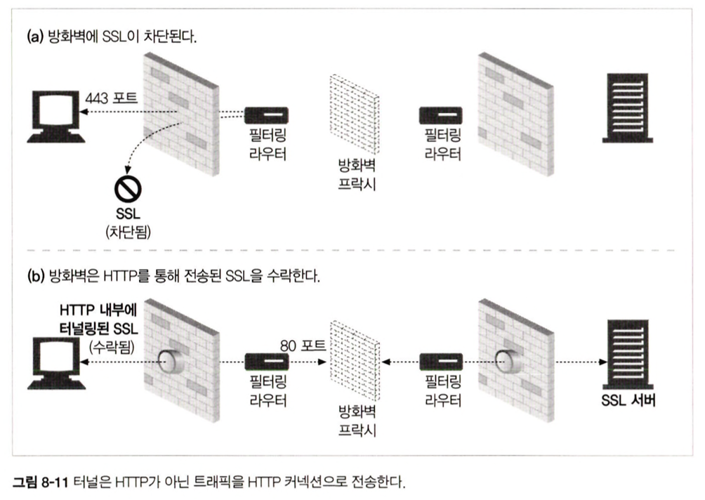

HTTP에 터널링 기능이 추가되어 HTTP메시지에 암호화된 날 데이터를 담고 일반 HTTP 채널을 통해 데이터를 전송한다. 터널은 HTTP가 아닌 트래픽이 포트를 제한하는 방화벽을 통과할 수 있게 해준다.

보안 SSL 트래픽이 방화벽을 통과하는데 유용하게 사용되지만 악의적인 트래픽이 사내로 유입되는 경로가 될 수도 있다.

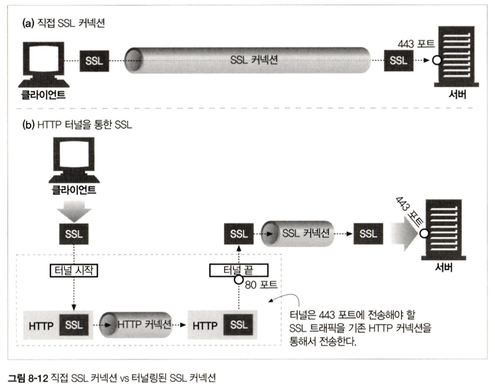

## SSL 터널링 vs HTTP/HTTPS 게이트웨이

HTTP/HTTPS 게이트웨이

- 클라이언트-게이트 사이의 보안이 적용되지 않은 일반 HTTP 커넥션
- 프락시가 인증을 담당하고 있어 클라이언트는 원격서버에 SSL 클라이언트 인증을 할수가 없다.

SSL터널링을 사용하면, 프락시에 SSL 구현을 할 필요 없이 SSL 세션이 클라이언트와 웹 서버간에 생성되므로 암호화된 데이터를 그대로 터널링 할 수 있다.

## 터널 인증

HTTP의 다른 기능들은 터널과 함께 적절히 사용할 수 있다.

프락시 인증 기능은 클라이언트가 터널을 사용할 수 있는 권한을 검사하는 용도로 터널에서 사용할 수 있다.

[프락시 인증 기능이 없는 터널](https://www.notion.so/8-ae174ced74e14f7bb8653db658bd041d?pvs=21)

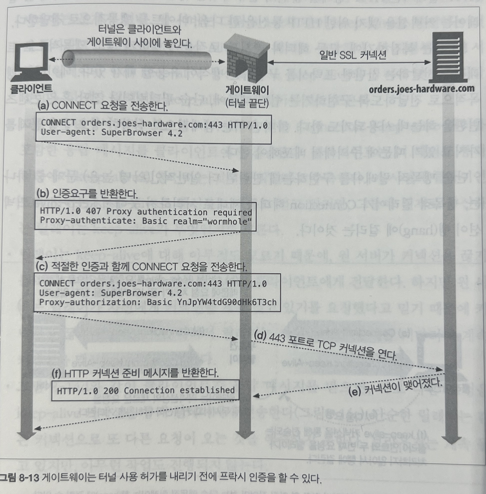

# 8.6 릴레이

HTTP 명세를 완전히 준수하지 않는 간단한 HTTP 프락시로 HTTP통신을 한 다음 바이트를 맹목적으로 전달한다.

복잡한 HTTP 헤더와 메서드 로직을 수행하지 않고 단순한 트래픽을 전달하는 방식이 유용한 경우에 사용

: 단순 필터링이나 진단 혹은 콘텐츠 변환

릴레이가 Connection 헤더를 제대로 처리하지 못해서 keep-alive 커넥션이 행(hang)에 걸릴 수 있다.

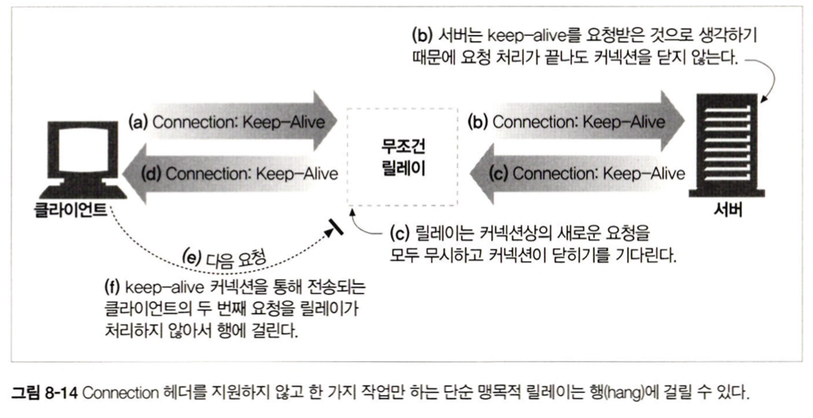

(a). 클라이언트가 릴레이에게 Connection: keep-alive 커넥션 요청을 한다.

(b). 릴레이는 HTTP 요청을 받지만 Connection 헤더를 이해하지 못하므로 요청을 서버에 넘긴다.

> Connection 헤더는 홉과 홉 에만 사용하는 헤더이며 단일 전송 링크만을 지원하고 체이닝이 안된다.

(c). 웹 서버는 프락시로부터 받은 Connection 헤더를 해석하고 keep-alive 요청을 허용하며 Connection: keep-alive 헤더로 응답한다.

(d). 릴레이는 서버로 부터 받은 응답 헤더를 클라이언트에게 그대로 전달한다. 릴레이는 헤더가 무엇인지조차 모른다. 릴레이는 원 서버가 커넥션을 끊기를 기다리며 데이터 전부를 클라이언트에게 전달한다. 하지만 원 서버는 keep-alive하게 커넥션을 유지한다.

(e). 응답을 받은 클라이언트는 다음 요청을 한다.

(f). 릴레이는 같은 커넥션으로 또 다른 요청이 오는것을 예측하지 못하고, 처리하지 않는다. 브라우저는 계속 돌고 있지만 아무런 작업도 진행되지 않아 행이 걸린다.

릴레이로 프락시를 단순하게 구현하는데 이점이 있지만 운용과 관련한 문제가 발생할 수 있다. 여러 문제를 예방하기 위해서 HTTP를 제대로 준수하는 프락시를 사용하는게 좋다.
